# 推荐个开源在线文档，助道友领悟 Django 之“道”

> 本文面向有~~手~~（需要一点点 Python Django 基础）的小伙伴，急需文档管理者食用最佳。


作者：HelloGitHub-吱吱

嗷嗷待哺的小白：“今天又是沉迷花里胡哨博客的一天，我希望归档一类知识或者是连载一些教程，而博客都是一篇篇散落的，没有连贯性，阅读体验不太良好，怎么办呢？”

HelloGitHub：“那你可是问对人了，这期 **[《讲解开源项目》](https://github.com/HelloGitHub-Team/Article)** 系列的新项目：MrDoc 觅道文档，将会解决你的烦恼。”

小白：“这又是什么神奇的开源工具。”

HelloGitHub：“这是一个基于 Django 开发的在线文档系统，适合作为**个人和小型团队**的私有云文档、云笔记和知识管理工具。你看它界面简洁，功能俱全，部署简单。话不多说，直接开始实践检验真理！”

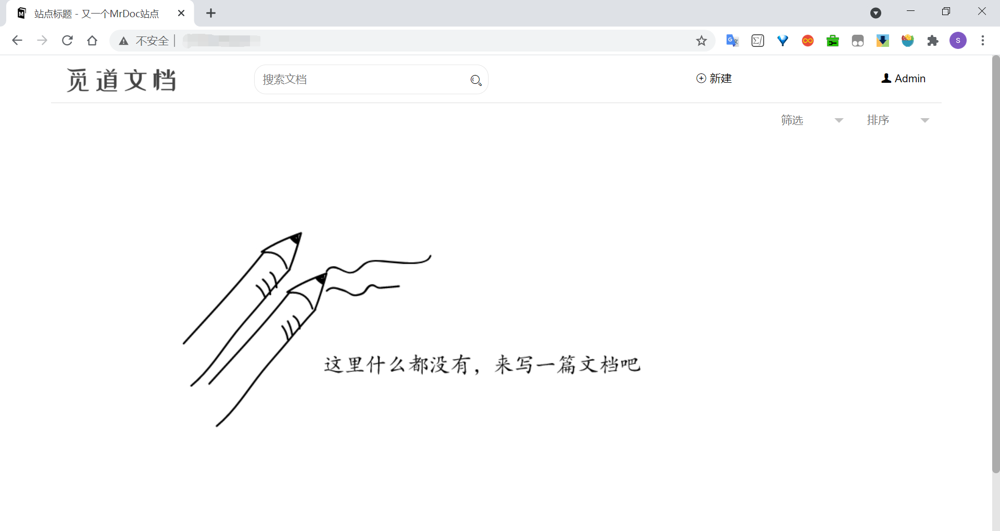

## 一、简单测试

HelloGitHub：“嘿嘿，先别着急，我们先在本地平台运行，测试测试功能，了解这个项目的基本使用，再一步步往前走。”

仅需 6 步你就可以从零运行起来这个项目！

1、我们本地的实验环境是：

- Windows 10 64 位操作系统
- Python 3.7，pip 21.0.1

2、我们需要将开源项目克隆到本地，使用如下命令：

```bash
git clone https://github.com/zmister2016/MrDoc
```

3、为 MrDoc 安装好所需的第三方库：进入 `Mrdoc/` 目录，运行如下命令：

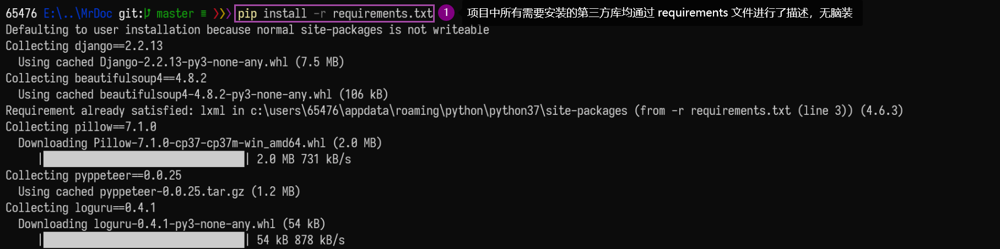

4、初始化数据库，该项目默认使用 sqlite 数据库。在命令行下执行：

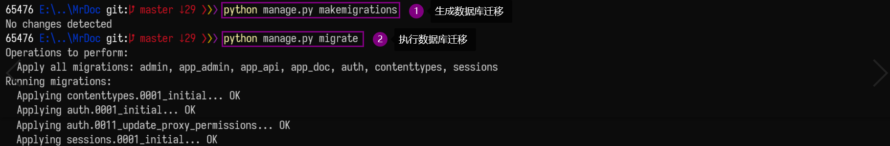

5、创建管理员账户，来管理整个 MrDoc 应用。注意用户名和电子邮箱地址在整个 MrDoc 应用中是**唯一**的。

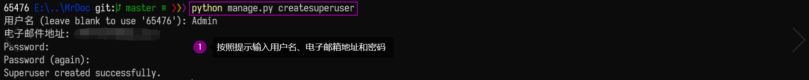

6、本地上线测试：在测试环境中，可以使用 Django 自带的服务器运行 MrDoc。

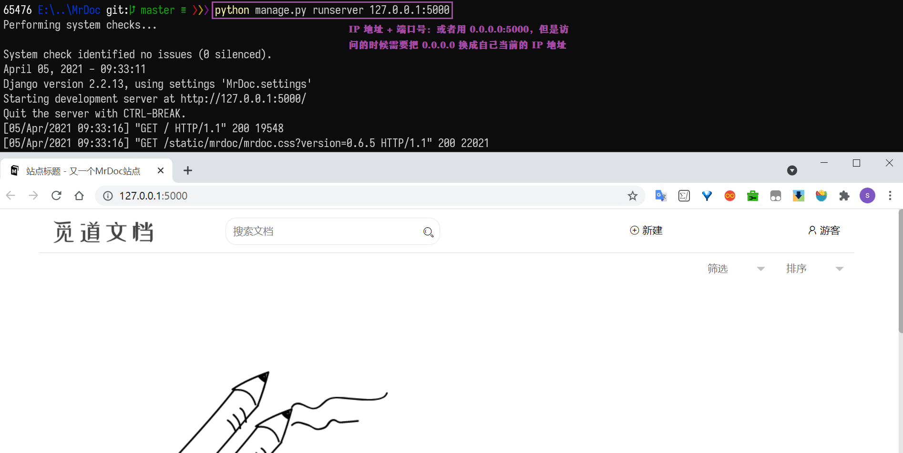

## 二、食用说明

小白搓搓手，期待：“我也在本地测试成功了，是不是可以探索一番里面的彩蛋呢？”

HelloGitHub：“好嘞，项目主打的关键字就是：个人团队协作和文档管理，让我现在来给你展现一下五脏俱全的 MrDoc。”

### 2.1 注册登录

HelloGitHub：“当我们访问网站的时候，以**游客**身份进行的。假如我们需要注册一个**普通用户**的帐号，则需要填写相应的表单信息，注册完毕后会自动跳转到已登录界面。”


小白：“补充：其实如果游客想点击 `新建` → `新建文档`，也是需要登录操作的哟。”

### 2.2 文集文档

HelloGitHub：“当我们登录以后，可以在 `新建` → `新建文集` 中创建一个文集。”


小白：“我发现了，可以点击首页的文集，进入到文集的浏览阅读页面，还可以用 `添加` 新建一个文档。在进入文档编辑器页面，我们可以 `点击文档树` 选择当前文档对应的上级或者 `取消上级`，以及通过输入 `文档排序值`，来给不同文档排序。”

HelloGitHub：“嗯呐，现在我们就不用担心教程学习类的文章不连续啦，因为他们都有层次顺序的分布在我们的文集中。不过因为目前 MrDoc 最多支持 3 级的文档，可别让自己的文档树太大鸭。”


HelloGitHub：“非常重要的一点是团队的共享和协作。我们普通用户可以对自己的文集进行管理，点击 `个人中心` → `我的文集` → `文集管理` → `文集成员` 处的 `协作管理` 小图标，可以添加**协作人**。而且在 `文集管理` → `操作` → `文集设置` 小图标可以修改 `基础信息`、`权限配置` 和 `管理控制`。当权限设置为**公开**时，则当以游客身份访问网页的时候能够看到该文集；当权限设置为**私密**，则只有自己能看到。当然也可以给固定的人看，这也就能实现了小团队的共享。”

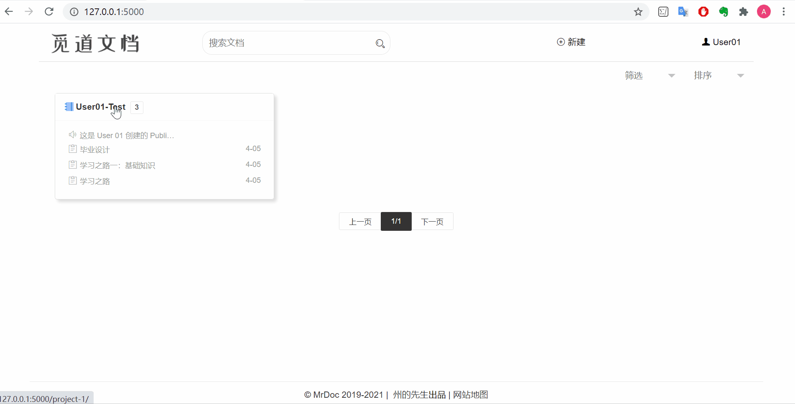

### 2.3 文档编辑

HelloGitHub：“现在我们把目光投向 MrDoc 的文档编辑和修改模块，它支持以 Markdown 和富文本两种方式进行文档编写，给我们提供了 3 种编辑器使用。它能支持插入数学公式、流程图、序列图、脑图、Echarts 图形图表和时间线，能够添加音视频链接和图片附件等，能够创建文档模板，总之是概括不完了，图也上不完了，需要在使用过程中慢慢的熟练。”


小白：“我现在也看得懂了，在 `个人中心` → `我的文档` → `文档管理` 中可以统一管理创建的所有文档，还可以看到 `历史版本管理` 信息呢，方便了用户进行对比，也方便了团队协作的管理。”

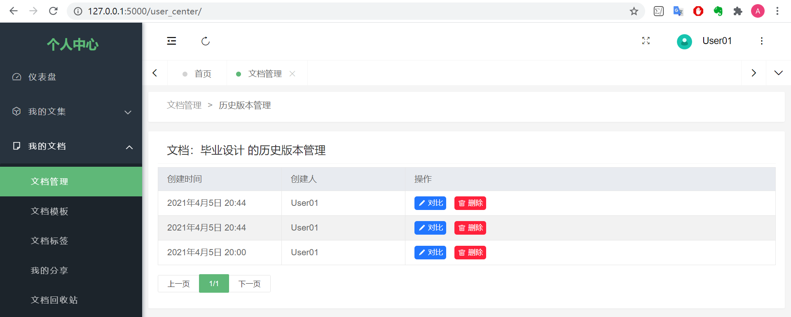

### 2.4 后台管理【管理员】

HelloGitHub：“大 boss 的权限必然是很高的，一切都收之眼底，包括用户的文集、文档、文档模块，还可以进行用户管理和站点设置。”

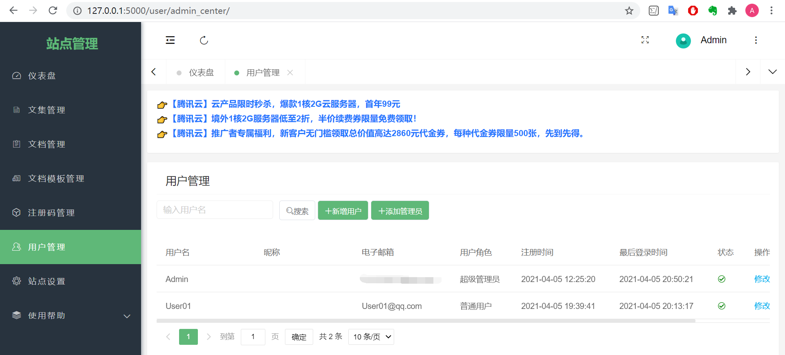

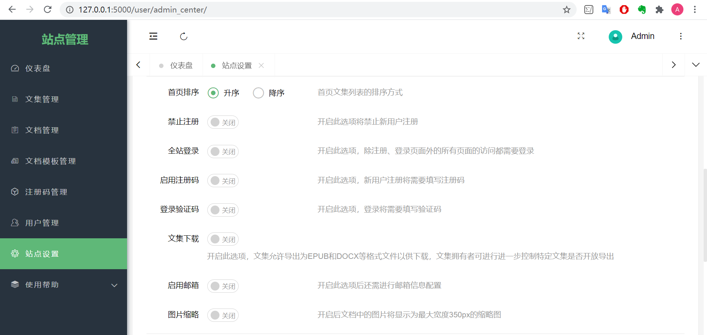

小白：“那我就做自己的主宰好了。”

## 三、上线部署

HelloGitHub：“已经了解了一些功能了，但是只在本地跑会不会太拉垮了，是不是得考虑将这个项目部署到我们的云服务器上，让自己的小团队实现高大上的知识协作管理呀。”

小白：“可以和组里的小伙伴多了一个摸鱼工具，想想就很开心~”

HelloGitHub：“先部署好吧，谁知道过程中会出现一堆坑呢。为了比较顺利的进行，我们这次的方法就选用官方提供的比较完整的教程：使用 `Nginx + uWSGI` 部署 `MrDoc`。”

1、我们云主机的环境是：

- Ubuntu 18.04.4 LTS
- Python 3.6.9，pip 21.0.1
- 在 `~` 目录下进行，即用 `pwd` 命令查看为：`/home/purple`，小伙伴们改成自己对应的目录

2、安装 uWSGI 和 Nginx：

```bash
sudo apt-get install uwsgi
sudo apt install uwsgi-plugin-python3
sudo apt-get install nginx
```

3、将 MrDoc 的源码拉取至本地（用之前的命令），但是为了不对服务器上现存的环境造成影响，我们这次需要用到**虚拟环境**：

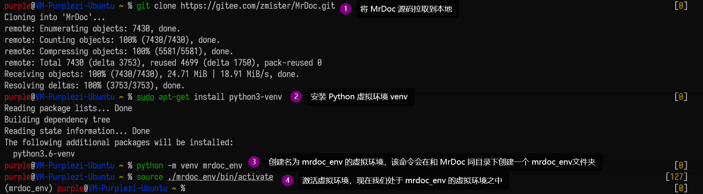

4、进入 MrDoc 文件夹，重复[简单测试](#简单测试)的 3、4、5 步骤，分别实现依赖库的安装、初始化数据库以及创建管理员账号（略）。

5、我们在 `~` 目录下新建一个名为 mrdoc_deploy 的文件夹，命令如下所示，用于存放部署的相关文件。

```bash
mkdir /home/purple/mrdoc_deploy
```

(1) `uWSGI` 配置文件：

在 `mrdoc_deploy` 目录下新建一个名为 `uwsgi_params` 的文件，用 `vim uwsgi_params` 命令进行写入：

```
uwsgi_param  QUERY_STRING       $query_string;
uwsgi_param  REQUEST_METHOD     $request_method;
uwsgi_param  CONTENT_TYPE       $content_type;
uwsgi_param  CONTENT_LENGTH     $content_length;
uwsgi_param  REQUEST_URI        $request_uri;
uwsgi_param  PATH_INFO          $document_uri;
uwsgi_param  DOCUMENT_ROOT      $document_root;
uwsgi_param  SERVER_PROTOCOL    $server_protocol;
uwsgi_param  REQUEST_SCHEME     $scheme;
uwsgi_param  HTTPS              $https if_not_empty;
uwsgi_param  REMOTE_ADDR        $remote_addr;
uwsgi_param  REMOTE_PORT        $remote_port;
uwsgi_param  SERVER_PORT        $server_port;
uwsgi_param  SERVER_NAME        $server_name;
```

在 `mrdoc_deploy` 目录下新建一个名为 `mrdoc_uwsgi.ini` 的文件，同理用 `vim mrdoc_uwsgi.ini` 写入：

```ini
[uwsgi]

# Django-related settings
socket = :8008
# the base directory (full path)
chdir           = /home/purple/MrDoc
virtualenv = /home/purple/mrdoc_env
# Django s wsgi file
module          = MrDoc.wsgi:application
wsgi-file       = MrDoc/wsgi.py
# process-related settings
# master
master          = true

# maximum number of worker processes
processes       = 1
threads = 2
# ... with appropriate permissions - may be needed
# chmod-socket    = 664
# clear environment on exit
plugins = python3
vacuum = true
python-autoreload = 1

# buffer size
buffer-size = 65536
```

注：如果后续运行服务的时候出现如下问题，则需要调整 `mrdoc_uwsgi.ini` 下的 `buffer-size` 参数。

```bash
spawned uWSGI master process (pid: 21172)
spawned uWSGI worker 1 (pid: 21173, cores: 2)
invalid request block size: 21573 (max 4096)...skip
invalid request block size: 21573 (max 4096)...skip
```

(2) `Nginx` 配置文件

在 `mrdoc_deploy` 目录下新建一个名为 `mrdoc_nginx.conf` 的文件，使用命令 `vim mrdoc_nginx.conf` 写入如下内容：

```conf
server {
    listen         80;
    server_name    此处填入域名;
    charset UTF-8;
    access_log      /var/log/nginx/mrdoc_access.log;
    error_log       /var/log/nginx/mrdoc_error.log;

    client_max_body_size 75M;

    location / {
        include /home/purple/mrdoc_deploy/uwsgi_params;
        uwsgi_pass 127.0.0.1:8008;
        uwsgi_read_timeout 60;
    }

    location /static {
        expires 30d;
        autoindex on;
        add_header Cache-Control private;
        alias /home/purple/MrDoc/static;
    }
    location /media  {
        alias /home/purple/MrDoc/media;
    }
}
```

注意在 `server_name` 参数中，需要填入自己的域名。此处我填的是云主机的公网 IP 地址，之后访问网站则需要输入该 IP 地址。

(3) 为了能让 MrDoc 应用按我们的要求运行，使用 `systemctl` 工具来管理服务。

在 `mrdoc_deploy` 目录下新建一个名为 `mrdoc.service` 的文件，用命令 `vim mrdoc.service` 将如下内容写入文件：

```service
[Unit]
Description = MrdocApp
After = syslog.target

[Install]
WantedBy = multi-user.target

[Service]
WorkingDirectory = /home/purple/MrDoc
ExecStart = /usr/bin/uwsgi --ini /home/purple/mrdoc_deploy/mrdoc_uwsgi.ini
User = purple
Restart = always
StandardError = syslog~
```

6、添加进程管理

```bash
sudo systemctl enable /home/zmister/mrdoc_deploy/mrdoc.service
```

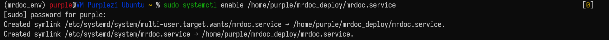

7、创建 Nginx 站点软链接

```bash
sudo ln -s /home/zmister/mrdoc_deploy/mrdoc_nginx.conf /etc/nginx/sites-enabled/mrdoc_nginx.conf
```

8、启动 MrDoc 服务

```bash
sudo systemctl start mrdoc.service
```

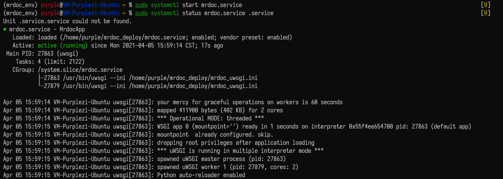

注意：当试图启动的时候，出现如下报错。原因是：在配置 `mrdoc.service` 的时候 `ExecStart` 参数如果按照官方文档写的是 `uwsgi`，但实际上应该写成绝对路径（可以查看一下自己的路径），我的是 `/usr/bin/uwsgi`。

```bash
(mrdoc_env) purple@VM-Purplezi-Ubuntu ~ % sudo systemctl start mrdoc.service
Failed to start mrdoc.service: Unit mrdoc.service is not loaded properly: Exec format error.
See system logs and 'systemctl status mrdoc.service' for details.
```

## 四、最后的最后

小白：“课代表来了，一句话总结，只需要在部署的时候费点劲，之后就可以体验这个项目带给我们的方便快捷了，有手即可。”

HelloGitHub：“在官方文档中，其实还有一些功能没有覆盖到，比如说作者还提供了 MrDoc 浏览器扩展，有空记得去看看哇。记得要第一时间关注我们，我们将会不间断正常运行为您带来有趣的开源项目分享。”
