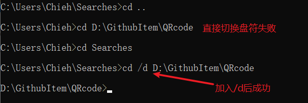

# 简单方便的二维码生成器：QRcode

# 一、介绍

这是一个由 Python 编写的艺术二维码生成器, 支持 GIF 动态二维码和图片二维码。

项目地址: [qrcode](https://github.com/sylnsfar/qrcode/blob/master/README-cn.md)


## 1.1 推荐理由
为什么需要使用到这个二维码生成器来生成二维码呢?

1. 快速上手, 仅需 2 行代码, 即可开始食用!
2. 彩色二维码和动态二维码可以让用户很直观的知道二维码的内容。如下，可以直观的看出是与 GitHub 相关的二维码（HelloGithub 项目的地址）
   
    
3. 使用该项目可以迅速创建好看, 有趣的二维码。
   
    
    
4. 使用方式多样。qrcode 有以下的 3 种使用方式：
  1. 命令行方式
  2. 导入文件方式 
  3. [exe](https://github.com/sylnsfar/qrcode_win)
  4. [网页](http://www.amazing-qrcode.com/) (已挂)
5. 用就对了，我不要你觉得，我要我觉得 ~~滑稽~~
---

# 二、快速上手

- 操作系统: Windows
- Python 版本: 3.5
- 运行方式：命令行

## 2.1 安装

1. 安装依赖
```shell
pip install -r requirements.txt
```
> 注：此处可能需要升级 pip, 输入 `pip install --upgrade pip`

2. 安装 MyQR
```shell
pip install myqr
```

安装完成之后, 就可以直接在命令行中使用了! 下面逐一讲解各种二维码的生成方法

## 2.2 普通二维码

首先生成一个普通二维码

1. 打开 cmd 

2. 输入命令
```shell
myqr https://github.com -n helloword.png
```

得到第一个二维码图片，图片的地址为当前地址，后面可以通过传入参数修改默认地址（普通二维码）

- **参数`-n`**: 文件重命名
- **其他参数请看附录**

> 默认保存路径为 cmd 所在目录（cmd 切换盘符的技巧, 请看附录）

## 2.3 彩色二维码

1. 先准备一张照片放在目录下（最好是**方形**的）

    例如:

    

2. 将照片名字修改为 github.jpg (后缀根据自己的照片格式而定)

3. 在命令行中输入：
 ```shell
 myqr https://github.com -n mypicture.png -p github.jpg -c
 ```
参数:
- **参数`-n`**: 图片名字（name）
- **参数`-p`**: 图片（picture），支持 jpg, gif, png 格式
- **参数`-c`**: 彩色（colorized），如果不设置, 默认黑白
- **其他参数请看附录**

## 2.4 动态二维码

和彩色二维码的方法一致, 但是需要注意-> **修改后缀为 gif**, 否则会报错

# 三、附录
## 3.1 MyQR 参数

官方文档参数比较乱, 于是整理了一下

- **参数`-n`**: 图片名字（name）
- **参数`-p`**: 图片（picture），支持`.jpg`, `.gif`, `.png`, `.bmp`格式
- **参数`-c`**: 彩色（colorized），如果不设置, 默认黑白
- **参数`-v`**: 控制边长（version），范围是 1 至 40，数字越大边长越大；
- **参数`-l`**: 控制纠错水平 （level），范围是 L, M, Q, H，从左到右依次升高。
- **参数`-d`**: 控制输出文件位置（directory）
- **参数`-con`**: 用以调节图片的对比度（constrast），1.0 表示原始图片，更小的值表示更低对比度，更大反之。默认为 1.0
- **参数`-bri`**: 用来调节图片的亮度（brightness），其余用法和取值与 `-con` 相同

## 3.2 cmd 切换盘符

打开命令行有个小技巧, 可以将 cmd 迅速切换到想要的目录, 避免了切换盘符的麻烦

1. 利用文件管理, 找到目标文件夹

2. 顶部地址栏输入 cmd, 回车

    

3. 切换盘符的坑：直接切换盘符，会失败

    

## 3.3 二维码相关介绍

二维码有以下几种分类
1. 黑白和彩色码
   - 黑白码
   - 彩色码

        
        
2. 融合和视觉码
    - 融合码，就是将内容与二维码融合使它们成为一个整体，图片由二维码组成，二维码就是图片的一部分。这种比较适合使用构造简单的图片或者文字做美化主体内容
    - 视觉码，以图片为背景，再在图片上构建很多特殊的点，这些点不会影响背景的视觉效果

        
        
3. 艺术码:
   - 艺术二维码，就是将二维码进行的各个“码眼”按照设计师的构思进行分析、拆解、合并，再在那些“码眼”区域填充上一些小素材元素，最后形成一个别具特色二维码。
        

## 参考资料

1. [小技巧｜还在用黑白二维码？弱爆了！教你点新的技能！](https://www.jianshu.com/p/5f8df373be7a)
2. [PDF 淺談 QR Code](https://www.csie.ntu.edu.tw/~kmchao/bcc15spr/20150325_QR_Code.pdf)
3. [QRcode](https://github.com/sylnsfar/qrcode/blob/master/README-cn.md)
