# 就算不会 Web 开发，也能让数据“动”起来的开源项目！

> 本文面向有 Python 基础的小伙伴，有 Web 基础的更好


作者：HelloGitHub-吱吱

这里是 **HelloGitHub 推出的[《讲解开源项目》](https://github.com/HelloGitHub-Team/Article)系列**，今天要向小伙伴们介绍的是一个能够快速地把数据制作成可视化、交互页面的 Python 框架：Streamlit，分分钟让你的数据动起来！

> 项目地址：https://github.com/streamlit/streamlit

犹记得我在做机器学习和数据分析方面的毕设时，曾经为了制作精美的图表而抓耳挠腮，曾经为了在页面可视化、交互式展示数据而绞尽脑汁。现在摆在我们面前的是一个能够快速可视化数据并且制作成交互页面的 Python 框架，只需几分钟，就可以快速构建和部署功能强大的数据应用程序，写到这里 Streamlit 的高傲已经尽数体现了。

> Streamlit - The **fastest** way to build and share data apps 👊


下面我们就一起来上手这个强大的 Python 数据可视化框架吧！

## 一、浅尝~~辄止~~

1、本地实验环境：`Python 3.6 - Python 3.8`。

2、安装 Streamlit 体验官方提供的 hello world 小 demo。

```shell
pip install streamlit
streamlit hello
```

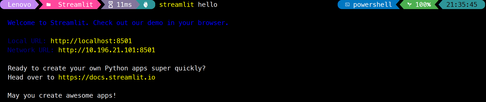

3、运行上述命令后会自动打开 Streamlit 的初始页面 `http://localhost:8501/`。

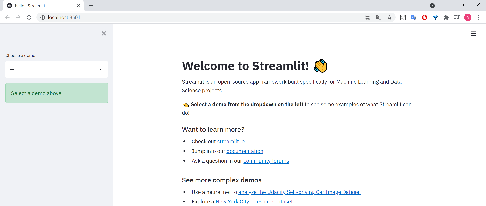

4、通过左边栏可以选择四个内置小项目并查看其代码，例如分形动画、折线图和层叠地图等，能在网页上点击选择设置一些参数，动态查看效果。

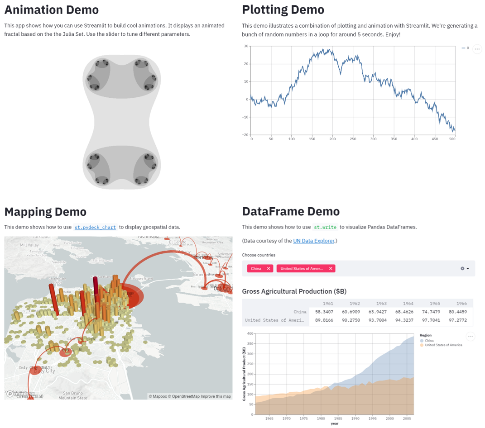


## 二、熟能生巧

通过 Streamlit 提供的接口，完美避开 Django 和 Flask 框架，无需编写 HTML、CSS、JavaScript 代码，与魔幻的前端 say goodbye。

### 2.1 开发自己的 app

1、首先创建一个 Python 文件，命名为 `test.py`，导入 Streamlit 库。

```python
import streamlit as st
```

2、通过如下命令启动项目，`Ctrl + c` 即可结束项目。

```python
# filename 自己的 py 文件名称
streamlit run [filename]
```

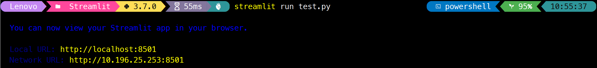

3、当应用程序正在运行时，每次修改 Python 文件并保存，网页都会弹出提示“Source file changed”，可以选择“Rerun”或者“Always rerun”，使得页面能够重新刷新。忽略掉小小的等待时间，我们能够在快速交互循环中「所见即所得」。

4、我们在任何时候对网页内容进行更新，包括：修改源码、使用者和网页进行交互（点击网页的按钮、输入文本），Streamlit 都是自上而下扫描解析并且运行整个代码。

### 2.2 基础命令

#### 2.2.1 显示文本

| 命令 | 效果 |
| ---- | ---- |
| `st.title()` | 添加一个标题 |
| `st.write()` | Streamlit 的瑞士军刀，可渲染如文本、Matplotlib 和 Altair 图表等几乎任何数据参数 |
| `st.text()` | 显示纯文本 |
| `st.header()`、`st.subheader()` | 二级标题和三级标题 |
| `st.markdown()` | 显示 Markdown |
| `st.latex()` | 显示格式为 LaTeX 的数学表达式 |
| `st.code()` | 显示带有可选语法高亮显示的代码块 |

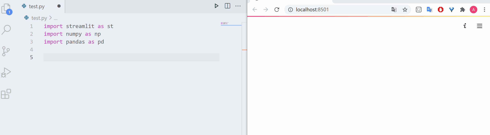

#### 2.2.2「魔法」

我愿称之为懒人命令——用尽量少的代码达到同样的效果。在不调用任何 Streamlit 方法的情况下，当用户自定义的变量出现在单行中，等同于 st.write() 效果。

```python
import pandas as pd
df = pd.DataFrame({
  'first column': [1, 2, 3, 4],
  'second column': [10, 20, 30, 40]
})

df
```

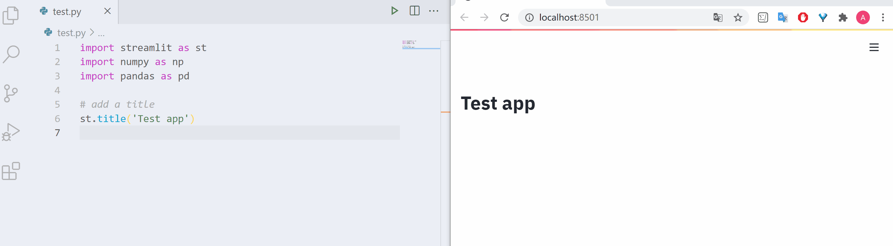

也可以将 `'''` 和 `'` 包裹的内容直接显示。

```python
# Draw a title and some text to the app:
'''
# Welcome to HelloGitHub

_快来加入我们吧_
'''

x = 10
'x', x  # <-- Draw the string 'x' and then the value of x
```

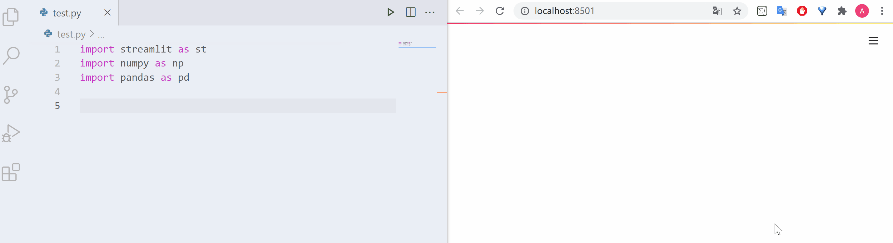

#### 2.2.3 显示数据表

Streamlit 能从多个不同角度快速、交互地可视化数据，原始数据、图表、JSON 数据等皆可。

| 命令 | 效果 |
| ---- | --- |
| `st.dataframe()` | 将数据框显示为交互式表格 |
| `st.table()` | 显示静态表格 |
| `st.json()` | 将对象或字符串显示为 JSON 字符串 |

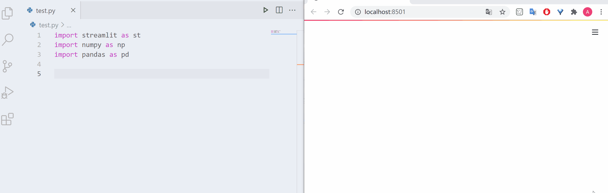

#### 2.2.4 绘制图表和地图

Streamlit 支持多种流行的数据图表库，如 Matplotlib、Altair、deck.gl 等。

| 命令 | 效果 |
| ---- | --- |
| `st.line_chart()` | 折线图 |
| `st.area_chart()` | 面积图 |
| `st.bar_chart()` | 条形图 |
| `st.map()`| 在地图上显示数据点 |
| `st.pyplot()` | matplotlib.pyplot 图表 |
| `st.altair_chart()` | 使用 Altair 库显示图表 | 
| `st.vega_lite_chart()` | 使用 vega_lite_chart 库显示图表 |
| `st.pydeck_chart()` | 使用 PyDeck 库绘制图表 |

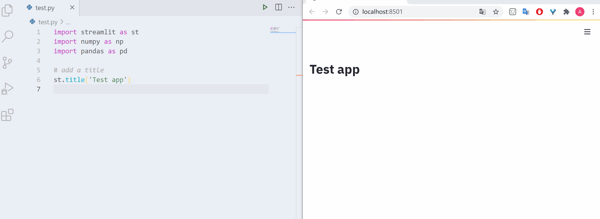

#### 2.2.5 显示多媒体

动动鼠标即可将图像、视频和音频文件直接嵌入 Streamlit 应用程序。

| 命令 | 效果 |
| ---- | --- |
| `st.image()` | 图片 |
| `st.audio()` | 音频 |
| `st.video()` | 视频 |

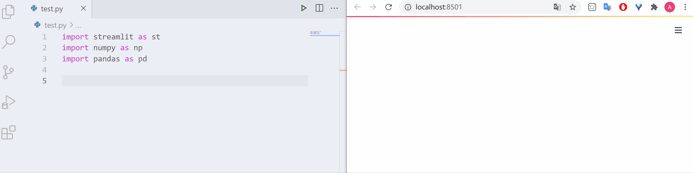

#### 2.2.6 交互式小部件

盯👀：漂亮的按钮、滑块、输入框等小部件。每次用户与小部件交互时，Python 脚本都会重新执行，并且该小部件的输出值会在运行期间设置为新值。

1、按钮 `button`。

```python
if st.button('HelloGitHub'):
    st.write('Subscribe our channels~')
```

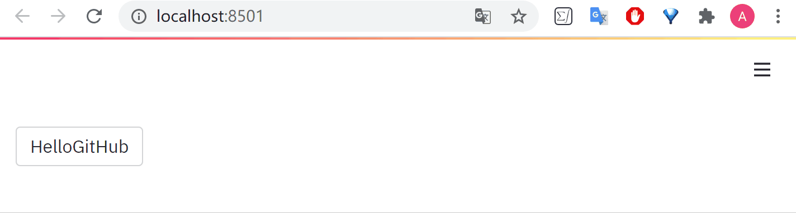

2、复选框 `checkbox`。

```python
ret = st.checkbox('I love HelloGitHub!')
if ret:
  st.write('Me too~')
```

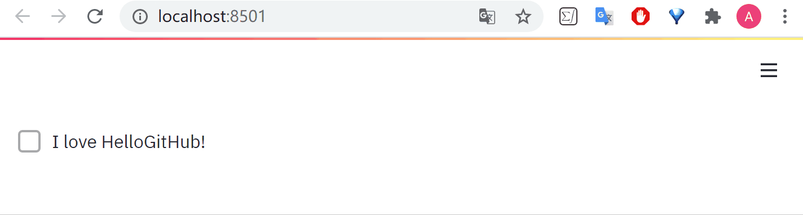

3、滑块 `slider`，可以选择 int / float / data / time / datetime 等类型。

```python
age = st.slider('HelloGitHub 几岁了?', 0, 10, 1)
st.write("HelloGitHub ", age, ' 岁了~')
```

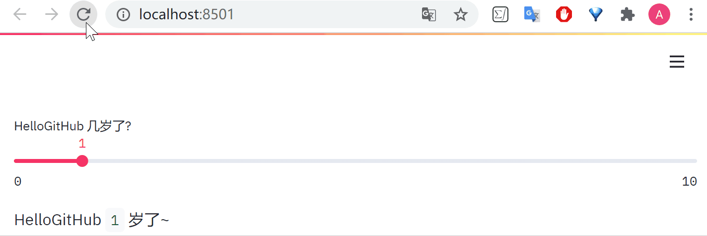

4、常用的命令列举

| 命令 | 效果 |
| --- | ---- |
| `st.radio()` | 单选按钮 |
| `st.select()`  | 单选框 |
| `st.multiselect()` | 多选框 |
| `st.text_input()` | 单行文本输入框 |
| `st.text_area()` | 多行文本输入框 |
| `st.number_input()` | 数字输入框 |
| `st.date_input()` | 日期输入框 |
| `st.time_input()` | 时间输入框 |
| `st.file_uploader()` | 文件上传 |
| `st.color_picker()` | 取色器 |

#### 2.2.7 显示进程和状态

1、进度条 `progress`。

```python
import time
my_bar = st.progress(0)
for percent_complete in range(100):
    time.sleep(0.1)
    my_bar.progress(percent_complete + 1)
```


2、`spinner`：在执行代码块时临时显示一条消息。

```python
import time
with st.spinner('Wait for it...'):
    time.sleep(5)
st.success('Done!')
st.balloons()
```

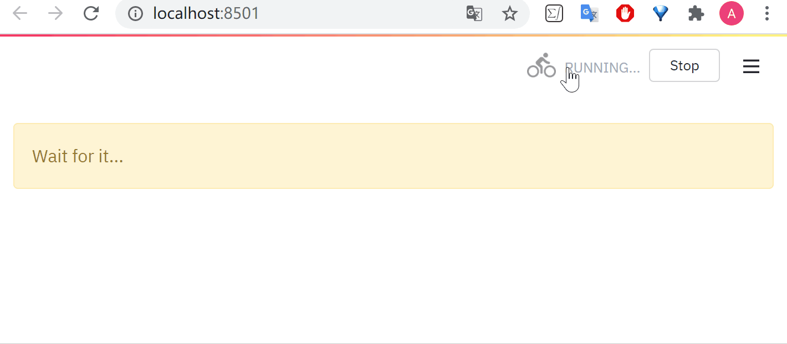

3、其他

| 命令 | 效果 |
| ---- | ---- |
| `st.balloons()` | 庆祝气球 |
| `st.error()` / `st.warning()` / `st.info()` / `st.success()` / `st.exception()` | 错误、警告、提示、成功、报错信息提示 |

#### 2.2.8 性能优化

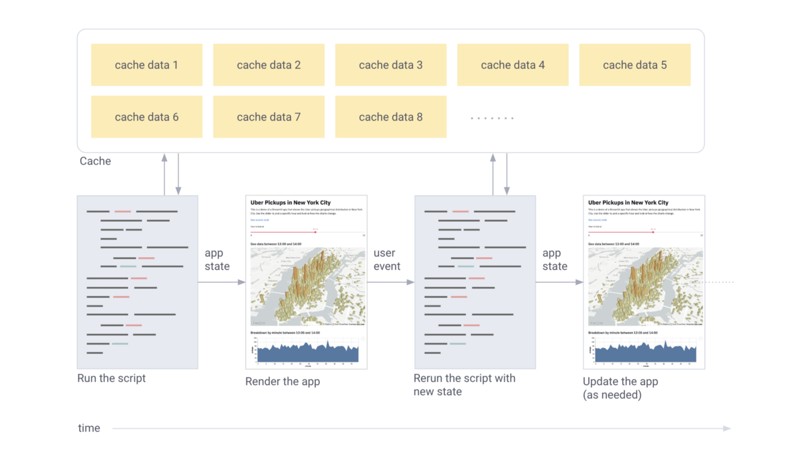

Streamlit 使用 `@st.cache` 装饰器使得页面能够快速“无痕”刷新。当我们给函数打上 `cache` 标记时，Streamlit 在碰到该函数的时候会检查三个值：函数名称、函数体、输入参数。如果发现这三个值的组合第一次出现，则会运行函数，并且将结果存储在本地缓存中。当下次调用该函数时，如果这三个值没有改变，则 Streamlit 会跳过函数执行，直接读取本地缓存返回结果。

```python
@st.cache
def HelloGitHub(url):
    # 返回相应数据
    return data

# 第一次遇到，执行该函数
d1 = HelloGitHub(DATA_URL_1)

# 传入参数一致，第二次遇到不会执行该函数
# 而会直接返回前一次计算的结果，d1 = d2
d2 = HelloGitHub(DATA_URL_1)

# 传入参数不同，重新执行该函数
d3 = HelloGitHub(DATA_URL_2)
```

#### 2.2.9 布局设置

1、将交互小部件放入侧边栏。

```python
add_selectbox = st.sidebar.selectbox(
    "Which one?",
    ("C++", "Java", "Python")
)
```

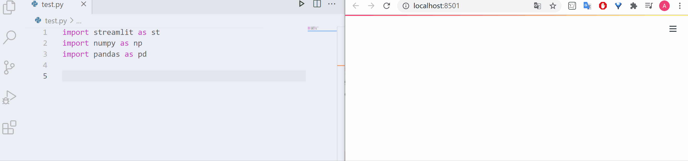

2、表单 `st.form()`：将元素与“提交”按钮一起处理。

```python
# 向表单插入元素
with st.form("my_form1"):
    st.write("我在 1 框框里~")
    slider_val = st.slider("框框滑块")
    checkbox_val = st.checkbox("pick me")
    # Every form must have a submit button.
    submitted = st.form_submit_button("1-Submit")

# 乱序插入元素
form = st.form("my_form2")
form.slider("我在 2 框框里~")
st.slider("我在外面")
# Now add a submit button to the form:
form.form_submit_button("2-Submit")
```

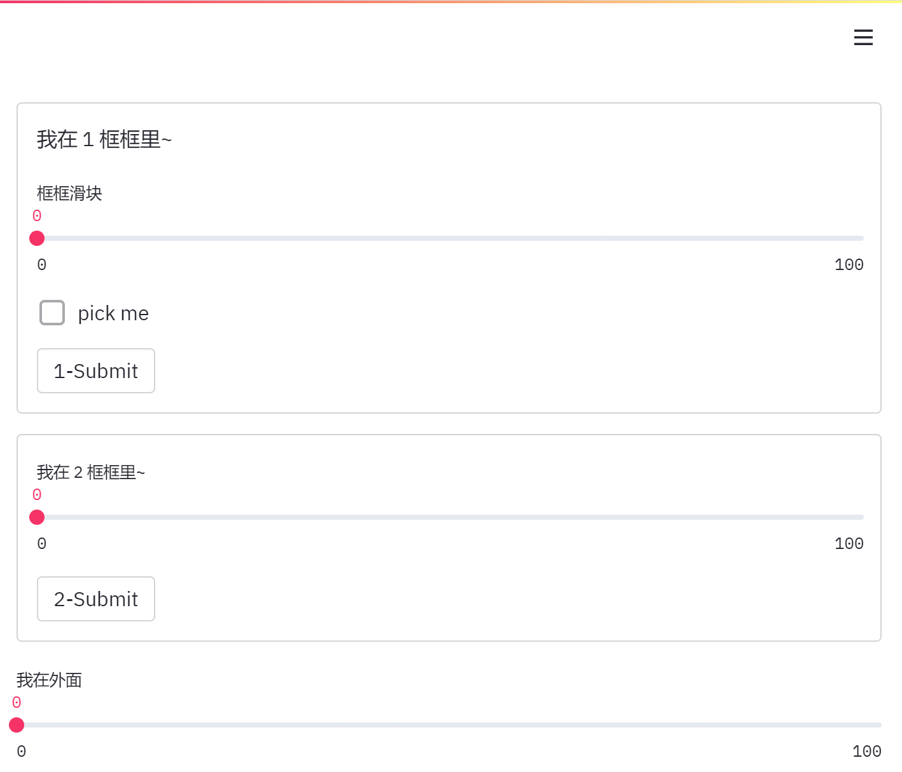

3、插入列并排的容器

```python
# 官方示例
col1, col2, col3 = st.beta_columns(3)
with col1:
    st.header("A cat")
    st.image("https://static.streamlit.io/examples/cat.jpg")
with col2:
    st.header("A dog")
    st.image("https://static.streamlit.io/examples/dog.jpg")
with col3:
    st.header("An owl")
    st.image("https://static.streamlit.io/examples/owl.jpg")
```

### 2.3 修改配置

1、查看所有的配置选项：`streamlit config show`。

2、Windows 系统可以在 `%userprofile%/.streamlit/config.toml` 全局文件下或者在当前运行 Streamlit 的文件夹下建立 `.streamlit/config.toml` 文件进行设置。

3、某些配置例如外观、主题等点击网页上的 `Settings` 也可轻松选择。

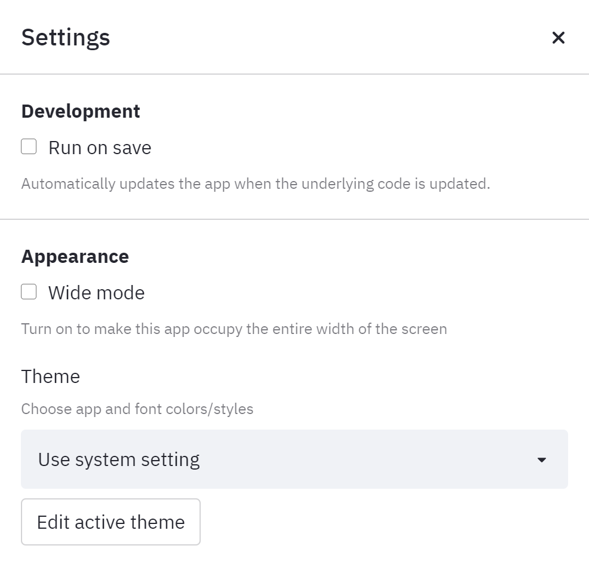

### 2.4 在 Streamlit sharing 上部署、管理和共享

1、将自己的项目代码上传到 GitHub 的共有仓库，添加需求文件以管理任何外部依赖项，例如 `requirements.txt` 等。

2、在 `https://streamlit.io/sharing` 上注册账号并且申请邀请「Request an invite!」。收到邀请电子邮件后，即可使用该平台部署管理。

3、选择 `New app` 在 `Deploy an app` 中填入相应信息即可。

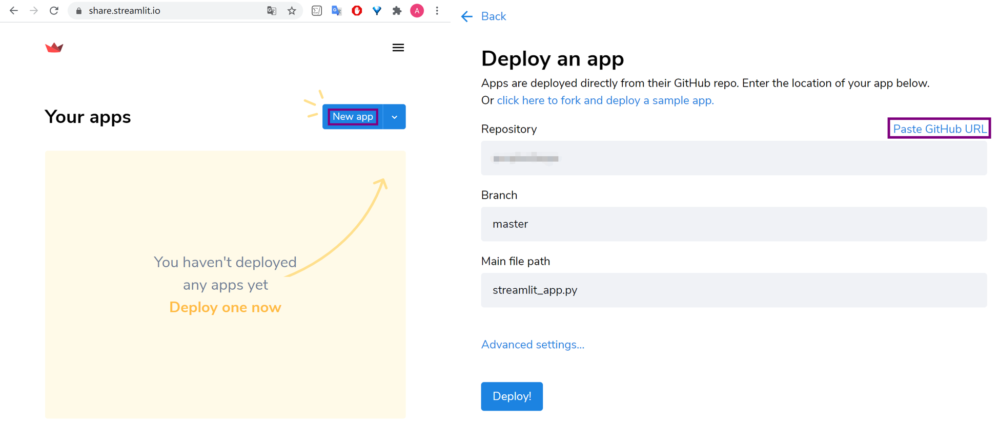

4、若应用程序有很多依赖项，则第一次部署可能需要一些时间，最终应用程序可以使用如下链接访问：

```
https://share.streamlit.io/[user name]/[repo name]/[branch name]/[app path]
```

## 三、精益求精

到此，Streamlit 框架的基本接口和用法都已经讲完啦！更多详情还需要友友们在实践中探索，并将指令成功“嵌入”到自己的项目中。

很多命令在文档的「API cheat sheet」中都可以快速搜索到，希望很快就能够在 Streamlit Gallery 上看到大家分享的应用，可以留言给我地址我会去把玩的~。

最后，您的关注和宝贵三连「收藏、点赞、在看」，是对我们 HelloGitHub 莫大的支持，我们将会为您源源不断推送新鲜、有趣的开源项目。

参考：

- [Turn Python Scripts into Beautiful ML Tools](https://towardsdatascience.com/coding-ml-tools-like-you-code-ml-models-ddba3357eace)
- [Streamlit Docs](https://docs.streamlit.io/)
- [Streamlit Sharing](https://share.streamlit.io/)
- [Streamlit Gallery](https://streamlit.io/gallery)
