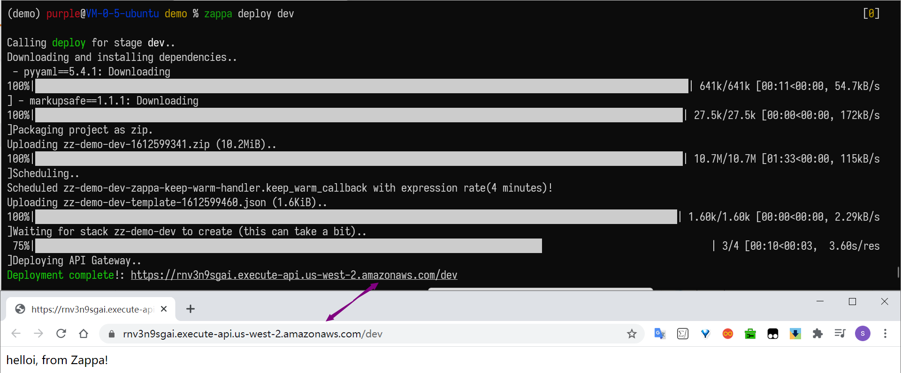
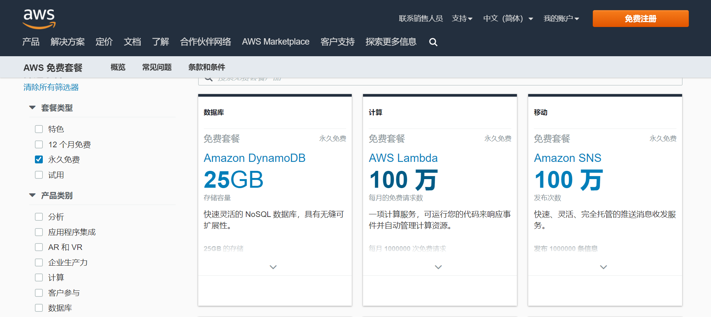
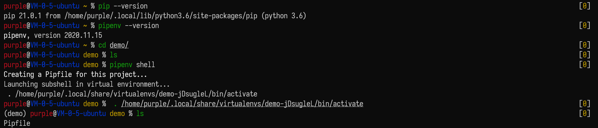
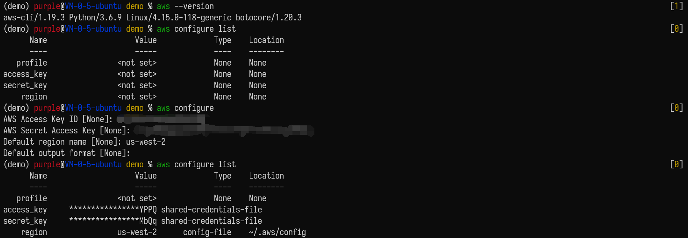
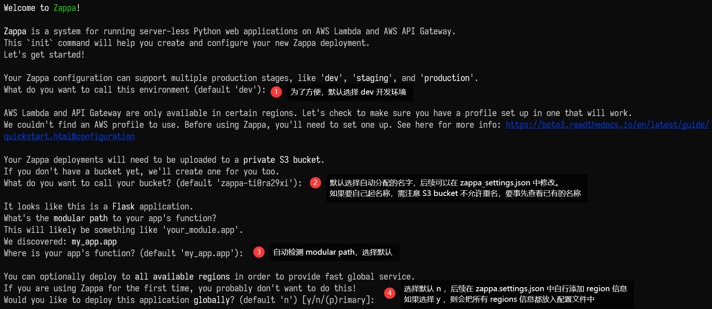

# 上线 Python 应用仅需一条命令的开源框架：Zappa（详细教程）

> 本文面向有 Python Web 基础的小伙伴


作者：HelloGitHub-吱吱

这里是 **HelloGitHub 推出的[《讲解开源项目》](https://github.com/HelloGitHub-Team/Article)系列**，今天要向小伙伴们介绍一个 Python 无服务（Serverless）框架 Zappa。

Zappa 让我们可以轻松部署 Python 应用程序：仅需几条命令、打包代码、上传云服务器、程序上线，bingo 一气呵成！从此减少部署成本，放下运维的重担。仅需你有一点点 Python Web 基础！

它到底有多便捷？下面就让我们上手来试试吧！



> 项目地址：https://github.com/Miserlou/Zappa

## 一、前言

### 1.1 介绍 Serverless

刚开篇便提到了一个~~莫名其妙~~的名词：**无服务（Serverless）**，一开始我也是问号脸，经过多方搜证，我们可以简单的认为 Serverless 是指不必担心底层基础结构，不需要管理服务器，从而来构建和运行应用程序。具体概念小课堂如下：

#### 1.1.1 什么鬼？

回忆一下，平时上线一个简单的 Python Web 应用的过程。

- 一个 24 小时不间断运行的服务器：比如云主机，用以搭建代码运行环境和进行系统配置，维持着运行我们的应用；
- 部署 Web 服务器：我们需要选择合适的 Web 服务器，经过配置和启动，实现反向代理和负载均衡；
- 域名绑定：最后如果要被广泛用户访问，我们需要注册域名，并且绑定在服务器；
- 运营维护：配置和启动在应用上线之后，我们还需要管理和维护我们的服务器，预防黑客攻击，应对未来用户访问高峰期。

而对于使用 Serverless 架构的应用，我们只需要关心我们的应用编写和核心业务，无需操心云主机、操作系统、资源分配和 Web 服务器配置等相关问题，无需考虑服务器的规格大小、存储类型、网络带宽、自动扩缩容问题，无需再对服务器进行运维、不断打系统补丁和应用补丁、无需进行数据备份等工作。一切非核心业务都外包给了公共云营运商，让开发人员从复杂的部署和运维环境中脱身出来，专注于业务本身的价值。

用 Zappa 里的一句话说就是 **“without any permanent infrastructure”**（无需任何永久性基础设施）。

敲黑板，尽管从名字上说是 Serverless，但是仍然需要物理服务器，只是我们开发人员成了甩手掌柜。

#### 1.1.2 好处有？

- 降低运维需求和维护成本；
- 完全自动化的弹性扩容和缩容：在业务高峰期时，产品的计算能力和容量自动扩大，承载更多的用户请求；反之，在业务下降时，所使用的资源也会同时收缩，避免资源浪费；
- 节省开支，全新的计量计费模式：开发者仅需根据使用量来付费。在无业务量的情况下，不会有空闲资源占用，也不会有费用产生。

#### 1.1.3 普遍认为 Serverless = FaaS + BaaS

- BaaS（Backedn as a Service 后端即服务）
  - 后端，指的就是各种云产品和云服务，例如对象存储 OS ，消息队列 MQ，云数据库 DB，云缓存 Redis以及各种以 API 形式提供的服务。用户直接开通即可使用，无需考虑部署、扩容、备份、安全等各种运维工作。
- FaaS（Functions as a Service 函数即服务）
  - 是 Serverless 的核心，让用户仅需编写和上传核心业务代码，交由平台完成部署、调度、流量分发和弹性伸缩等能力，它提供了一种新的方式来提供计算资源，进一步降低云计算的使用门槛。

#### 1.1.4 AWS Lambda

在该项目中，伸手白嫖[ AWS 海外区域账户免费 AWS Lambda 套餐](https://amazonaws-china.com/cn/free/?cs-awsft-actsft&sc_channel=ta&sc_campaign=freetier_crosslink&sc_country=cn&sc_geo=chna&sc_category=mult&sc_outcome=acq&trkCampaign=freetier_crosslink_acts&trk=request_for_pilot_account&all-free-tier.sort-by=item.additionalFields.SortRank&all-free-tier.sort-order=asc)。[AWS Lambda](https://amazonaws-china.com/cn/lambda/?did=ft_card&trk=ft_card) 作为 Serverless 最早的框架产品由亚马逊在2014年推出，是一种无服务器的计算服务，无需预置或管理服务器即可运行代码。Lambda 几乎可以为任何类型的应用程序或后端服务运行代码，我们只需上传相应的代码，它会处理运行和扩展代码所需的一切工作。



### 1.2 Python 的 Serverless 框架

本篇文章的主角：Zappa 登场！我们可以通过 Zappa 工具体验一下 Serverless 技术，用它实现我们 Python 应用程序的无服务器部署，初步体验无限伸缩扩展、零宕机、零维护的快捷。有了 Zappa，我们无需：

- **配置** Web 服务器
- **付费** 24/7 服务器的正常运行时间
- **担心**负载平衡和可扩展性
- **保持**自己的服务器时刻在线状态

## 二、亲自动手

实战时间：已经实验（踩坑）成功（不断）的我就来分享部署一个简单的 `Flask` 应用的过程，不要担心跟着做你也可以~

### 2.1 环境

1. Python版本要求：3.6/3.7/3.8
2. 测试系统：Ubuntu 18.04.4 LTS

### 2.2 准备

1. **保证**自己的项目是运行在[虚拟环境](https://docs.python-guide.org/dev/virtualenvs/)下。

    ```bash
    # 需要安装 Python 3.x 版本
    python --version

    # 安装 Pipenv
    pip install --user pipenv

    # 进入自己的项目
    cd demo

    # 实例化 pipfile 和 venv
    pipenv shell
    ```

    

2. **安装** Zappa 和 Flask，项目需要其他库的话，可自行添加。

    ```bash
    $ pipenv install zappa flask
    ```

    

3. 在目录下创建 `my_app.py` 文件，写入官方样例，可以先 `pipenv run python my_app.py`看看是否能正常运行

    ```python
    from flask import Flask
    app = Flask(__name__)

    @app.route('/')
    def hello():
        return "hello, from Zappa!\n"

    if __name__ == '__main__':
        app.run()
    ```

4. [注册 AWS 账户](https://portal.aws.amazon.com/gp/aws/developer/registration/index.html?nc2=h_ct&src=default)，并且正确安装 AWS credentials file

    - 登录 AWS，找到 `My Security Credentials` 下的 `Access keys (access key ID and secret access key)` ，如果没有则创建一个，记住 `access key ID` 和 `secret access key`

    - 安装 AWS 的命令行界面，添加 credentials

        ```bash
        # 在虚拟环境下安装
        pipenv install awscli

        # 查看信息
        aws configure list

        # 添加，并且按照提示将 access key ID 和 secret access key 填入
        aws configure

        # 后两个 region name 和 output format 选填
        ```
        
        
     
    - 此时在 `~/.aws` 目录下会出现两个文件 config 和 credentials，credentials 中储存了 AWS 的 ` access key ID` 和 `secret access key`， config 中储存了 region name 和  output format 信息。
    - 如果是在 Windows 上操作的同学，可以查看官方提供的安装 AWS credentials file 的[教程](https://amazonaws-china.com/cn/blogs/security/a-new-and-standardized-way-to-manage-credentials-in-the-aws-sdks/)。

### 2.3 安装与配置

1. 通过执行下面语句进行初始化，定义部署和配置的设置，自动检测应用类型（Flask 或 Django）

    ```bash
    $ zappa init
    ```

    在执行过程中，可能需要如下设置，后续也可以在新生成的 `zappa_setting.json` 的配置文件中修改：

    

    完成后，我们的项目目录中将有一个 `zappa_settings.json` 文件，里面是我们刚刚定义的基本部署设置，后期我们可以按照自己的需求修改此文件。

    ```json
    {
        "dev": {
            "app_function": "my_app.app",
            "profile_name": null,
            "project_name": "demo",
            "runtime": "python3.6",
            "s3_bucket": "zappa-ti0ra29xi"
        }
    }
    ```

2. 注意如果之前已经在 `~/.aws/config` 文件中添加 region 信息，则会在 `zappa init` 的时候自动寻找到这些 region 信息，无需后续修改。
   
    如果之前没有添加，则修改 `zappa_settings.json`，添加 region 信息如下：
   
    ```bash
    # 修改如下
    {
        "dev": {
            "app_function": "my_app.app",
            "profile_name": null,
            "project_name": "demo",
            "runtime": "python3.6",
            "s3_bucket": "zappa-ti0ra29xi"
            "aws_region": "us-west-2"
        }
    }
    ```
   
    region 的信息可以自行选择，[具体信息请移步](https://docs.aws.amazon.com/zh_cn/general/latest/gr/rande.html)。

### 2.4 部署和使用

配置设置后，可以使用如下命令将应用程序打包并部署：

```bash
$ zappa deploy dev
```

当我们调用 deploy 时，Zappa 会自动将我们的应用程序和本地虚拟环境打包到 Lambda 兼容的 archive，用为 Lambda 预先编译的版本替换所有依赖项，设置功能处理程序和必要的 WSGI 中间件，然后上传 archive 到 S3，创建和管理必要的Amazon IAM 策略和角色，将其注册为新的 Lambda function，创建新的 API 网关资源，为其创建 WSGI 兼容的路由，将其链接到新的 Lambda function，最后从 S3 bucket 中删除 archive。

执行成功后，就会出现一个链接，点击链接即可访问我们的简易 Web 应用。看到已上线的应用程序，心内窃喜，直呼快准狠。


## 三、其他命令

1. 更新操作：假设应用程序已经部署完毕，并且只需要上传新的Python代码，而无需修改基础路由，则可以执行以下操作：

    ```bash
    $ zappa update dev
    ```

    这将创建一个新的 archive，将其上传到 S3 并更新 Lambda function 以使用新代码。

2. 查看部署和事件计划的状态，只需使用命令：

    ```bash
    $ zappa status production
    ```

3. 查看部署的日志：

    ```bash
    $ zappa tail dev

    # 过滤 HTTP 请求
    $ zappa tail dev --http

    # 执行相反操作，并且仅显示非 HTTP 事件和日志消息
    $ zappa tail dev --non-http

    # 选择时长
    $ zappa tail dev --since 4h # 4 hours
    ```

4. 回滚操作： 通过提供要返回的修订版本数将部署的代码回滚到以前的版本。

    ```bash
    # 回滚到3年前部署的版本
    $ zappa rollback production -n 3
    ```

5. 安排 function 定期执行：修改 `zappa_setting.json` ，加入如下内容：

    ```json
    {
        "dev": {
            ...
            "events": [{
                // The function to execute
                "function": "your_module.your_function",
                // When to execute it (in cron or rate format)
                "expression": "rate(1 minute)" 
            }],
            ...
        }
    }
    ```

    然后执行如下操作，我们的 function 就会在每分钟执行一次。

    ```bash
    $ zappa schedule dev

    # cancal
    $ zappa unschedule dev
    ```

6. 取消部署：如果要删除以前发布的 API Gateway 和 Lambda function，则只需：

    ```bash
    $ zappa unschedule dev
    ```

## 四、踩坑建议

在成功运行一次之前，踩坑千千万万遍，都是因为自己手残眼瞎魔改了很多地方，把经历过的报错记录下来，分享给和我一样的小小白。

1. `“Unable to import module ‘handler’: attempted relative import with no known parent package”`：原因是我们期望的依赖在虚拟的环境中没有，需要查看自己虚拟环境中的依赖是否完整，[解决请移步](https://medium.com/@gregorypierce/unable-to-import-module-handler-attempted-relative-import-with-no-known-parent-package-f3545ab91df1)。

2. 出现如下报错，可以更换一个 region 信息，[解决请移步](https://github.com/Miserlou/Zappa/issues/1194)。

    ```bash
    $ zappa deploy dev
    Calling deploy for stage dev..
    Creating demo-dev-ZappaLambdaExecutionRole IAM Role..
    Error: Failed to manage IAM roles!
    You may lack the necessary AWS permissions to automatically manage a Zappa execution role.
    Exception reported by AWS:An error occurred (InvalidClientTokenId) when calling the CreateRole operation: The security token included in the request is invalid.
    To fix this, see here: https://github.com/Miserlou/Zappa#custom-aws-iam-roles-and-policies-for-deployment
    ```

3. 如果我们在 `zappa init` 的时候，不使用默认分配的 `s3_bucket` ，则须注意自己的名称是不允许重名的，点击查看[官方方法](https://amazonaws-china.com/cn/premiumsupport/knowledge-center/s3-error-bucket-already-exists/)，否则会报错 `botocore.errorfactory.BucketAlreadyExists: An error occurred (BucketAlreadyExists) when calling the CreateBucket operation: The requested bucket name is not available. The bucket namespace is shared by all users of the system. Please select a different name and try again.` 。

## 五、写在最后

是不是当自己成功部署后，突然觉得妙不可言，一身轻松，好像再也没有了之前所说的繁琐的过程，反而几条命令，白嫖 AWS 的服务，咱的应用程序就轻巧上线了呢，还不赶紧把生成的链接分享给小伙伴们点击一下。

至此，我们已经可以基本实现快速部署一个简单的 Flask 应用了，由于篇幅有限，还有部分 Zappa 的高级功能没有提及，以及如何使用 Zappa 部署 Django 应用或者一个更为庞大的项目（包含数据库等），希望感兴趣的小伙伴们能够多多尝试，我已经开始期待的搓搓手了。如果大家对开源项目感兴趣，请第一时间关注我们 HelloGitHub，我们将会为大家带来更多有趣的干货内容。 