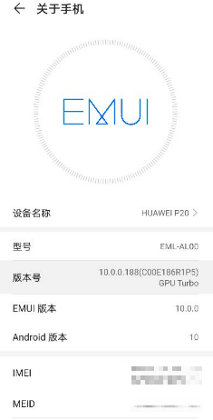

# 这款开源测试神器，圆了我玩游戏不用动手的梦想


一天我在公司用手机看游戏直播，同事问我在玩什么游戏？我和他说在看直播，他恍然大悟：原来如此，我还纳闷你玩游戏，咋不用动手呢。。。。一语惊醒梦中人：玩游戏不用动手，怎样才能做到玩游戏不用手呢？我要去 GitHub 上找找～


本期介绍的是 GitHub 上标星 5.4k 由网易开源和维护的开源项目：**Airtest** 一款基于 Python 的跨平台 UI 自动化测试框架，释放双手“玩”游戏、“耍”应用！


> 项目地址：https://github.com/AirtestProject/Airtest

所谓 UI 自动化就是让游戏和应用，按照预先设定的步骤自己动。可用来实现自动测试应用，也可以用来实现应用自动化。。。就像升级版按键精灵？

## 一、应用场景

首先这个项目适合所有读者，只要跟着本教程仅需会一点 Python 语法，就可以学会用 Airtest 解决一些重复性的工作，释放你的双手！比如：检测僵尸好友、批量点赞、刷游戏副本、自动化测试等等。


如果测试同学上手了 Airtest 就会赞不绝口，毕竟测试界面的每个按钮是否有效是一个机械性的任务，**不应该让机械的操作浪费宝贵的时间**，有了它可以轻松搞定“点点点”的测试需求。

另外 Airtest 对于普通使用者能做到最有意思的事情就是做 **游戏自动化**。例如，在游戏中经常会有许多固定模式的日常任务，通过 Airtest 可以让这些枯燥的日常任务，**自动执行**从而节省时间。对于阴阳师等游戏配合游戏自带的自动战斗经过调试我们甚至可以做到**全自动游玩**，让玩家彻底解放双手！

看到这里是不是跃跃欲试了呢？下面就跟着小编一起上手 Airtest 吧~

## 二、上手

安装：

```shell
$ pip install -U airtest
```

对于新手来讲，我个人推荐使用官方推出可视化编辑器 **AirtestIDE**，使用起来非常方便，一键快速连接安卓、iOS 等设备，同时支持图像识别与 UI 元素识别。


> 下载地址：https://airtest.netease.com/

后面的教程也是采用 AirtestIDE 讲解，手机为 Android 系统。

### 1. 打开手机开发者模式

打开手机的设置界面，找到 **关于手机** 界面：


连续点击 **版本号** 栏目直到提示开发者模式已经打开：




然后根据机型不同，找到开发人员选项中，打开**开发人员选项** -> **USB 调试** -> **“仅充电”模式下允许ADB调试**，关闭 **监控 ADB 安装应用**


之后将我们的手机使用数据线与电脑连接起来。

> 注意：为了防止发生安全问题，不连接 AirtestIDE 时请关闭 USB 调试功能！

### 2. 连接安卓手机

启动 AirtestIDE 后会提示需要登录，这里可以直接点击 Skip 跳过。然后我们就能看到主界面啦：


当手机连接到电脑后，点击**设备连接窗口**的**刷新 ADB**按钮后等待一会儿就能看见我们的手机：


点击 **操作** 栏的 **connect** 后即可连接手机。

> 第一次连接时在手机上会弹出认证提示，无特殊情况点击同意即可

之后就能看到我们手机画面：


同时鼠标可代替手指进行点击操作。

### 3. 实现自动访问 HG 官网


实现手机自动访问网站仅需要简单的 3 步：

1、在 **Airtest 辅助窗** 找到 **touch** 与 **text**：


2、点击 **touch** 后在手机画面选择浏览器图标截图，生成如下代码：


3、选择 **text** 输入：**www.hellogithub.com**

最后点击 **运行** 按钮即可。

> 注意，此部分由于需要安装 yosemite 调试工具可能需要先运行几次才可成功，而且图像识别有一定概率会失败

同样，IDE 也支持录制动作，点击 **Airtest 辅助窗** 里的录像按钮即可：


之后使用鼠标操作手机，IDE 就会自动为我们生成脚本了。

### 4. 生成报告（测试人员最爱）

Airtest 可以非常方便的生成测试报告，只需要点击 IDE 上方的生成报告按钮：


即可自动生成全面的测试报告：


## 三、自动识别

在实际应用中，有些时候是图片识别无法完成或者存在困难的，这时我们可以利用 Poco 工具直接识别 UI 框架定位元素。

一个很简单的例子，自动打开 HG 的微信小程序并分享机器学习的内容：

```python
from airtest.core.api import *
from poco.drivers.android.uiautomation import AndroidUiautomationPoco

poco = AndroidUiautomationPoco()

auto_setup(__file__)

poco(text="HelloGitHub").click()
poco(text="#机器学习").click()
poco(text="tutorials").click()
poco("android.widget.Button").click()
```

利用 IDE 的 Poco 录制功能可以很方便的自动生成上述代码，实际效果如下：


在应用当中巧妙地利用 Poco 可以节省很多图片识别时间以及应用背景不同时程序的稳定性。

## 四、结语

到这里 Airtest 的演示就结束啦！本文仅仅演示了 Airtest 最基本的功能。游戏自动化只是其中很小的一个功能，它主要还是用来做自动化测试。支持不同设备同时进行测试，但对于使用者而言有一定的上手门槛，感兴趣去的小伙伴可以去深入研究研究，但要注意方向呀~


> 《讲解开源项目》：https://github.com/HelloGitHub-Team/Article

最后，感谢您的阅读！这里是 HelloGitHub 分享 GitHub 上有趣、入门级的开源项目。您的每个点赞、留言、分享都是对我们最大的鼓励!