# Airtest，优秀的UI测试框架！

> 本项目适合有一定 Python 开发经验的朋友。


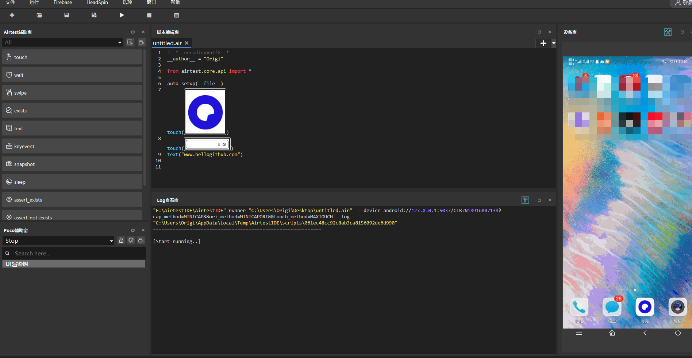HelloGitHub 推出的[《讲解开源项目》](https://github.com/HelloGitHub-Team/Article)系列，本期介绍 Python 的 UI 测试框架——**Airtest**，其在 Github 上标星 5.2k，且有大场网易负责维护，当属UI自动化框架的不二之选！

> 项目地址：https://github.com/AirtestProject/Airtest
>
> Airtest官网：https://airtest.netease.com/home/

**Airtest** 官方对于 Airtest 的介绍是：**跨平台的UI自动化框架，适用于游戏和 App**。

本文将利用 **AirtestIDE** 简单了解 **Airtest** 框架。

## 一、安装：

```shell
$ pip install -U airtest
```

对于新手来讲，我个人推荐使用官方推出的 **AirtestIDE**，使用起来非常方便，支持一键连接 安卓、IOS、Windows 窗口，同时支持图像识别与 UI 元素识别，跨平台通用性也非常好，后面的内容也是基于 AirtestIDE。

> 下载地址： https://airtest.netease.com/home/

## 二、应用前景

对于编写 UI 的朋友，airtest 支持多个平台，甚至包括利用 chrome 模拟点击网页。个人开发者运用虚拟机配合 airtest 及其测试报告能够加速我们 UI 的调试速度——毕竟测试界面的每个按钮是否有效是一个机械性的任务，时间长了难免会影响心情，不应该浪费我们宝贵的时间。

当然，airtest 对于普通开发者来讲能做到最有意思的事情就是做 **游戏自动化**。例如，在游戏中经常会有许多固定模式的日常任务，通过 airtest 我们可以让这些枯燥的日常任务自动执行从而节省时间。对于阴阳师等游戏配合游戏自带的自动战斗经过调试我们甚至可以做到**全自动游玩**，让玩家彻底解放双手！

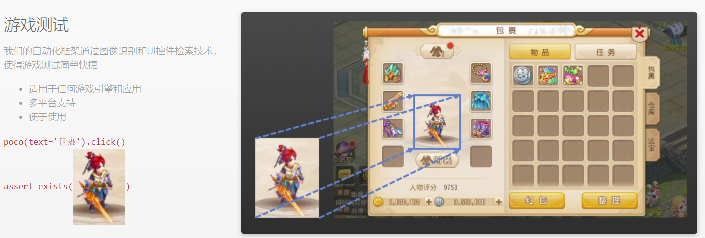

> 图片源自 airtest 官网


## 三、简单使用

### 1. 启用开发者模式

打开手机的设置界面，找到 **关于手机** 界面：

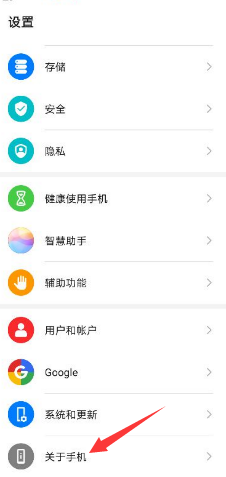


连续点击 **版本号** 栏目直到提示开发者模式已经打开：

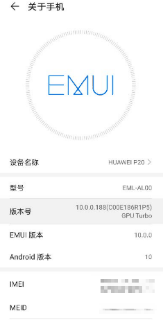


之后根据机型不同，找到开发人员选项中，打开**开发人员选项**、**USB 调试**、**“仅充电”模式下允许ADB调试**，关闭 **监控 ADB 安装应用**


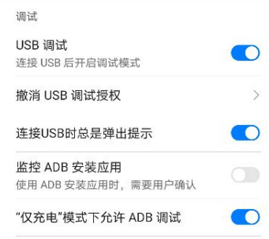

之后将我们的手机使用数据线与电脑连接起来。

> 注意：为了防止发生安全问题，不连接 AirtestIDE 时请关闭 USB 调试功能！

### 2. 连接安卓手机

启动 AirtestIDE 后会提示我们需要登录，这里可以直接点击 Skip 跳过。

之后我们就能看到主界面：

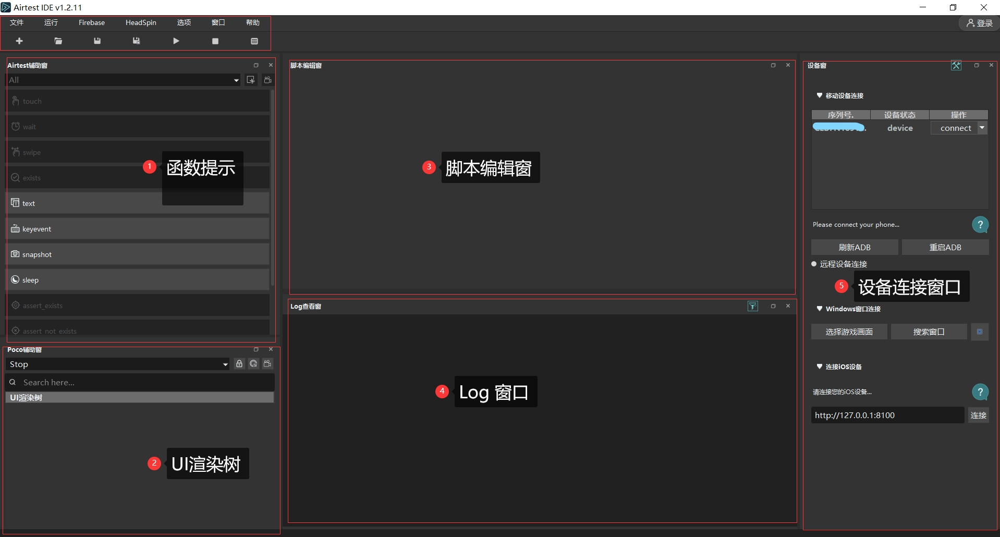

当手机连接到电脑后，点击**设备连接窗口**的**刷新 ADB**按钮后等待一会儿就能看见我们的手机：

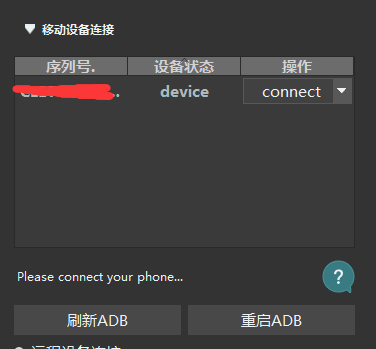

点击，**操作** 栏的 **connect** 后即可连接手机。

> 第一次连接时在手机上会弹出认证提示，无特殊情况点击同意即可

之后就能看到我们手机画面：

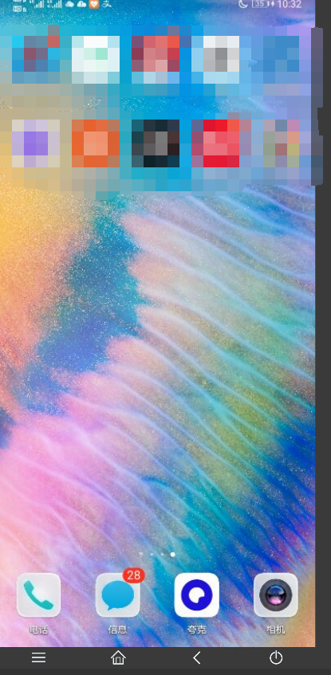

同时鼠标可代替手指进行点击操作。

### 3. 自动访问 HG 官网


实现开头部分所展示的效果只需要简单几步：

1. 在 **Airtest 辅助窗** 找到 **touch** 与 **text**：

   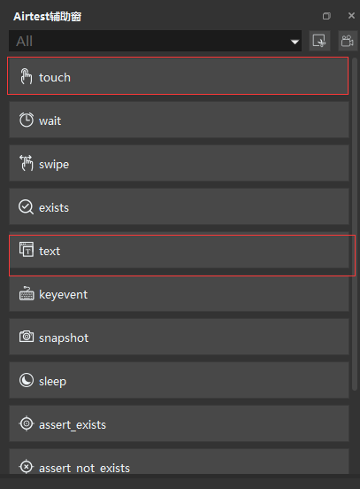

2. 点击**touch**后在手机画面选择浏览器图标截图，生成如下代码：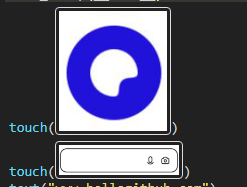

4. 选择**text**，输入 **www.HelloGitHub.com**

最后点击 **运行** 按钮即可。

> 注意，此部分由于需要安装 yosemite 调试工具可能需要先运行几次才可成功，而且图像识别有一定概率会失败

同样，IDE 也支持录制动作，点击**Airtest 辅助窗** 里的录像按钮即可：

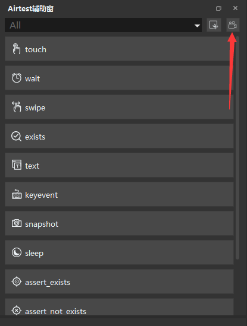

之后使用鼠标操作手机，IDE 就会自动为我们生成脚本了。

### 4. 生成报告

Airtest 可以非常方便的生成测试报告，只需要点击 IDE 上方的生成报告按钮：

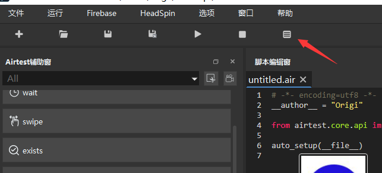

即可自动生成全面的测试报告：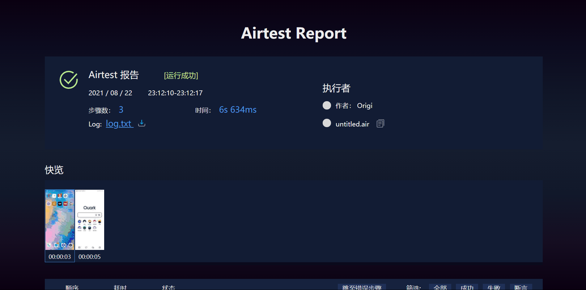

### 5. Poco 工具

在实际应用中，有些时候是图片识别无法完成或者存在困难的，这时我们可以利用 Poco 工具直接识别 UI 框架定位元素

一个很简单的例子，自动打开 HG 的微信小程序并分享机器学习的内容：

```python
from airtest.core.api import *
from poco.drivers.android.uiautomation import AndroidUiautomationPoco

poco = AndroidUiautomationPoco()

auto_setup(__file__)

poco(text="HelloGitHub").click()
poco(text="#机器学习").click()
poco(text="tutorials").click()
poco("android.widget.Button").click()
```

利用 IDE 的 Poco 录制功能可以很方便的自动生成上述代码，实际效果如下：


在应用当中巧妙地利用 Poco 可以节省很多图片识别时间以及应用背景不同时程序的稳定性。

## 四、结语

到这里 Airtest 的演示就结束啦！本文仅仅演示了 Airtest 最基本的功能。在实际使用当中，Airtest 不仅可以用于游戏自动化，还可以实现不同设备同时进行测试，但对于使用者而言有一定的上手门槛。

最后，感谢您的阅读。这里是 HelloGitHub 分享 GitHub 上有趣、入门级的开源项目。您的每个点赞、留言、分享都是对我们最大的鼓励!

## 五、参考资料

Airtest 官方教程：https://airtest.doc.io.netease.com/tutorial/1_quick_start_guide/

Airtest 官方文档：https://airtest.doc.io.netease.com/