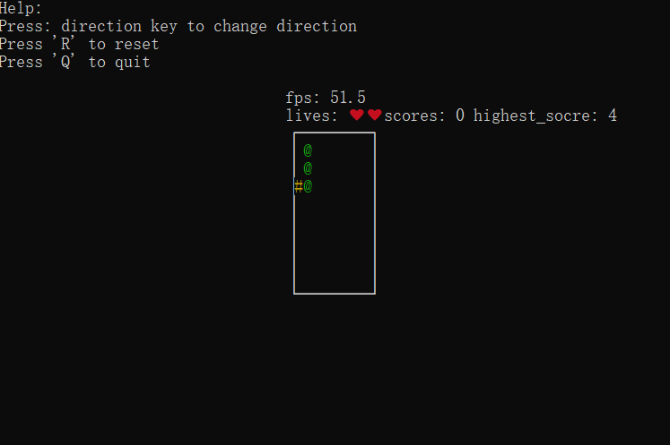
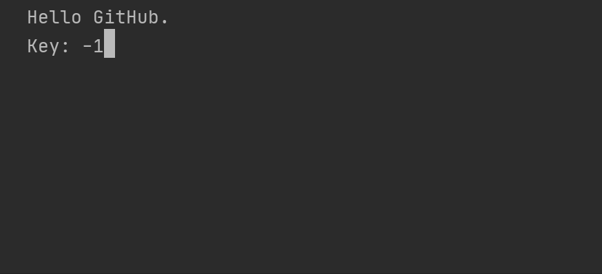
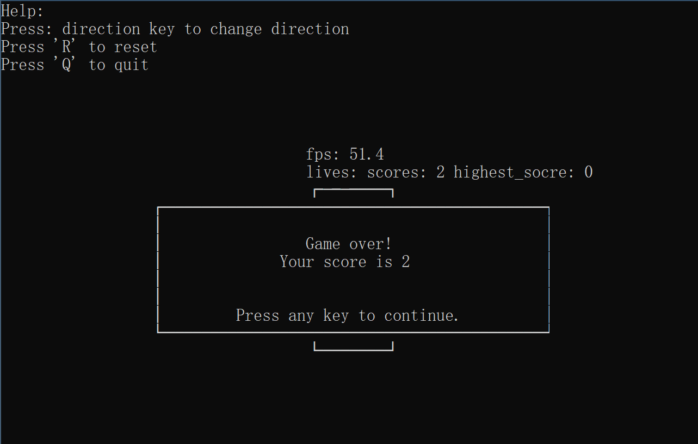
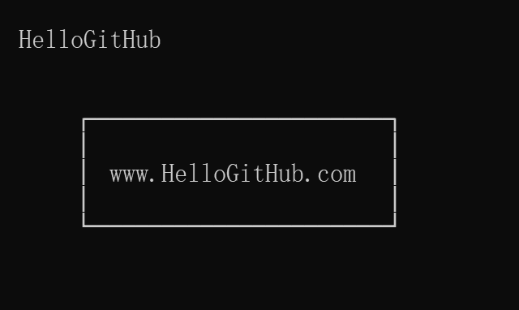
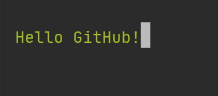
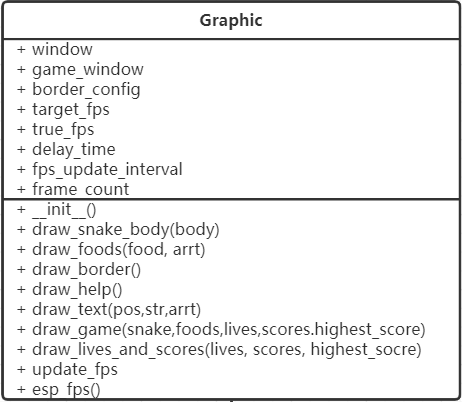
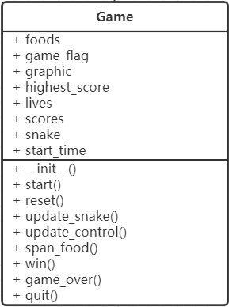

# 自己动手实现超简单的贪吃蛇

> 本文适合有 Python 基础的朋友

HelloGitHub 推出的[《讲解开源项目》](https://github.com/HelloGitHub-Team/Article)系列，本期介绍新手练手级项目——**snake**.

> 项目地址：https://github.com/AnthonySun256/easy_games


> 灵感来自：https://github.com/tancredi/python-console-snake

作为 Python 新手，你是不是一直想写出一个自己的图形化程序但又不知从何下手？今天，我来教大家如何从零做起利用 Python 和 命令行 实现一个简易又不失美感的小游戏——**贪吃蛇**.



本文分为两个部分：我们首先简单了解 Python 命令行图形化库 **curses** 接着解读 **snake** 相关代码。

## 一、环境配置与使用

Python 已经内置了 curses 库，但是对于 Windows 操作系统我们需要安装一个补丁以进行适配。

Windows 下安装补全包：

> pip install windows-curses

游戏使用：

```shell
cd easy_games
python snake
```


## 二、初识 curses

curses 是一个应用广泛的图形函数库，可以在终端内绘制简单的用户界面。

在这里我们只进行简单的介绍，只学习贪吃蛇需要的功能

> 如果您已经接触过 curses，请跳过此部分内容。

### 2.1. 简单使用

Python 内置了 curses 库，其使用方法非常简单，以下脚本可以显示出当前按键对应编号：

```python
# 导入必须的库
import curses
import time

# 初始化命令行界面，返回的 stdscr 为窗口对象，表示命令行界面
stdscr = curses.initscr()
# 使用 noecho 方法关闭命令行回显
curses.noecho()
# 使用 nodelay(True) 方法让 getch 为非阻塞等待（即使没有输入程序也能继续执行）
stdscr.nodelay(True)
while True:
    # 清除 stdscr 窗口的内容（清除残留的符号）
    stdscr.erase()
    # 获取用户输入并放回对应按键的编号
    # 非阻塞等待模式下没有输入则返回 -1
    key = stdscr.getch()
    # 在 stdscr 的第一行第三列显示文字
    stdscr.addstr(1, 3, "Hello GitHub.")
    # 在 stdscr 的第二行第三列显示文字
    stdscr.addstr(2, 3, "Key: %d" % key)
    # 刷新窗口，让刚才的 addstr 生效
    stdscr.refresh()
    # 等待 0.1s 给用户足够反应时间查看文字
    time.sleep(0.1)
```



> 您也可以尝试把 nodelay(True) 改为 nodelay(False) 后再次运行，这时候程序会阻塞在 stdscr.getch() 只有当您按下按键后才会继续执行。

### 2.2. 整点花样

您也许会觉得上面的例子太菜了，随便用几个 print 都能达到相同的效果，现在我们来整点花样以实现一些使用普通输出无法达到的效果。

#### 2.2.1. 新建一个子窗口

说再多的话也不如一张图来的实际：



如果我们想要实现图中 **Game over!** 窗口，可以使用 ``newwin`` 方法：

```python
import curses
import time

stdscr = curses.initscr()
curses.noecho()
stdscr.addstr(1, 2, "HelloGitHub")
# 新建窗口，高为 5 宽为 25，在命令行窗口的 四行六列处
new_win = curses.newwin(5, 25, 4, 6)
# 使用阻塞等待模式
new_win.nodelay(False)
# 在新窗口的 2 行 3 列处添加文字
new_win.addstr(2, 3, "www.HelloGitHub.com")
# 给新窗口添加边框，其中边框符号可以这是，这里使用默认字符
new_win.border()
# 刷新窗口
stdscr.refresh()
# 等待字符输入（这里会一直等待输入）
new_win.getch()
# 删除新窗口对象
del new_win
# 清除所有内容（比 erase 更彻底）
stdscr.clear()
# 重新添加文字
stdscr.addstr(1, 2, "HelloGitHub")
# 刷新窗口
stdscr.refresh()
# 等待两秒钟
time.sleep(2)
# 结束 curses 模式，恢复到正常命令行模式
curses.endwin()
```



除了 ``curses.newwin`` 新建一个**独立**的窗口，我们还能在任意窗口上使用 ``subwin`` 或者 ``subpad`` 方法新建**子窗口**，例如 ``stdscr.subwin`` ``stdscr.subpad`` ``new_win.subwin`` ``new_win.subpad`` 等等，其使用方法与本节中创建的 ``new_win`` 或者 ``stdscr`` **没有区别**，只是新建窗口使用**独立**的缓存区，而子窗口和父窗口**共享**缓存区。

> 如果某个窗口会在使用后删除，最好使用 newwin 方法新建独立窗口，以防止删除子窗口造成父窗口的缓存内容出现问题。

#### 2.2.2 给点颜色

白与黑的搭配看久了也会显得单调，curses 提供了内置颜色可以让我们自定义前后背景。

在使用彩色模式之前我们需要先使用使用 ``curses.start_corlor()`` 进行初始化操作：

```python
import curses
import time
stdscr = curses.initscr()
stdscr.nodelay(False)
curses.noecho()
# 初始化彩色模式
curses.start_color()
# 在1号位置添加前景色是绿色，背景色是黑色的彩色对儿
curses.init_pair(1, curses.COLOR_GREEN, curses.COLOR_BLACK)
# 在一行一列处显示文字，使用 1号 色彩搭配
stdscr.addstr(1, 1, "HelloGitHub!", curses.color_pair(1))
# 阻塞等待按键然后结束程序
stdscr.getch()
curses.endwin()
```

> 需要注意的是，0号 位置颜色是默认黑白配色，无法修改



#### 2.2.3 给点细节

在此部分最后的最后，我们来说说如何给文字加一点文字效果:

```python
import curses
import time
stdscr = curses.initscr()
stdscr.nodelay(False)
curses.noecho()
# 之后的文字都加上下划线，直到调用 attroff为止
stdscr.attron(curses.A_UNDERLINE)
stdscr.addstr(1, 1, "www.HelloGitHub.com")
stdscr.getch()
```


## 三、贪吃蛇

前面说了这么多，现在终于到了我们的主菜，在这部分，我将一步步教给大家如何从零开始做出一个简单却又不失细节的贪吃蛇。

### 3.1 设计

对于一个项目来讲，相比于尽快动手写下第一行代码不如先花点时间进行一些必要的设计，毕竟结构决定功能，一个项目没有一个良好的结构是没有前途的。

**snake** 将贪吃蛇这个游戏分为了三大块：

1. 界面：负责显示相关的所有工作
2. 游戏流程控制：判断游戏输赢、游戏初始化等
3. 蛇和食物：移动自身、判断是否死亡、是否被吃等

每一块都被做成了单独的对象，通过相互配合实现游戏。下面让我们来分别看看应该如何实现。

### 3.2 蛇语者

对于贪吃蛇游戏里面的蛇来讲，它可以做的事情有三种：移动，死亡（吃到自己，撞墙）和吃东西

围绕着这三个功能，我们可以首先写出一个简陋的蛇，其类图如图所示：


这个蛇可以检查自己是不是死亡，是不是吃了东西，以及更新自己的位置信息。

其中，``body`` 和 ``last_body`` 是列表，分别存储当前蛇身坐标和上一步蛇身坐标，默认列表第一个元素是蛇头。``direction`` 是当前行进方向，``window_size`` 是蛇可以活动的区域大小。

``rest`` 方法用于重置蛇的状态，它与 ``__init__`` 共同负责蛇的初始化工作：

```python
class Snake(object):
    def __init__(self) -> None:
        # Position 是我自定义的类，只有 x, y 两个属性，存储一个坐标点
        # 初始化蛇可以移动范围的大小
        self.window_size = Position(game_config.game_sizes["width"], game_config.game_sizes["height"])
        # 初始化移动方向
        self.direction = game_config.D_Down
        # 重置身体列表
        self.body = []
        self.last_body = []
        # 生成新的身体，默认在左上角，头朝下，长三个格子
        for i in range(3):
            self.body.append(Position(2, 3 - i))
	# rest 重置相关属性
    def reset(self) -> None:
        self.direction = game_config.D_Down
        self.body = []
        self.last_body = []
        for i in range(3):
            self.body.append(Position(2, 3 - i))
```

> Position 是我自定义的类，只有 x, y 两个属性，存储一个坐标点
>
> 在最开始我们可能只是模糊的感觉应该有这几个属性，但是对于其中的内容和初始化方法又不完全清楚，这是正常的。我们需要做的就是继续实现需要的功能，在实践中添加和完善最初的构想。

之后，我们从继续上到下实现，对照类图，我们接下来应该实现一下 ``update_snake_pos`` 即 更新蛇的位置，这部分非常简单：

```python
def update_snake_pos(self) -> None:
    # 这个函数在文章下方，获得蛇在 x, y 方向上分别增加多少
    dis_increment_factor = self.get_dis_inc_factor()
    # 需要注意，这里要用深拷贝（import copy）
    self.last_body = copy.deepcopy(self.body)
	# 先移动蛇头，然后蛇身依次向前
    for index, item in enumerate(self.body):
        if index < 1:
            item.x += dis_increment_factor.x
            item.y += dis_increment_factor.y
        else:  # 剩下的部分要跟着前一部分走
            item.x = self.last_body[index - 1].x
            item.y = self.last_body[index - 1].y
```
> 其实 last_body 可以只记录最后一次修改的身体，这里我偷了个懒

在这里有一个细节，如果我们是第一次写这个函数，为了让蛇头能够正确的按照玩家操作移动，我们需要知道蛇头元素在 x, y 方向上各移动了多少。

最简单的方法是直接一串 if-elif，判断方向再相加：

```python
if self.direction == LEFT:
    head.x -= 1
elif self.direction == RIGHT:
    head.x += 1
    ....
```

但是这样的问题在于，如果我们的需求更改（比如我现在说蛇可以一次走两个格子，或者吃了特殊道具，x, y 方向上走的距离不一样等等）直接修改这样的代码会让人很痛苦。

所以在这里更好的解决办法是使用一个 ``dis_increment_factor`` 存储蛇再 x 和 y 上各移动多少，并且新建一个函数 ``get_dis_inc_factor`` 进行判断：

```python
def get_dis_inc_factor(self) -> Position:
    # 初始化
    dis_increment_factor = Position(0, 0)

    # 修改每个方向上的速度
    if self.direction == game_config.D_Up:
        dis_increment_factor.y = -1
    elif self.direction == game_config.D_Down:
        dis_increment_factor.y = 1
    elif self.direction == game_config.D_Left:
        dis_increment_factor.x = -1
    elif self.direction == game_config.D_Right:
        dis_increment_factor.x = 1

    return dis_increment_factor
```

> 当然了，这么做或许有点多余，但是努力做到一个函数只做一件事情能帮助化简我们的代码，降低写出又臭又长还难调试代码的可能性。

解决了移动问题，下一步就是考虑贪吃蛇如何吃到食物了，在这里我们用 ``check_eat_food`` 和 ``eat_food`` 两个函数完成：

```python
def eat_food(self, food) -> None:
    self.body.append(self.last_body[-1])  # 长大一个元素

def check_eat_food(self, foods: list) -> int:  # 返回吃到了哪个食物
    # 遍历食物，看看当前食物和蛇头是不是重合，重合就是吃到
    for index, food in enumerate(foods):
        if food == self.body[0]:
            # 吃到食物则调用 eat_food 函数，处理蛇身长大等操作
            self.eat_food(food)
            # 弹出吃掉的食物
            foods.pop(index)
            # 返回吃掉食物的序号，没吃则返回 -1
            return index
    return -1
```
在这里，``foods`` 是一个存储着所有食物位置信息的列表，每次蛇体移动后都会调用 `check_eat_food` 函数检查是不是吃到了某一个食物。

> 可以发现，检查是不是吃到和”吃下去“ 这两个动作我分为了两个函数，以做到每个函数“一心一意”方便后期修改。

现在，我们的蛇已经能跑能吃了。但是作为一只能照顾自己的贪吃蛇，我们还需要能够判断当前自身状态，比如最基本的我需要知道我刚刚是不是咬到自己了，只需要看看蛇头是不是移动到了身体里面：

```python
def check_eat_self(self) -> bool:
    return self.body[0] in self.body[1:]  # 判断蛇头是不是和身体重合
```

或者我想知道是不是跑得太快而撞了墙：

```python
def check_hit_wall(self) -> bool:
    # 是不是在上下边框之间
    is_between_top_bottom = self.window_size.y - 1 > self.body[0].y > 0
    # 是不是在左右边框之间
    is_between_left_right = self.window_size.x - 1 > self.body[0].x > 0
    # 返回 是 或者 不是 撞了墙
    return not (is_between_top_bottom and is_between_left_right)
```

这些功能都是简单得不能再简单了，但是要相信自己，就是这么简单的几行代码就能实现一个听你指挥能做出复杂动作的**蛇**

> 完整代码见文章开头处的 项目地址

### 3.3 命令行？画板！

上一节中我们实现了游戏里的第一位角色：**蛇**。为了将它显示出来我们现在需要将我们的命令行改造成一块”画板“。

在动手之前我们同样思考：我们需要”画“哪些东西在我们的命令行上？我们直接给出类图：



是不是觉得有些眼花缭乱以至于感觉无从下手？其实 ``Graphic`` 类方法虽多但是大多数方法只是执行一个**特定**的功能而已，而且**每次**更新游戏**只需要调用** ``draw_game`` 方法即可：

```python
def draw_game(self, snake: Snake, foods, lives, scores, highest_score) -> None:
    # 清理窗口字符
    self.window.erase()
    # 绘制帮助信息
    self.draw_help()
    # 更新当前帧率
    self.update_fps()
    # 绘制帧率信息
    self.draw_fps()
    # 绘制生命、得分信息
    self.draw_lives_and_scores(lives, scores, highest_score)
    # 绘制边框
    self.draw_border()
    # 绘制食物
    self.draw_foods(foods)
    # 绘制蛇身体
    self.draw_snake_body(snake)
    # 更新界面
    self.window.refresh()
    # 更新界面
    self.game_area.refresh()
    # 延迟一段时间，以控制帧率
    time.sleep(self.delay_time)
```
> 遵循 从上到下设计，从下到上实现 的原则

可以看出 ``draw_game`` 实际上已经完成了 ``Graphic`` 的所有功能。

再往下深入，我们可以发现类似 ``draw_foods`` ``draw_snake_body`` 实现基本一样，都是遍历坐标列表然后直接在相应位置上添加字符即可：

```python
def draw_snake_body(self, snake: Snake) -> None:
    for item in snake.body:
        self.game_area.addch(item.y, item.x,
                             game_config.game_themes["tiles"]["snake_body"],
                             self.C_snake)

def draw_foods(self, foods) -> None:
    for item in foods:
        self.game_area.addch(item.y, item.x,
                             game_config.game_themes["tiles"]["food"],
                             self.C_food)
```
将其分开实现也是为了保持代码干净易懂以及方便后期修改。``draw_help`` ``draw_fps`` ``draw_lives_and_scores`` 也是分别打印了不同文字信息，没有任何新的花样。

``update_fps`` 实现了帧率的估算以及调节等待时间稳定帧率：

```python
def esp_fps(self) -> bool:  # 返回是否更新了fps
    # 每 fps_update_interval 帧计算一次
    if self.frame_count < self.fps_update_interval:
        self.frame_count += 1
        return False
    # 计算时间花费
    time_span = time.time() - self.last_time
    # 重置开始时间
    self.last_time = time.time()
    # 估算帧率
    self.true_fps = 1.0 / (time_span / self.frame_count)
    # 重置计数
    self.frame_count = 0
    return True

def update_fps(self) -> None:
    # 如果重新估计了帧率
    if self.esp_fps():
        # 计算误差
        err = self.true_fps - self.target_fps
        # 调节等待时间，稳定fps
        self.delay_time += 0.00001 * err
```
``draw_message_window`` 则实现了绘制胜利、失败的画面：

```python
def draw_message_window(self, texts: list) -> None:  # 接收一个 str 列表
    text1 = "Press any key to continue."
    nrows = 6 + len(texts)  # 留出行与行之间的空隙
    ncols = max(*[len(len_tex) for len_tex in texts], len(text1)) + 20
	# 居中显示窗口
    x = (self.window.getmaxyx()[1] - ncols) / 2
    y = (self.window.getmaxyx()[0] - nrows) / 2
    pos = Position(int(x), int(y))
    # 新建独立窗口
    message_win = curses.newwin(nrows, ncols, pos.y, pos.x)
    # 阻塞等待，实现任意键继续效果
    message_win.nodelay(False)
    # 绘制文字提示
    # 底部文字居中
    pos.y = nrows - 2
    pos.x = self.get_middle(ncols, len(text1))
    message_win.addstr(pos.y, pos.x, text1, self.C_default)
	# 绘制其他信息
    pos.y = 2
    for text in texts:
        pos.x = self.get_middle(ncols, len(text))
        message_win.addstr(pos.y, pos.x, text, self.C_default)
        pos.y += 1
	# 绘制边框
    message_win.border()
	# 刷新内容
    message_win.refresh()
    # 等待任意按键
    message_win.getch()
    # 恢复非阻塞模式
    message_win.nodelay(True)
    # 清空窗口
    message_win.clear()
    # 删除窗口
    del message_win
```
这样，我们就实现了游戏动画的显示！

### 3.4 控制！

到目前为止，我们实现了游戏内容绘制以及游戏角色实现，本节我们来学习 snake 的最后一个内容：**控制**。

老规矩，敲代码之前我们应该先想一想：如果要写一个 ``control`` 类，他应该都包含哪些方法呢？



仔细思考也不难想到：应该有一个循环，只要没输或者没赢就一直进行游戏，每轮应该更新画面、蛇移动方向等等。这就是我们的 ``start``：

```python
def start(self) -> None:
    # 重置游戏
    self.reset()
	# 游戏运行标志
    while self.game_flag:
		# 绘制游戏
        self.graphic.draw_game(self.snake, self.foods, self.lives, self.scores, self.highest_score)
		# 读取按键控制
        if not self.update_control():
            continue
        # 控制游戏速度
        if time.time() - self.start_time < 1/game_config.snake_config["speed"]:
            continue
        self.start_time = time.time()
        # 更新蛇
        self.update_snake()
```
只要我们写出了 ``start`` 对于剩下的结构也就能轻松的实现，比如读取按键控制就是最基本的比较数字是不是一样大：

```python
def update_control(self) -> bool:
    key = self.graphic.game_area.getch()

    # 不允许 180度 转弯
    if key == curses.KEY_UP and self.snake.direction != game_config.D_Down:
        self.snake.direction = game_config.D_Up
    elif key == curses.KEY_DOWN and self.snake.direction != game_config.D_Up:
        self.snake.direction = game_config.D_Down
    elif key == curses.KEY_LEFT and self.snake.direction != game_config.D_Right:
        self.snake.direction = game_config.D_Left
    elif key == curses.KEY_RIGHT and self.snake.direction != game_config.D_Left:
        self.snake.direction = game_config.D_Right
    # 判断是不是退出
    elif key == game_config.keys['Q']:
        self.game_flag = False
        return False
    # 判断是不是重开
    elif key == game_config.keys['R']:
        self.reset()
        return False
```

更新蛇的状态时只需要判断是不是死亡、胜利、吃到东西就可：

```python
def update_snake(self) -> None:
    self.snake.update_snake_pos()
    index = self.snake.check_eat_food(self.foods)
    if index != -1:  # 如果吃到食物
        # 得分 +1
        self.scores += 1
        # 如果填满了游戏区域就胜利
        if len(self.snake.body) >= (self.snake.window_size.x - 2) * (self.snake.window_size.y - 2):  # 蛇身已经填满游戏区域
            self.win()
        else:
            # 再放置一个食物
            self.span_food()
	# 如果死了，就看看是不是游戏结束
    if not self.snake.check_alive():
        self.game_over()
```

### 3.5 直接使用

为了让这个包能够直接使用 ``python snake`` 就能直接开始游戏，我们来看一下 ``__main__.py`` ：

```python
import game

g = game.Game()
g.start()
g.quit()
```

当我们尝试直接运行一个包时，Python 自动从 ``__main__.py`` 中开始执行，对于我们写好的代码，只需三行即可开始游戏！

## 四、结尾

到这里如何编写一个贪吃蛇游戏就结束了，实际上编写一个小游戏不难，难的是对于新手来讲如何去组织程序的结构。我所实现的只是其中的一种方法，每个人对于游戏结构理解不同所写出的代码也会不同。但无论怎样，我们都应该遵循一个目标：尽量遵循代码规范，养成良好的风格，这样不仅利于别人阅读你的代码也利于自己排查 bug，更新新的功能。

## 五、参考

curses 接口文档：https://docs.python.org/zh-cn/3/library/curses.html

python-console-snake：https://github.com/tancredi/python-console-snake