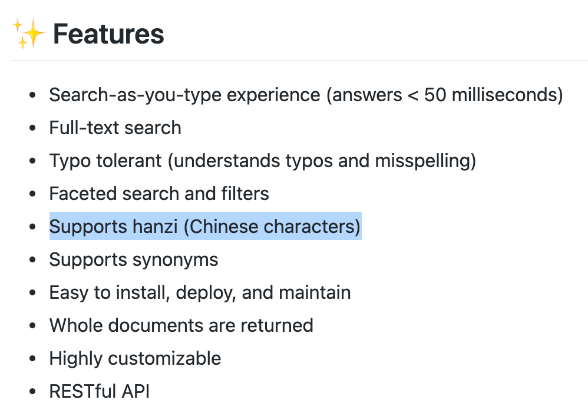
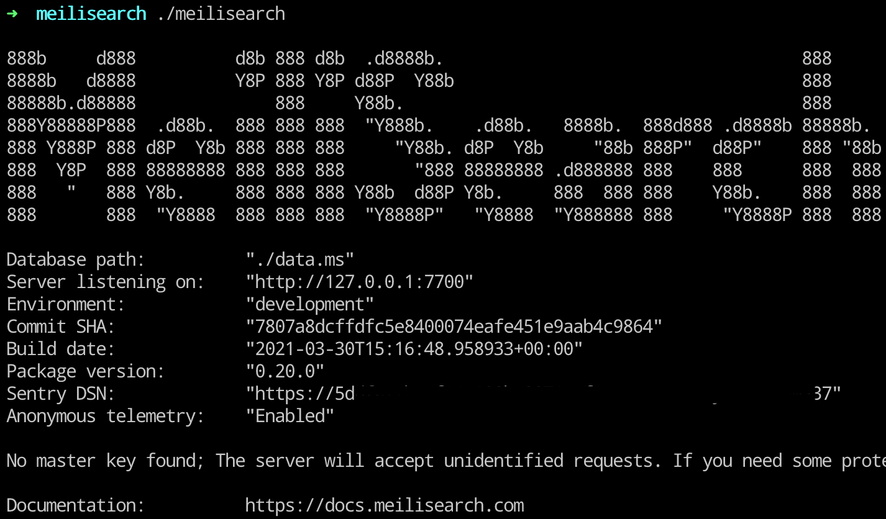
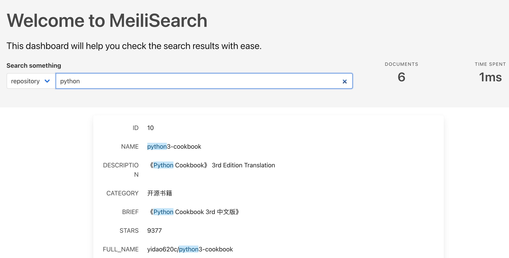

## 开源的傻瓜搜索引擎，帮你快速实现搜索功能

> 傻瓜一词借鉴自傻瓜相机，又称轻便相机、全自动相机，通常指容易操作针对一般人而设计的小型全自动相机。


在 HelloGitHub 找到有趣、入门级的开源项目，大家好我是卤蛋。说到开源搜索引擎第一个想到的应该是鼎鼎大名的 ElasticSearch，但 ES 对于个人项目有些重。

今天给大家带来一款轻盈、人人都会用的开源傻瓜搜索引擎——MeiliSearch

> https://github.com/meilisearch/MeiliSearch


在介绍 MeiliSearch 之前，我想先聊下我是怎么找到它并喜欢上它的。


## 我的要求并不高

我开发的 HelloGitHub 小程序：支持关键字搜索往期月刊中的开源项目。


小程序的搜索功能是用 Rust 写的开源搜索引擎 Sonic，它虽然搜索速度快但使用过程中发现：

- 不支持中文分词，导致搜索结果较差
- 没有官方的 Python 客户端，三方开源客户端问题较多
- 搜索返回的结果仅有 ID，需要再去数据库关联其他数据

这些问题直接影响了搜索的体验，让我十分苦恼一边看搜索相关的知识，另外也在寻找新的开源解决方案。想找一个：

**部署+配置简单、支持中文分词、搜索速度快、轻量级开源搜索引擎项目。**

俗称：傻瓜中文搜索引擎。


## 它有个美丽的名字


它有个“美丽”（meili）的名字「MeiliSearch」，同样是用 Rust 写的开源搜索引擎，支持：



概述功能：搜索速度快、全文搜索、支持汉字、容易安装和维护，这不就是我在找的：傻瓜中文搜索引擎吗？

我已经摩拳擦掌的跃跃欲试了，话不多说搞起！

## 简单的开始

纸上得来终觉浅，得上手试试效果。

### 1、安装和启动
Linux & Mac OS 的一键安装和启动的命令：

```
curl -L https://install.meilisearch.com | sh
./meilisearch
```
这个安装够不够傻瓜🤪 启动成功如下图：



用浏览器访问：`http://127.0.0.1:7700/` 就可以看到 MeiliSearch 提供的 Web 搜索页面。我提前写入了一些数据，用来演示搜索：




### 2、基本操作

MeiliSearch 就是一个搜索的服务，提供 RESTful API 通讯协议更加通用，官方提供了多种编程语言的客户端：
- JavaScript
- Python
- PHP
- Go
- ...

后面的演示将采用 Python 代码作为示例，安装 Python SDK：

```
# 要求 Python3.6+
pip3/pip install meilisearch
```

用 Python 实现连接、写入、查询、删除等基本操作：

```python
import meilisearch

client = meilisearch.Client('http://127.0.0.1:7700', 'masterKey') # masterKey 是密码

# index 相当于数据库的表
index = client.index('books')

# 准备写入搜索的数据
documents = [
  { 'book_id': 123,  'title': 'Pride and Prejudice' },
  { 'book_id': 456,  'title': 'Le Petit Prince' },
  { 'book_id': 1,    'title': 'Alice In Wonderland' },
  { 'book_id': 1344, 'title': 'The Hobbit' },
  { 'book_id': 4,    'title': 'Harry Potter and the Half-Blood Prince' },
  { 'book_id': 42,   'title': 'The Hitchhiker\'s Guide to the Galaxy' }
]
# 删：清空指定 index
index.delete_all_documents()

# 写：
result = index.add_documents(documents) 
# 该引擎会根据写入数据 ID 做替换或者新增的操作
# 写入后并不代表搜索引擎处理完成，可以查看返回 updateId 的状态
index.get_update_status(result.get('updateId'))
# enqueued, processed or failed 三种状态（processed 代表完成）

# 查：
index.search('harry pottre')
# 结果：
# 包含丰富的字段
"""
{
  // 命中的结果
  "hits" => [{
    "book_id" => 4,
    "title" => "Harry Potter and the Half-Blood Prince"
  }],
  // 页
  "offset" => 0,
  // 每页条数
  "limit" => 20,
  // 处理耗时
  "processingTimeMs" => 1,
  // 查询的内容
  "query" => "harry pottre"
}
"""
```
至此已经实现了搜索的最基本的功能，但探索不止于此。

### 3、优化搜索效果

MeiliSearch 可通过配置规则来提高搜索结果：
- synonyms：同义词
- stopWords：停用词（为节省存储空间和提高搜索效率，自动过滤掉某些字或词）
- rankingRules：排序规则
- ...

可以用 Python 客户端更新 MeiliSearch 配置，示例代码：
```python
# 停用词
client.index('movies').update_settings({
  'stopWords': [
      'the',
      'a',
      'an'
  ],
})
# 排序规则
client.index('movies').update_ranking_rules([
    "typo",
    "words",
    "proximity",
    "attribute",
    "wordsPosition",
    "exactness",
    "asc(publish_time)",
    "desc(watch)"
])
# 查看 stop words
client.index('movies').get_stop_words()
# 重置设置
# index.reset_settings()
# 除了搜索其它操作都是异步，会直接返回一个 updateId 需要通过 ID 查询处理状态
# wait_for_pending_update 可阻塞等待处理结果
```

这些设置可以有效的提高搜索效果，比如使用停用词之前，搜索“开源的书籍”命中不了“开源书籍”，加了停用词即可命中，因为匹配时忽略了输入内容包含的停用词（无用词）。

说一个我遇到的坑，我测试搜索效果时发现：go 搜不到，但是 golang 就可以搜索到，排查了半天最后发现是因为 go 在上面的停用词字典中😅

另外，功能上对比 sonic 没有词联想（suggest），可以通过新建 index+searchableAttributes 实现。

同义词集合我没有找到，如果大家有现成的 中/英文 同义词词典，欢迎留言告诉我～感谢


### 4、部署
MeiliSearch 部署很简单，增加到系统的 systemd 服务就行了。

```
cat << EOF > /etc/systemd/system/meilisearch.service
[Unit]
Description=MeiliSearch
After=systemd-user-sessions.service

[Service]
Type=simple
ExecStart=/usr/bin/meilisearch --http-addr 127.0.0.1:7700 --env production --master-key xxxxxx

[Install]
WantedBy=default.target
EOF

# Set the service meilisearch
systemctl enable meilisearch

# Start the meilisearch service
systemctl start meilisearch

# Verify that the service is actually running
systemctl status meilisearch
```

但部署正式环境，需要注意以下几点：
1. 生产环境必须设置密码，开发环境无强制
2. 生产环境 Web 页面会关闭
3. 没有远程访问和权限控制，可以通过 Nginx 实现 IP 白名单+ Cerbot 实现 HTTPS，提高安全性
4. 可通过 `curl 地址` 查看服务状态

---

以上就是我使用 MeiliSearch 的一些心得，总体给我的感觉：
- 安装简单，没有复杂的配置：省心
- 数据写入方便，功能丰富：傻瓜
- 查询快

一条命令即可启动搜索服务，一行代码实现搜索功能，有了它我这个搜索小白都能分分钟实现一个搜索服务，舒服～

## 爱的结晶（实战）

我用 MeiliSearch 重写了 HelloGitHub 小程序的搜索功能，后端用的 FastAPI 框架。除此之外还增加了一些新功能：
1. 热门搜索词
2. 项目详情页
3. 项目镜像地址提高访问速度
4. 新的界面

HelloGitHub 小程序第二版效果图如下：


后面计划增加：信息流、评论、打分、用户系统、积分系统，因为只有我一个人开发，所以进度会很慢...但我不会半途而废哒 💪

## 最后

如果说 MeiliSearch 缺点的话，我觉得搜索准确度还有待提高，一方面我需要学习下分词和 NLP 的一些知识，另一方面需要再熟悉下它的 API 和原理，然后再找一些词典辅助，应该能提高准确度，但心急吃不了热豆腐慢慢来吧。

最后，希望本文的分享有帮助到你，今天的文章就到这里了。如果你也想分享把玩开源项目的心得，欢迎投稿原创文章给我，微信：xueweihan（备注：投稿）

> 优秀的开源项目像散落在海边的贝壳，需要发现它的人。
> 
> HelloGitHub 就是拾贝者，找开源项目来 HelloGitHub 就对了！
