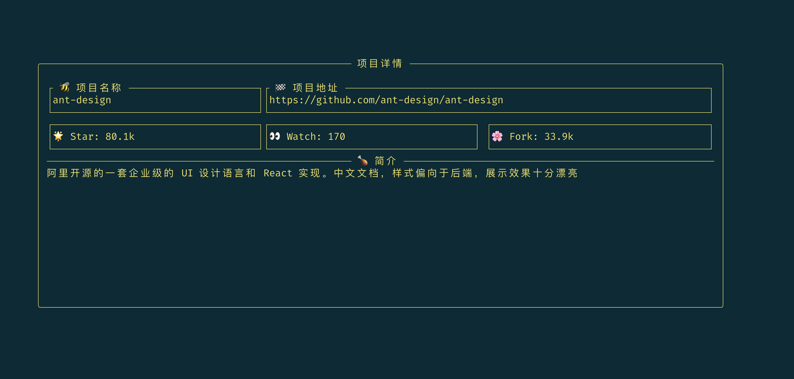

# 解锁！浏览 HelloGitHub.com 的新姿势

> 本文不会涉及太多技术细节和源码，请放心食用


大家好，我是 HelloGitHub 老荀，好久不见！

在完成 [HZK](https://github.com/HelloGitHub-Team/HelloZooKeeper) 系列之后，我就很少“露面了”，但是我对开源和 HelloGitHub 的热情并没有丝毫的减少，逮着机会就来输出一波，防止被大家遗忘。

这次带来的是我写的一款在终端浏览 HelloGitHub 的工具：hg-tui，让你双手不离开键盘就能畅游在 HG 的开源世界。功能如下：

- 色彩丰富、平铺展示
- 通过关键字搜索月刊往期的项目
- 类 Vim 的快捷键操作方式
- 一键直达开源项目首页
- 支持 Linux、macOS、Windows

> 地址：https://github.com/kaixinbaba/hg-tui

下面我将分享 hg-tui 开源项目的缘起、构思、开发的全部流程，最后还会分享我通过这个项目对开源的一些感悟。

## 一、起因

我前端时间一直在学 Rust，前段时间看到 HG 讲解 tui-rs 的文章。

看完后手痒的厉害，就写了一篇 tui-rs 入门文章，但感觉还不过瘾就像写一个项目练手。

因为我平时经常上 hellogithub.com 划水、找开源项目，所以就决定用 tui-rs 做一个终端浏览 hellogithub.com 的工具。

## 二、构思

首先我希望这个应用能有以下功能：

- 有搜索框，可以按关键词搜索 hellogithub 中的任意项目
- 通过表格按列展示搜索结果
- 既然是终端应用，那操作方式肯定是使用键盘方式，快捷键我采用了一些大家熟知的 Vim 快捷键
- 浏览项目的途中，可以随时在浏览器中打开当前浏览的项目

有了这些主要功能点的思路，下面就要想想怎么设计一个界面了，我本职工作是一条后端 🐶，一碰到画界面就头疼，几经周折，大概把界面设计成了这样：


又因为是 TUI 界面层级不能太深，所以再多弄个详情页面（用来浏览文字明细）或者弹窗页面（提示消息）就差不多了，我又想到了 GitHub 为每一种编程语言都设计了一种颜色，我可以把这些颜色应用在我的项目里，让整个终端界面看起来没那么单调，色彩更丰富。我这里展示下目前的成品效果图

主界面：


详情页：



弹窗提示：


最后为了向 TUI 妥协，按期数或类别搜索，我是通过使用搜索前缀来和普通关键词搜索作出区别

上面展示的这些差不多已经是这个项目的全部了

## 三、开发

### 3.1 技术选型

要实现上述的那些功能，就要从 Rust 的生态中选择合适的库了

下面这些是我这个项目中使用到的：

- 基础设施： `anyhow`、`thiserror`、`lazy_static`、`better-panic`
- 绘制 UI：`tui`、`crossterm`
- HTTP client：`reqwest`
- 缓存：`cached`
- HTML 解析：`nipper`
- 工具：`regex`、`crossbeam-channel`
- 命令行：`clap`

Rust 虽然还是编程界的小学生（2011 年启动），但是经过了这些年的发展，生态已经逐渐完善（和几位大哥还是差很多），加上 Rust 是系统级的语言，所以我相信未来 Rust 一定能成为多面手。

### 3.2 项目结构

项目目录规划（非全部）

```rust
src
├── app.rs		// 统一管理整个应用的状态
├── cli.rs		// 命令行解析
├── draw.rs		// 绘制 UI
├── events.rs		// UI 事件、输入事件、通知
├── fetch.rs		// HTTP 请求
├── main.rs		// 入口
├── parse.rs		// HTML 解析
├── utils.rs		// 工具
└── widget 		// 自定义组件
    ├── ...
```

合理的分文件（目录）开发，可以让每个功能模块 高内聚、低耦合，并且可以很容易的分开进行单元测试。

当然这些文件也不是在项目之初就已经一股脑的建立好的，都是在完善功能的路上一点点添加进来的～

### 3.3 代码片段

因为是基于 `tui-rs` 开发的应用，所以主流程肯定是遵循该库的设计的，首先需要定义一个 `App` 用来保存整个项目的状态信息

```rust
pub struct App {
    /// 用户输入框
    pub input: InputState,

    /// 内容展示
    pub content: ContentState,

    /// 弹窗提示
    pub popup: PopupState,

    /// 状态栏
    pub statusline: StatusLineState,

    /// 模式
    pub mode: AppMode,

    /// 项目明细子页面
    pub project_detail: ProjectDetailState,
		
  	...
}

```

每一个状态字段其实就是对应一个自定义组件，要在 `tui-rs` 中实现自定义组件（实现方式也是我自己的理解）也很简单，只要三步，我以 `Input` 组件为例

```rust
/// 用户输入框组件，组件本身没有字段，是一个无状态的对象
/// 无状态对象只关心 UI 怎么绘制，不存储数据
pub struct Input {}

/// 组件的状态，每一个字段就是组件需要存储的数据
#[derive(Debug)]
pub struct InputState {
    input: String,
    active: bool,
    pub mode: SearchMode,
}

/// 最后为 Input 组件实现 StatefulWidget trait
impl StatefulWidget for Input {
    type State = InputState; // 指定关联类型为 InputState
  
    /// area 绘制的区域
    /// buf 缓冲区（可以直接写入字符串，如果要高度定制的话，可以理解为画笔）
    /// state 从这个变量中直接取绘制过程中需要的数据
    fn render(self, area: Rect, buf: &mut Buffer, state: &mut Self::State) {
        // 具体绘制的逻辑
      	...
    }
}
```

只要是面向用户的应用都会处理各种各样的用户输入（事件），Rust 中一般都使用 channel 来解耦处理各种各样的事件，再利用 Rust 强大的枚举支持，定义各种各样的事件（用户输入和非用户输入）

```rust
/// 定义事件枚举
#[derive(Debug, Clone)]
pub enum HGEvent {
    /// 用户事件（键盘事件）
    UserEvent(KeyEvent),

    /// 应用内部组件的通知事件
    NotifyEvent(Notify),
}

#[derive(Debug, Clone, PartialEq)]
pub enum Notify {
    /// 重绘界面
    Redraw,

    /// 退出应用
    Quit,

    /// 弹出窗口展示消息
    Message(Message),

    /// tick，比如一些数据需要每隔一段时间自动更新的（比如：显示的时间）
    Tick,
}

/// 弹窗的消息，分为 错误、警告、提示
#[derive(Debug, Clone, PartialEq)]
pub enum Message {
    Error(String),

    Warn(String),

    Tips(String),
}
```

为了区分用户事件和通知，我使用了两个不同的 channel 分别处理这两类

```rust
lazy_static! {
    /// 因为通知队列希望被应用内部共享，所以使用了 lazy_static 方便使用
    pub static ref NOTIFY: (Sender<HGEvent>, Receiver<HGEvent>) = bounded(1024);
}
```

又因为不同的事件处理，并不应该互相阻塞，所以整个应用采用了最基础的多线程模型来提高性能，这里使用的也是标准库的多线程

```rust
pub fn handle_key_event(event_app: Arc<Mutex<App>>) {
    let (sender, receiver) = unbounded();
    ...

    std::thread::spawn(move || loop {
        // 单独一个线程接收用户事件
        if let Ok(Event::Key(event)) = crossterm::event::read() {
            sender.send(HGEvent::UserEvent(event)).unwrap();
        }
    });
    std::thread::spawn(move || loop {
      	// 单独一个线程处理用户事件
        if let Ok(HGEvent::UserEvent(key_event)) = receiver.recv() {
            ...
        }
    });
}
```

其他剩下的就是本应用的业务逻辑，具体的代码可以直接看仓库 [https://github.com/kaixinbaba/hg-tui](https://github.com/kaixinbaba/hg-tui) 

## 四、感悟

我一开始启动项目的时候，初衷很简单，仅仅是为了做个实际的项目把玩一下 `tui-rs`

- 作为项目的第一个用户
    - 自己既是产品也是开发，能让自己站在用户的角色考虑
- 开源就是以开放的态度接受别人的建议
- 没有与生俱来的完美，不断迭代让它越来越好（1 个月 100+ commit）
- GitHub Action 真的是一个强大的功能（其实这次是我第一次认真研究 GitHub Action 功能）
- homebrew 对项目 star 还有要求（吐槽），希望大家看到这里的话能给个 star✨

---

仔细想想这可能是我写的第一个拥有完整功能的 Rust TUI 项目，从有想法到完成开发前后差不多用了三周不到的时间，期间碰到了各种各样的问题，我整理了一下：

- tui-rs 如何使用，为了看懂她的模板流程，我基本看完了 tui-rs 本身的所有源码（源码很少说实话，并不是一件难事）
- 查看其他使用的 tui-rs 的项目，学习她们是如何使用 tui-rs 的（源码真的是宝藏，没什么问题是看源码解决不了的，看了不下数十个项目，如果你有兴趣的话，这里是[地址](https://github.com/fdehau/tui-rs#apps-using-tui)）
- 在生态中寻找合适的 Rust crate 来处理我当前的场景并学会使用她（Rust 的文档功能实在是太强了）
- 和 Rust 编译器斗智斗勇（Rust 编译器是我见过最强大的，一定要灵活运用搜索引擎，最后实在不行可以去 Rust 社区提问一把，Rust 的社区真的是很热情）
- 尽量编写符合 Rust 的代码风格项目（我写每一种编程语言都会去寻找她的最佳工程实践学习并遵守她，古话说得好，没有规矩不成方圆）

---

...

她从出生那一刻起，身体里流淌的就是开源的血。

软件世界里的开源，就像金庸世界中的侠客。每一个开源贡献者都是我心目中行走江湖的英雄，我心中那一点点的英雄主义和理想主义，羡慕着他们的同时也希望能像他们一样，为开源的世界贡献出自己的一点点微不足道的热情。

每一个开源项目可能都只是起源于作者的一个小小的灵光乍现，也可能只是为了解决自己实际工作生活中的小小痛点，但是随着功能的逐步完善，每一个小小的项目最终都可能成长成璀璨夺目的明星项目，然后为其他人甚至整个行业带来了生产力效率的提升，这可能也是每一个开源作者最终所期待的吧～

我的这个项目说实话很小，无论是代码量还是功能上，所以导致我一开始并不想写这样一篇文章去介绍她，[蛋蛋](https://github.com/521xueweihan)却用了一段话打动了我，其中印象最深的一句话是：**任何一个开源项目都是从小项目开始的。完成一个开源项目并不难，十年如一日的维护才是最难的**。

我最近也看了一个开源斗士的故事，故事不短很打动我，链接在[这里](https://gitstats.chenjiandongx.me/#/)，我想可能若干年后，我在工作中已经不写代码了，但是我相信我也会在生活之余写写自己的小玩意～

---

如果你们有什么好的建议，欢迎给我提 [issue](https://github.com/kaixinbaba/hg-tui/issues)

最后如果你喜欢本文章和本项目的话，欢迎点赞，star～爱你们哟～


