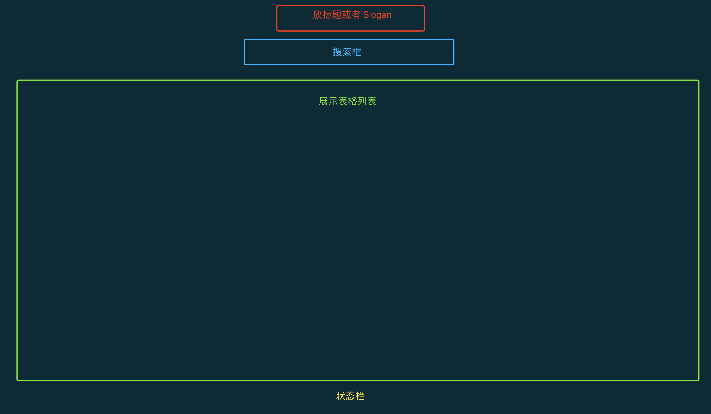

# 解锁！玩转 HelloGitHub 的新姿势

> 本文不会涉及太多技术细节和源码，请放心食用


大家好，我是 HelloGitHub 的老荀，好久不见啊！

我在完成 [HelloZooKeeper](https://mp.weixin.qq.com/mp/appmsgalbum?action=getalbum&__biz=MzA5MzYyNzQ0MQ==&scene=1&album_id=1709315979568037891&count=3&from=singlemessage#wechat_redirect) 系列之后，就很少“露面了”。但是我对开源和 HelloGitHub 的热情并没有丝毫的减少。这不，逮着个机会就来输出一波，防止被大家遗忘😂。


这次带来的是我写的一款在终端浏览 HelloGitHub 的工具：hg-tui，让你双手不离开键盘就能畅游在 HG 的开源世界。功能如下：

- 色彩丰富、平铺展示
- 关键字搜索月刊往期的项目
- 类 Vim 的快捷键操作方式
- 一键直达开源项目首页
- 支持 Linux、macOS、Windows

> 地址：https://github.com/kaixinbaba/hg-tui

下面我将分享自己发起这个开源项目的缘起、构思、再到开发的全部过程，最后分享一下，我通过做这个项目对开源的一些感悟。

## 一、起因

我本职是做 Java 开发，但架不住 Rust 太有意思了！所以最近在学 Rust 恰好前段时间看到 HG 讲解 tui.rs 的[文章](https://mp.weixin.qq.com/s/Bm0Hoy5kCvHqrwUwv_CVag)。

看完后手痒的厉害，就写了一篇 tui.rs 入门文章，但感觉还不过瘾就想写一个项目练手。

因为我平时经常上 HelloGitHub 找开源项目，所以就决定用 `tui.rs` 做一个终端浏览 HelloGitHub 官网的工具。

> 官网：https://hellogithub.com/

## 二、构思

首先我希望这个应用能有以下功能：

- 有搜索框，可以按关键词搜索 HelloGitHub 中的任意项目
- 通过表格按列展示搜索结果
- 既然是终端应用，那操作方式肯定是使用键盘方式，快捷键我采用了一些大家熟知的 Vim 快捷键
- 浏览项目的途中，可以随时在浏览器中打开当前浏览的项目

有了这些主要功能点的思路，下面就要想想怎么设计一个界面了，我本职工作后端一碰到画界面就头疼，几经周折大概把界面设计成了这样：



又因为是 TUI 界面层级不能太深，所以再多弄个详情页面（用来浏览文字明细）或者弹窗页面（提示消息）就差不多了。

我又想到了 GitHub 为每一种编程语言都设计了一种颜色，我也可以把这些颜色应用在我的项目里，让整个终端界面看起来没那么单调，色彩更丰富。效果如下：

主界面：


详情页：


弹窗提示：


最后为了向 TUI 妥协，按期数或类别搜索，我是通过使用搜索前缀来和普通关键词搜索作出区别。

上面展示的这些差不多已经是这个项目的全部了

## 三、开发

### 3.1 技术选型

要实现上述的那些功能，就要从 Rust 的生态中选择合适的库了

下面这些是我这个项目中使用到的：

- 基础设施：`anyhow`、`thiserror`、`lazy_static`、`better-panic`
- 绘制 UI：`tui`、`crossterm`
- HTTP client：`reqwest`
- 缓存：`cached`
- HTML 解析：`nipper`
- 工具：`regex`、`crossbeam-channel`
- 命令行：`clap`

虽然 Rust 还是编程界的小学生（2011 年启动），但是经过了这些年的发展，生态已经逐渐完善，工具库已经很丰富了。再加上 Rust 是系统级的语言，值得投入时间学习！

### 3.2 项目结构

项目结构规划（非全部）

```rust
src
├── app.rs		// 统一管理整个应用的状态
├── cli.rs		// 命令行解析
├── draw.rs		// 绘制 UI
├── events.rs	// UI 事件、输入事件、通知
├── fetch.rs	// HTTP 请求
├── main.rs		// 入口
├── parse.rs	// HTML 解析
├── utils.rs	// 工具
└── widget 		// 自定义组件
    ├── ...
```

合理的分文件（目录）开发，可以让每个功能模块 高内聚、低耦合，并且可以很容易的分开进行单元测试。

当然这些文件也不是在项目之初就已经一股脑的建立好的，都是在完善功能的路上一点点添加进来的～

### 3.3 主要代码

因为是基于 `tui.rs` 开发的应用，所以主流程肯定是遵循该库的设计的，首先需要定义一个 `App` 用来保存整个项目的状态信息。

```rust
pub struct App {
    /// 用户输入框
    pub input: InputState,
    /// 内容展示
    pub content: ContentState,
    /// 弹窗提示
    pub popup: PopupState,
    /// 状态栏
    pub statusline: StatusLineState,
    /// 模式
    pub mode: AppMode,
    /// 项目明细子页面
    pub project_detail: ProjectDetailState,
  	...
}
```

每一个状态字段,其实就是对应一个自定义组件.要在 `tui.rs` 中实现自定义组件（实现方式也是我自己的理解）也很简单只要三步，我以 `Input` 组件为例。

```rust
/// 用户输入框组件，组件本身没有字段，是一个无状态的对象
/// 无状态对象只关心 UI 怎么绘制，不存储数据
pub struct Input {}

/// 组件的状态，每一个字段就是组件需要存储的数据
#[derive(Debug)]
pub struct InputState {
    input: String,
    active: bool,
    pub mode: SearchMode,
}

/// 最后为 Input 组件实现 StatefulWidget trait
impl StatefulWidget for Input {
    type State = InputState; // 指定关联类型为 InputState
  
    /// area 绘制的区域
    /// buf 缓冲区（可以直接写入字符串，如果要高度定制的话，可以理解为画笔）
    /// state 从这个变量中直接取绘制过程中需要的数据
    fn render(self, area: Rect, buf: &mut Buffer, state: &mut Self::State) {
        // 具体绘制的逻辑
      	...
    }
}
```

只要是面向用户的应用，都会处理各种各样的用户输入（事件）。Rust 中一般都使用 channel 来解耦处理各种各样的事件，再利用 Rust 强大的枚举支持，定义各种各样的事件（用户输入和非用户输入）即可。

```rust
/// 定义事件枚举
#[derive(Debug, Clone)]
pub enum HGEvent {
    /// 用户事件（键盘事件）
    UserEvent(KeyEvent),
    /// 应用内部组件的通知事件
    NotifyEvent(Notify),
}

#[derive(Debug, Clone, PartialEq)]
pub enum Notify {
    /// 重绘界面
    Redraw,
    /// 退出应用
    Quit,
    /// 弹出窗口展示消息
    Message(Message),
    /// tick，比如一些数据需要每隔一段时间自动更新的（比如：显示的时间）
    Tick,
}

/// 弹窗的消息，分为 错误、警告、提示
#[derive(Debug, Clone, PartialEq)]
pub enum Message {
    Error(String),
    Warn(String),
    Tips(String),
}
```

为了区分用户事件和通知，我使用了两个不同的 channel 分别处理这两类：

```rust
lazy_static! {
    /// 因为通知队列希望被应用内部共享，所以使用了 lazy_static 方便使用
    pub static ref NOTIFY: (Sender<HGEvent>, Receiver<HGEvent>) = bounded(1024);
}
```

又因为不同的事件处理，并不应该互相阻塞，所以整个应用采用了最基础的多线程模型来提高性能，这里使用的也是标准库的多线程。

```rust
pub fn handle_key_event(event_app: Arc<Mutex<App>>) {
    let (sender, receiver) = unbounded();
    ...
    std::thread::spawn(move || loop {
        // 单独一个线程接收用户事件
        if let Ok(Event::Key(event)) = crossterm::event::read() {
            sender.send(HGEvent::UserEvent(event)).unwrap();
        }
    });
    std::thread::spawn(move || loop {
      	// 单独一个线程处理用户事件
        if let Ok(HGEvent::UserEvent(key_event)) = receiver.recv() {
            ...
        }
    });
}
```

其他剩下的就是业务逻辑，完整的代码可以直接看仓库 [https://github.com/kaixinbaba/hg-tui](https://github.com/kaixinbaba/hg-tui) 

## 四、心路历程

一开始我做 `hg-tui` 项目的时候，仅仅是为了做个实际的项目把玩一下 `tui.rs` 这个框架，做好之后问题层出不穷，但我深知没有与生俱来的完美，只有不断的迭代才能让它越来越好，经过 100 多次的提交后，现在用着感觉顺手多了。**毕竟作者是项目的第一个用户，自己用着不舒服其他人就更不喜欢了！**

我想着既然要让别人用，**一定要容易安装**。接着我做了基于 GitHub Action 自动编译和发布，支持 Windows、Linux、macOS [直接下载](https://github.com/kaixinbaba/hg-tui/releases)就能用。


我还做了对 homebrew 安装的支持，但因为 Star 数不够没有收录到 homecore 要求：30 forks、30 watchers、75 stars


希望大家看到这里的话能给个 star✨

> 地址：https://github.com/kaixinbaba/hg-tui

## 五、最后

`hg-tui` 它从出生那一刻起，体内流淌的就是开源的血。

它很小甚至是微不足道，我本不想开源，但[蛋蛋](https://github.com/521xueweihan)的一段话让我改变了主意：**开源不是完结，仅仅只是开始**。

一个开源项目可能只是作者的一个灵光乍现，也可能只是为了解决自己实际工作生活中的小小痛点，没准用完就丢到角落里了。但开源出来或许就能找到有相同需求的人，从而延续这个项目的生命，或许这就是开源的本意吧。

以上就是我做这个项目的全部心得和收获，如果你们对 `hg-tui` 有什么建议和问题，欢迎给我提 [issue](https://github.com/kaixinbaba/hg-tui/issues)

最后，如果你喜欢本文和项目的话，欢迎点赞和 Star 爱你们哟～