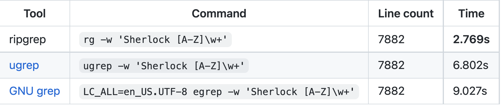

# 命令行文本搜索神器 —— ripgrep


大家平时肯定用过 linux 中的 `grep` 命令，我是一般是通过管道符 `|` 和 `cat` 等命令配合在日志文件中搜索自己需要的信息的，这次我给带来的开源项目是用纯 Rust 编写的命令行神器 —— ripgrep。

官方给出的性能测试上 ripgrep 有着无可匹敌的查询速度，以下性能测试截图均来自官方仓库。

测试截图 1:


测试截图 2:


测试截图 3:



---

可以看到 ripgrep 的性能几乎是数倍（甚至是数十倍）于其他拥有类似功能的工具！这么好用的工具，就让我来介绍下如何使用吧～

## 一、安装

任何开源项目第一步总是从安装开始的，ripgrep 作为一个工具性质的项目当然更是如此。ripgrep 本身支持各种平台和操作系统的安装。

```bash
# MacOS - Homebrew
$ brew install ripgrep

# Windows - Chocolatey
$ choco install ripgrep

# RHEL/CentOS 7/8 - yum
$ sudo yum-config-manager --add-repo=https://copr.fedorainfracloud.org/coprs/carlwgeorge/ripgrep/repo/epel-7/carlwgeorge-ripgrep-epel-7.repo
$ sudo yum install ripgrep

# Ubuntu Cosmic - apt
$ sudo apt-get install ripgrep
```

更多的安装方法可以查看 [安装向导](https://github.com/BurntSushi/ripgrep#installation)

安装完毕后，可以试一下 `rg` 命令是否生效，看到下面的输出就说明安装成功了～

```bash
$ rg -V
ripgrep 12.1.1
```

## 二、基本使用

官方的文档中演示的目录采用的是 ripgrep 自己的源码（不过是 0.7.1 版本，作为文本搜索演示根本无所谓），我们先把源码下载下来，解压并进入目录

```bash
$ curl -LO https://github.com/BurntSushi/ripgrep/archive/0.7.1.zip
$ unzip 0.7.1.zip
$ cd ripgrep-0.7.1
```

让我们来试试第一个搜索命令吧 `rg fast README.md`


ripgrep 把所有带有 fast 的行都查询了出来（这里之所以用截图，是因为 ripgrep 会高亮显示搜索结果，代码块体现不出来），从这个简单的例子中就能看到 ripgrep 的最基本格式是 `rg <待搜索文本> <搜索目标>`，而事实上 `<搜索目标>` 这部分都不需要，如果仅仅是 `rg fast` 的话，ripgrep 会默认递归查询当前目录下的“所有文件”去搜索对应的文本。

另外值得注意的是 ripgrep 默认是大小写敏感的，如果你搜索 `rg Fast README.md` 将不会得到结果，如果要忽略大小写可以使用 `-i` 或 `--ignore-case` 

 

除了支持直接的文本搜索，ripgrep 还支持**正则表达式**搜索，例如 `rg 'fast\w+' README.md`


因为使用了 `\w+` 表示 fast 之后必须有大于等于一个的有效非空白字符，所以仅仅是 fast 的话，是不会被搜索出来的，另外需要注意的是如果使用正则表达式的话 `<待搜索文本>` 必须用**引号**包裹起来，使用单引号 `'` 或双引号 `"` 都是可以的！除了使用**正则表达式**外，当 `<待搜索文本>` 中包含空格等空白字符的话，也需要使用**引号**包裹的，不然会被识别成 `rg` 的参数！

上面我说过，如果 `<搜索目标>` 不写的话，会递归查询当前目录下的“所有文件”，这个“所有文件”是打引号的，因为 ripgrep 在搜索的时候会默认忽略掉 `.gitignore`、`.ignore`、`.rgignore` 这三个**忽略文件**中记录的文件或者文件夹。

例如：`rg clap` 会获得如下的结果


我们现在以 `.rgignore` 举例，在当前目录下新建一个 `.rgignore` 文件，里面写一行 `*.rs` 然后保存

然后再运行 `rg clap` 命令


可以看到搜索结果中所有 `rs` 的文件都被忽略了，但如果你就是想搜索所有的 `rs` 文件也可以通过 `-g` 或 `--glob` 来指定。

例如：`rg clap -g '*.rs'`


`-g` 参数是可以重复的，如果有多个通配符表达式的话可以这样：`rg clap -g '*.rs' -g '*.toml'` 通配符表达式可以通过加 `!` 来取反，例如：`rg clap -g '!*.rs'` 这个搜索意思是搜索所有文件除了 `rs` 文件。

除了通过通配符指定搜索范围，也可以使用 `-t` 或 `--type` 指定文件类型来搜索，例如 `rg clap -t rust`，`-t` 参数优先级不如**忽略文件**，如果有文件类型在**忽略文件**中的话，使用 `-t` 是不会被搜索出来的！


具体 ripgrep 支持那些类型可以通过 `rg --type--list 查看`

```bash
$ rg --type-list
agda: *.agda, *.lagda
aidl: *.aidl
amake: *.bp, *.mk
asciidoc: *.adoc, *.asc, *.asciidoc
asm: *.S, *.asm, *.s
asp: *.ascx, *.ascx.cs, *.ascx.vb, *.aspx, *.aspx.cs, *.aspx.cs
ats: *.ats, *.dats, *.hats, *.sats
avro: *.avdl, *.avpr, *.avsc
awk: *.awk
bazel: *.bzl, BUILD, BUILD.bazel, WORKSPACE
bitbake: *.bb, *.bbappend, *.bbclass, *.conf, *.inc
brotli: *.br
buildstream: *.bst
bzip2: *.bz2, *.tbz2
c: *.[chH], *.[chH].in, *.cats
cabal: *.cabal
cbor: *.cbor
ceylon: *.ceylon
...
```

冒号 `:` 左边的就是可以填写在 `-t` 之后的类型名称，和通配符中的 `!` 类似根据文件类型也是可以做取反操作的，具体是 `-T` 或 `--type-not` 选项，意思是不搜索该文件类型的文件，具体这里就不演示了。

## 三、高级使用

ripgrep 作为一个工具，也是可以配置的，ripgrep 默认会查找 `RIPGREP_CONFIG_PATH` 环境变量对应的文件作为配置文件，这个文件配置起来也很简单，我拿一个官方文档中的例子举例（假设文件是 `~/.ripgreprc`）：

```bash
$ export RIPGREP_CONFIG_PATH=~/.ripgreprc
$ cat ~/.ripgreprc
# 以 # 号开头的行都是注释行
# 这两个选项是限制搜索结果宽度大于 150 个字符，多出的字符会标注为省略
--max-columns=150
--max-columns-preview

# 添加一个自定义 web 类型，可以通过 rg clap -t web 来只搜索 html、css、js 三种文件
--type-add
web:*.{html,css,js}*

# 使用该选项后，当用户搜索的文本都是小写时，默认忽略大小写搜索，如果含有大写则使用大小写精确匹配搜索
--smart-case
```

可以通过例子看到，ripgrep 的配置文件很简单：

- `#` 开头的都是注释，会被忽略
- 其他每一行都单独是一个 ripgrep 的参数

ripgrep 会自动在每次搜索的时候把配置文件中的参数都拼接上，虽然使用 `alias` 同样也可以达到类似的效果，但是显然使用配置文件更好


