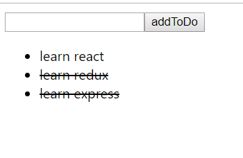
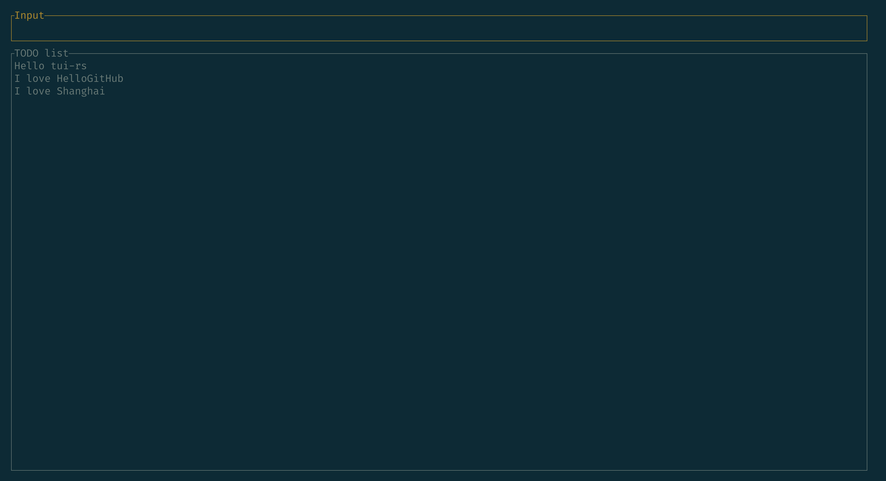
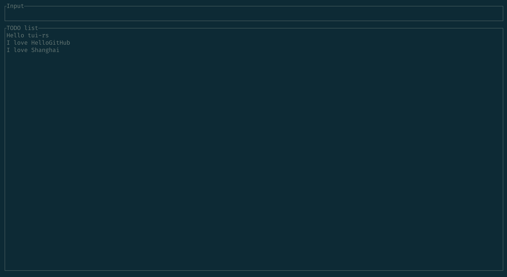
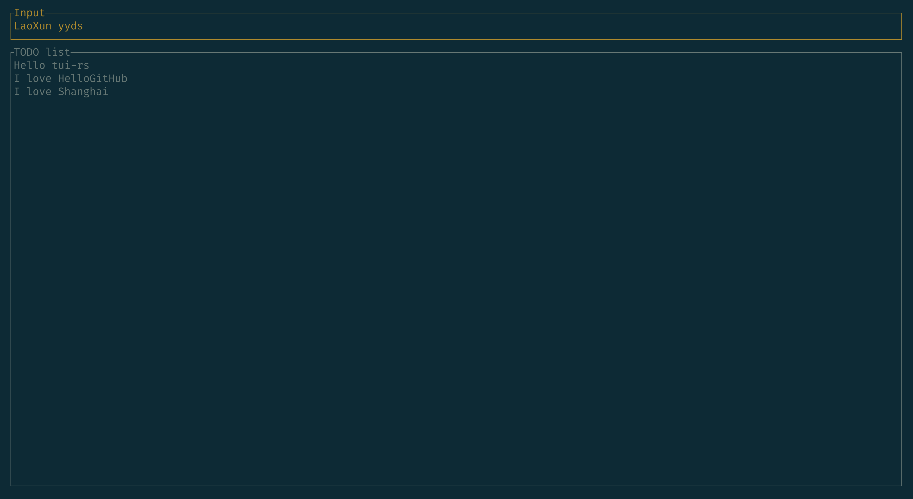
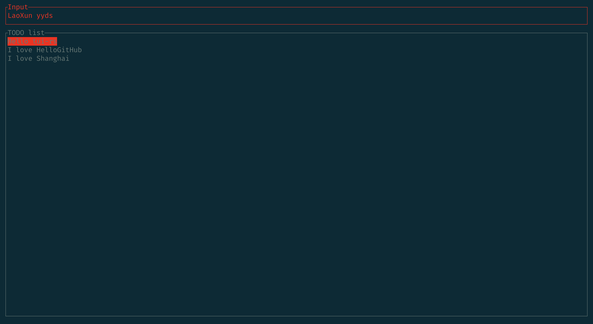

# 使用 tui-rs 开发一个 TODO list 小项目

> 本文需要一点 Rust 语法基础


HelloGithub 之前发了一个文章 [打造你的秘密武器，推荐一款超好用的跨平台命令行界面库](https://github.com/HelloGitHub-Team/Article/blob/master/contents/Rust/tui.rs/content.md)

我本身对 Rust 就很有兴趣，又对充满极客气息的终端界面没有抵抗力，双剑合璧，我决心去研究下怎么把玩 [tui-rs](https://github.com/fdehau/tui-rs) 这个磨人的小妖精。

于是一个想法很自然的就产生了，怎么使用这个库来开发一个简单入门的小项目呢？该项目的仓库中其实已经自带了很多个[代码实例](https://github.com/fdehau/tui-rs/tree/master/examples)，所以我决定模仿前端的 HelloWorld 做一个 TODO list 的小项目来入门这个牛逼的开源项目。

> 本文不是 Rust 教学，所以不会去教大家 Rust 的语法规则等，我本人也只是 Rust 的小白（工作中使用的是 Java）我会按照自己的理解去书写这个项目，一定有不足之处。若喷，请轻喷～

让我们开始吧～

## 一、需求概述

因为我们是模仿前端的 todo list 小项目，所以整体需求和前端的一致。

### 1.1 展示部分

首先，界面大概长这样：



todo list 一般有以下元素：

- 输入框，用来输入文本内容
- 提交按钮，将输入框的内容提交至列表中
- 列表，用来展示已提交的内容

### 1.2 交互部分

简单的 todo list 小项目一般是这个逻辑

- 输入框获得焦点后可以开始输入文本
- 点击按钮提交
- 点击列表中的文本，可以删除对应内容

### 1.3 tui 项目做出的妥协

由于我们开发的项目是基于终端界面显示的，另一方面是由于 tui-rs 本身的限制，对鼠标事件无法支持（具体可以看这个 [issue](https://github.com/fdehau/tui-rs/issues/166) 作者本身也回复了，鼠标事件不太好支持，对项目架构冲击较大，短时间内应该不会增加相关特性。

所以交互的部分只能从鼠标变成键盘事件了，所以最后我的这个项目的界面大概长这样：



界面上面一部分还是一个输入框，下面是展示的列表。

其次为了满足 TUI 交互的顺畅，我设计了三种模式：Normal（普通）、Insert（插入）、Delete（删除），用于区分不同的交互逻辑。

#### 1.3.1 普通模式

普通模式长这样（输入框为白色）：



**普通模式**下按 ESC 会退出应用，按 退格键 会进入**删除模式**，按其他任意字母（数字）键会进入**插入模式**

#### 1.3.2 插入模式

插入模式长这样（输入框为黄色）：



**插入模式**按 回车键 会将输入框中的文本内容提交至列表，并同时清空输入框，按 退格键 可以删除已输入内容，按 ESC 会回到**普通模式**

#### 1.3.3 删除模式

删除模式长这样（输入框为红色）：



**删除模式**会高亮选择列表其中的一项，按 J / K 进行上下选择（Vim YYDS），按 回车键 会将当前光标选中的内容删除，按 ESC 会回到**普通模式**

---

大致的交互逻辑就是这样，功能并不强，但是项目足够小才能让我们快速的把握住 tui-rs 开发的点，学起来才不费劲。

所以让我们开始正式开发吧～

## 二、开始编码

Rust 开发至少需要大家得把官方的工具给安装好（比如：cargo、rustup、rustc 等），然后选择一个趁手的 IDE 进行开发。

### 2.1 创建项目

我们的项目会从一个空文件夹开始

执行以下命令并回车

```bash
$ cargo new todolist
	Created binary (application) `todolist` package
```

cargo 就会初始化一个空的可执行的 Rust 项目

```bash
$ cd todolist
$ tree .
.
├── Cargo.toml
└── src
    └── main.rs
```

然后运行下

```bash
$ cargo run .
   Compiling todolist v0.1.0 (/YourOwnPath/todolist)
    Finished dev [unoptimized + debuginfo] target(s) in 0.37s
     Running `target/debug/todolist .`
Hello, world!
```

正常输出了 `Hello, world!`，我们的第一步就完成啦～

之后我们需要在项目根目录中的 `Cargo.toml` 引入对应的依赖（其他部分省略）

```bash
[dependencies]
tui = "0.17.0"
crossterm = "0.22"
```

### 2.2 模板代码

tui-rs 仓库本身的示例中都有类似的模板代码，你可以对他们进行自己的封装，我这里一是为了简单，二也为了之后读者能和 tui-rs 仓库中的示例有个对照，三是我自己也还没有深入研究这部分内容

所以模板代码部分基本采取了照搬

```rust
// main.rs
use crossterm::{
    event::{DisableMouseCapture, EnableMouseCapture},
    execute,
    terminal::{disable_raw_mode, enable_raw_mode, EnterAlternateScreen, LeaveAlternateScreen},
};

use std::{error::Error, io};
use tui::{
    backend::{CrosstermBackend},
    Terminal,
};


fn main() -> Result<(), Box<dyn Error>> {
    // 创建终端 start
    enable_raw_mode()?;
    let mut stdout = io::stdout();
    execute!(stdout, EnterAlternateScreen, EnableMouseCapture)?;
    let backend = CrosstermBackend::new(stdout);
    let mut terminal = Terminal::new(backend)?;
    terminal.clear()?;
    // 创建终端 end

    // TODO 业务逻辑

    // 退出终端 start
    disable_raw_mode()?;
    execute!(
        terminal.backend_mut(),
        LeaveAlternateScreen,
        DisableMouseCapture
    )?;
    terminal.show_cursor()?;
		// 退出终端 end
    Ok(())
}
```

我们中间的 `TODO 业务逻辑` 才是应用真正的代码

### 2.3 创建应用

在创建应用之前，我们可以先考虑下，我们的应用要能正常展示和交互的，需要存哪些数据？

- 我们的 todolist 应用有三个模式，那得设计一个枚举
- todolist 有一个输入框，要存用户输入的数据，感觉可以用 `String`
- todolist 有一个列表要展示，用户存入的文本，感觉可以用 `Vec<String>`
- 在删除模式下，我们有一个高亮显示的块，所以需要一个与之对应的 index，可以使用 `usize`
- 我们用一个结构体 `App` 去保存当前应用所有的数据

首先我们新建一个 `app.rs` 把和应用相关的代码放在里面

```rust
// app.rs

// 定义枚举
#[derive(Clone, Copy, Debug, PartialEq)]
enum Mode {
    Normal,
    Insert,
    Delete,
}

impl Default for Mode {
    fn default() -> Self {
        return Mode::Normal;
    }
}

// 代表我们的应用
#[derive(Debug, Default)]
struct App {
	// 一个布尔值变量，用来控制应用的退出
	quit: bool,
	// 当前的模式
	mode: Mode,
	// 输入框中的内容
	input: String,
	// 列表中的消息
	message: Vec<String>,  	
	// 删除模式下的光标位置
	index: usize,
}

// main.rs
// 别忘了在 main 中引入模块
mod app;
```

## 三、处理业务

刚刚我们在 main 方法中留下了一段 TODO 代码，我们可以在 `app.rs` 中定义这样一个函数 `startup`，在这个函数中设置一个主循环分别用来进行 UI 的绘制以及事件的处理

 ```rust
 // app.rs
 pub fn startup<B: Backend>(mut app: App, terminal: &mut Terminal<B>) -> Result<(), Box<dyn Error>> {
     while !app.quit {
         // TODO 绘制 UI
 
         // TODO 处理事件
     }
     Ok(())
 }
 ```

我们新建一个 `ui.rs` 并定义一个 `draw` 函数用来处理和绘制 UI 相关的逻辑

```rust
// ui.rs
pub fn draw<B: Backend>(app: &mut App, f: &mut Frame<B>) {
    // TODO 绘制输入框
    // TODO 绘制消息列表
}
```

我们再新建一个 `handle.rs` 并定义一个 `handle_events` 函数用来处理和事件相关的逻辑

```rust
// handle.rs
pub fn handle_events(app: &mut App, key: KeyEvent) {
    // TODO 处理事件的逻辑
}
```

最后也别忘记在 `main.rs` 中引入模块

```rust
mod ui;
mod handle;
```

有了这两个函数，我们 `startup` 函数就能写成

```rust
// app.rs
// 引入两个函数
use crate::ui::draw;
use crate::handle::handle_events;

pub fn startup<B: Backend>(mut app: App, terminal: &mut Terminal<B>) -> Result<(), Box<dyn Error>> {

    while !app.quit {
        // 绘制 UI
        terminal.draw(|f| draw(&mut app, f))?;
	// 处理事件（我们的项目中只关心键盘事件）
        if let Event::Key(key) = event::read()? {
            handle_events(&mut app, key);    
        }
    }
    Ok(())
}
```

在 `main.rs` 中我们就能写成

```rust
use app::{App, startup};

fn main() -> Result<(), Box<dyn Error>> {
    // 创建终端 start
    ...
    // 创建终端 end

    let app = App::default();
    let res = startup(app , &mut terminal);

    // 退出终端 start
    ...
    // 退出终端 end
    Ok(())
}
```

### 3.1 绘制 UI

我们这个项目中简单的 TODO list 只有分为上下两块，上面是输入框，下面是列表，在 `tui-rs` 中是使用 `Layout` 来进行画面的分割的，`tui-rs` 中大部分的对象都是实现 `Default` 的，所以一般都是使用 `default` 方法进行创建

```rust
pub fn draw<B: Backend>(app: &mut App, f: &mut Frame<B>) {
    let chunks = Layout::default()
        .direction(Direction::Vertical) // 这里按照上下分割
        .margin(3) // 和前端的 margin 概念是差不多的
        .constraints(
            [
                Constraint::Min(3), // 上面的第一部分高度最小是 3 
                Constraint::Percentage(90), // 下面的占 90%
            ] // 具体分成几块就看这个 [ ] 中的数量了
            .as_ref(),
        )
        .split(f.size()); // f 代表当前终端，所以 f.size() 就是整个终端的区域
}
```

分割完毕后就可以基于 `chunk` 进行分别绘制了，为了把逻辑拆分，我这里再定义两个函数分别用来处理输入框和消息列表，并把分割完成的区域分别传递给它们，绘制代码如下，必要地方我都加了注释

```rust
use tui::{
    backend::Backend,
    layout::{Constraint, Direction, Layout, Rect},
    style::{Color, Style},
    text::Span,
    widgets::{Block, Borders, List, ListItem, Paragraph},
    Frame,
};

use crate::app::{App, Mode};

pub fn draw<B: Backend>(app: &mut App, f: &mut Frame<B>) {
    let chunks = ...; // 这里 chunks 是一个 Vec
  	
    // 这里 chunks[0] 就是上面那个区域
    draw_input(app, f, chunks[0]);
    // 同理 chunks[1] 就是下面那个区域
    draw_messages(app, f, chunks[1]);
}

pub fn draw_input<B: Backend>(app: &mut App, f: &mut Frame<B>, rect: Rect) {
    // tui-rs 中所有的样式都是 Style 来控制的
    let style = match app.mode {
        Mode::Normal => Style::default(), //  普通模式
        Mode::Delete => Style::default().fg(Color::Red), // 删除模式，输入框为红
        Mode::Insert => Style::default().fg(Color::Yellow), // 插入模式，输入框为黄
    };
    // Frame 有一个 render_widget 方法，这个方法相当于是在屏幕上绘制，它有两个参数
    // 第一个参数是 画什么？
    // 第二个参数是 画在哪儿？
    f.render_widget(
      	// 我们要画的就是 app 中 input 字段的内容，把它包装成 Paragraph 并带上样式
        Paragraph::new(app.input.as_ref())
            .style(style)
            .block(Block::default().borders(Borders::ALL).title("Input")),
      	// rect 就是上一个方法中传入的 chunks[0] 代表屏幕切割完的上半部分
        rect,
    )
}

pub fn draw_messages<B: Backend>(app: &mut App, f: &mut Frame<B>, rect: Rect) {
    // 屏幕的下半部分就是我们要展示的消息列表，从 app 的 message 字段取出
    let messages: Vec<ListItem> = app
        .message
        .iter()
        .enumerate()
        .map(|(i, m)| {
            let style = if i == app.index && app.mode == Mode::Delete {
              	// 如果当前是删除模式，并且该索引是删除光标位置，就把背景设置为红色
                Style::default().bg(Color::Red)
            } else {
                Style::default()
            };
            // tui-rs 中大部分的文本内容都可以使用 Span 来包装，完全可以理解为 html 中的 <span> 标签
            ListItem::new(Span::styled(format!("{}", m), style))
        })
        .collect();
    // 最后再把上面的 Vec<ListItem> 包装成 List
    let messages =
        List::new(messages).block(Block::default().title("TODO list").borders(Borders::ALL));
    // 画在屏幕上
    f.render_widget(messages, rect);
}

```

### 3.2 处理事件

为了逻辑清晰，处理事件也分成了不同的函数

```rust
use crossterm::{
    event::{KeyCode, KeyEvent},
};

use crate::app::Mode;
use crate::app::App;


pub fn handle_events(app: &mut App, key: KeyEvent) {
    // 处理不同模式的切换的按键
    handle_mode(app, key);
    // 处理输入框的按键
    handle_input(app, key);
    // 处理消息列表的按键
    handle_message(app, key);
}

fn handle_mode(app: &mut App, key: KeyEvent) {

    match key.code {
        KeyCode::Esc => {
            // ESC
            match &app.mode {
                Mode::Insert | Mode::Delete => {
                    // 插入 或 删除 =》 普通
                    app.mode = Mode::Normal;
                }
                Mode::Normal => {
                    // 当前处于普通模式下就退出
                    app.quit = true;
                }
            }
        }
      	// 退格键，普通 =》 删除
        KeyCode::Backspace if app.mode == Mode::Normal => {
            app.mode = Mode::Delete;
        }
        _ => {}
    
    }
}

fn handle_input(app: &mut App, key: KeyEvent) {
    match key.code {
        KeyCode::Backspace if app.mode == Mode::Insert => {
            // 若当前处于插入模式的话，就是删除输入框中的字符
            if !app.input.is_empty() {
                app.input.pop();
            }
        }
        KeyCode::Char(char) => {
            match app.mode {
                Mode::Normal | Mode::Insert => {
                    // 输入其他字符，先切换到输入模式，然后将字符添加到输入框中
                    app.mode = Mode::Insert;
                    app.input.push(char);
                }
                _ => {}
            }
        }
        KeyCode::Enter if app.mode == Mode::Insert && !app.input.is_empty() => {
            // 插入模式下，并且输入框不为空，就把输入框中的内容添加到消息列表中
            app.message.push(app.input.clone());
            // 并清空输入框
            app.input.clear();
        }
        _ => {}
    }
}

pub fn handle_message(app: &mut App, key: KeyEvent) {
    match key.code {
        KeyCode::Char(char) if app.mode == Mode::Delete => {
            // 当前处于删除模式下
            match char {
              	// j 向下移动光标
                'j' | 'J' => {
                    if app.index == app.message.len() - 1 {
                      	// 如果到末尾就重置为 0
                        app.index = 0;
                    } else {
                        app.index += 1;
                    }
                }
              	// k 向上移动光标
                'k' | 'K'=> {
                    if app.index == 0 {
                      	// 如果到了开头就回到末尾
                        app.index = app.message.len() - 1;
                    } else {
                        app.index -= 1;
                    }
                }
                _ => {}
            }
        }
        KeyCode::Enter if app.mode == Mode::Delete && app.index < app.message.len() => {
            // 删除模式下，按 回车 会删除当前光标下的消息
            app.message.remove(app.index);
        }
        _ => {}
    }
}

```

---

然后通过 `cargo run` 运行看看吧～

## 四、总结

一个非常简单的 `tui-rs` 入门小项目就完成了，这个项目还是肉眼可见有很多可以提升的问题：

- UI 渲染和事件的处理都在主线程中循环，对性能肯定是有影响的
- 事件处理的逻辑中，不同组件的不同事件也是放在一个线程中顺序判断执行的
- 我们的项目中只有两个简单的部分，一旦我们的项目变大，`App` 中的代码就会非常的耦合，变得难以维护，尽管我们拆分了不同的函数，但这仍然不是最好的解决方案，我们应该像前端那样，把不同的部分都写成自己的组件

单线程的问题，可以使用 `channel` 的模式去解决，定义多个队列（事件、消息等等），通过生产者消费者模式异步将这些逻辑串起来，既拆分了代码也极大的提高了性能

下一次讲解下 `tui-rs` 如何自定义组件，把自己的结构体包装成像 `tui-rs` 内置的 `Span`、`Paragraph`、`List` 等等一样～


