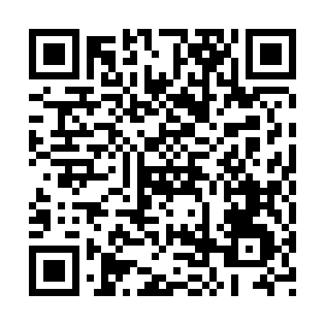
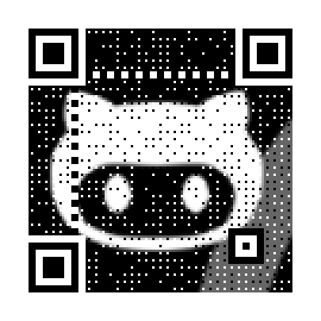
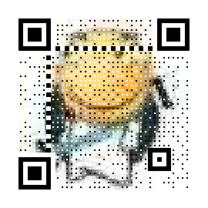
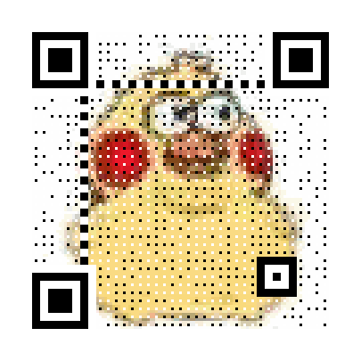
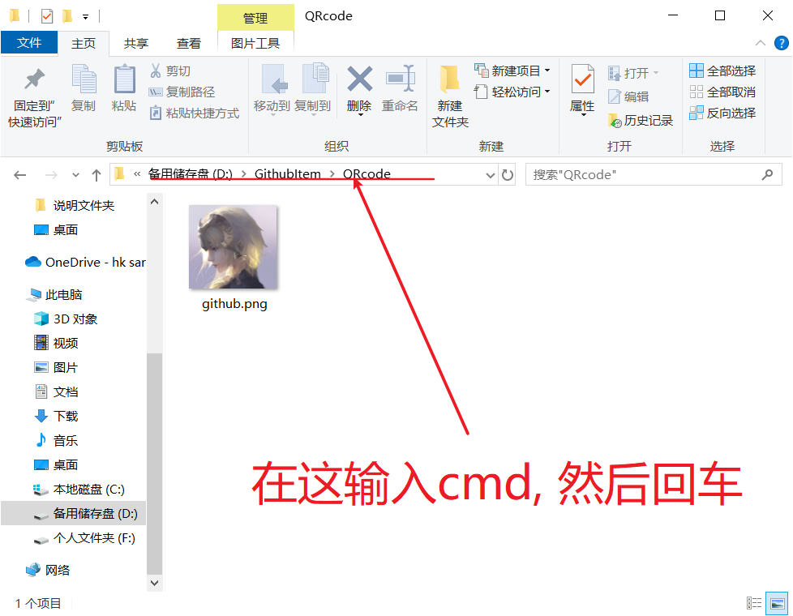
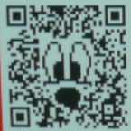
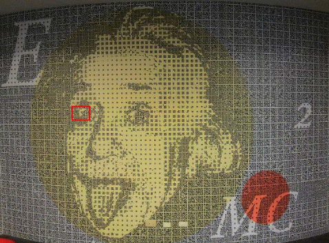

# QRcode

# 介绍

这是一个由 Python 编写的艺术二维码生成器, 支持GIF动态二维码和图片二维码
项目地址: [qrcode](https://github.com/sylnsfar/qrcode/blob/master/README-cn.md)

若比较熟悉, 想直接使用, 请点击->[快速上手](#快速上手(命令行))

## 推荐理由
为什么需要使用到这个二维码生成器来生成二维码呢?

**理由一: 快速上手, 仅需2行代码, 即可开始食用!**

**理由二: 彩色二维码和 动态二维码可以让用户很直观的知道二维码的内容**

如下, 左图=.=#, 右图可以直观的看出是与 GitHub 相关的二维码 (HelloGithub项目的地址, 喜欢的话就关注一下)



**理由三: 使用该项目可以迅速创建好看, 有趣的二维码.**



**理由四: 使用方式多样**
1. 命令行方式
2. 导入文件方式 
3. [exe](https://github.com/sylnsfar/qrcode_win)
4. [网页](http://www.amazing-qrcode.com/) (已挂)

---

# 快速上手(命令行)

操作系统: windows
Python版本: 3.5

## 安装

1. 安装依赖
```shell
pip install -r requirements.txt
```

2. 安装MyQR
```shell
pip install myqr
```


## 食用

安装完成之后, 就可以直接在命令行中使用了! 下面逐一讲解各种二维码的生成

### 普通二维码

首先测试一下, 生成一个普通二维码

1. 打开 cmd 

2. 输入命令
```shell
myqr https://github.com -n helloword.png
```

这样就得到第一个二维码 (普通二维码)

- **参数`-n`**: 文件重命名

> 默认保存路径为 cmd 所在目录 ( [cmd 切换盘符的技巧](#cmd切换盘符))

### 彩色二维码

1. 先准备一张照片放在目录下 (最好是**方形**的)

例如:


1. 将照片名字修改为 github.jpg (后缀根据自己的照片格式而定)

2. **命令行**输入
```shell
myqr https://github.com -n mypicture.png -p github.jpg -c
```
参数:
- **参数`-n`**: 图片名字 (name)
- **参数`-p`**: 图片 (picture), 支持jpg, gif, png格式
- **参数`-c`**: 彩色 (colorized) , 如果不设置, 默认黑白

### 动态二维码

和彩色二维码的方法一致, 但是需要注意-> **修改后缀为 gif**, 否则会报错


# 附录
## MyQR参数

官方文档参数比较乱, 于是整理了一下

- **参数`-n`**: 图片名字 (name)
- **参数`-p`**: 图片 (picture), 支持`.jpg`, `.gif`, `.png`, `.bmp`格式
- **参数`-c`**: 彩色 (colorized) , 如果不设置, 默认黑白
- **参数`-v`**: 控制边长，范围是 1 至 40，数字越大边长越大；
- **参数`-l`**: 控制纠错水平，范围是 L, M, Q, H，从左到右依次升高。
- **参数`-d`**: 控制输出文件位置
- **参数`-con`**: 用以调节图片的对比度，1.0 表示原始图片，更小的值表示更低对比度，更大反之。默认为 1.0
- **参数`-bri`**: 用来调节图片的亮度，其余用法和取值与 `-con` 相同

## cmd切换盘符

打开命令行有个小技巧, 可以将 cmd 迅速切换到想要的目录, 避免了切换盘符的麻烦

1. 利用文件管理, 找到目标文件夹

2. 顶部地址栏输入 cmd, 回车


**切换盘符的麻烦**


## 二维码相关介绍

二维码有以下几种分类
1. 黑白和彩色码


1. 融合和视觉码

 融合码，就是将内容与二维码融合使它们成为一个整体，图片由二维码组成，二维码就是图片的一部分。这种比较适合使用构造简单的图片或者文字做美化主体内容
 视觉码，其实就是以图片为背景，再在图片上构建很多特殊的点，这些点不会影响背景的视觉效果
 



1. 艺术码:



艺术二维码，就是将二维码进行的各个“码眼”按照设计师的构思进行分析、拆解、合并，再在那些“码眼”区域填充上一些小素材元素，最后形成一个别具特色二维码。


## 参考资料
1. [小技巧｜还在用黑白二维码？弱爆了！教你点新的技能！](https://www.jianshu.com/p/5f8df373be7a)
2. [PDF淺談QR Code](https://www.csie.ntu.edu.tw/~kmchao/bcc15spr/20150325_QR_Code.pdf)
3. [QRcode](https://github.com/sylnsfar/qrcode/blob/master/README-cn.md)