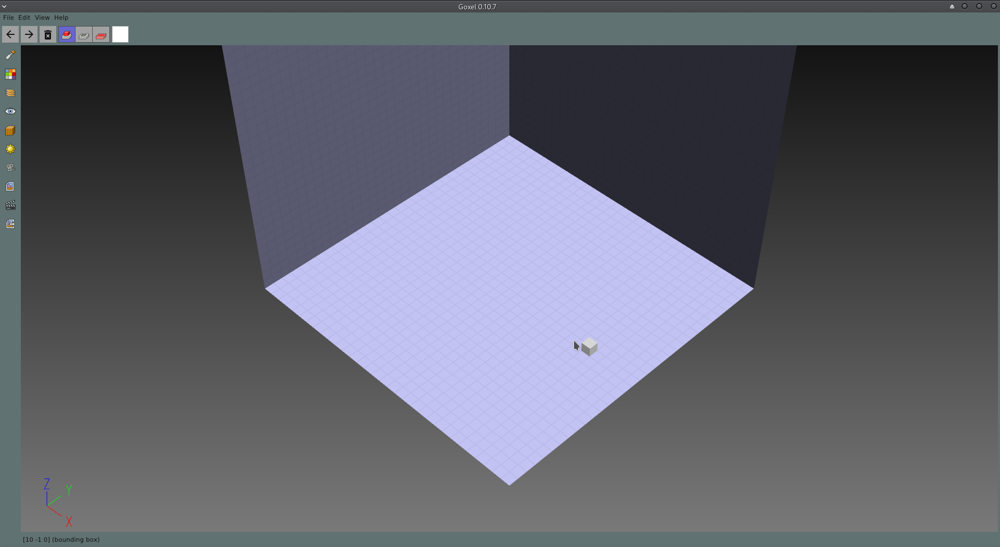
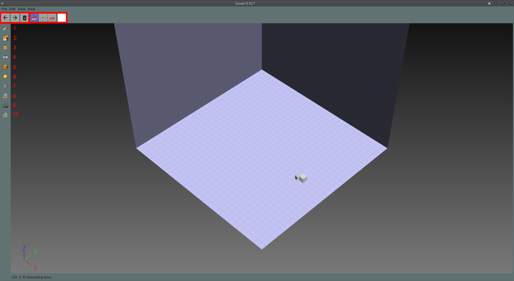

# 记忆中的像素块褪色了吗？用开源体素编辑器重新做个 3D 的吧！

> 本文适合对图形表现有兴趣的美术或者开发人员


<p align="center">本文作者：HelloGitHub-<strong>Joey</strong></p>

早期的的显示设备像素颗粒较大，使得显示内容的颗粒感严重，像是由一堆方块组成的。比较好的例子就是 GBA 上的游戏，相信这也是很多朋友宝贵的童年回忆。这种艺术风格一直延续到现在，虽然显示设备的分辨率已经足以显示非常细腻的画面，但还是有不少人偏爱像素风格的游戏与艺术画。


像素（Pixel）的概念对应到 **3D** 空间中就是体素（Voxel），使用离散的基本单位来表示 **3D** 空间中的物体，最直白的理解就是一个个小方块，“我的世界”就是一款非常著名的体素游戏。


这里是 **HelloGitHub 推出的《讲解开源项目》系列**，今天要介绍的体素编辑器 **Goxel** 就是一款用来创作 **3D** 体素艺术作品的编辑器。有了它人人都可以尝试自己制作出 3D 像素作品，回味童年的味道。

> 项目地址：https://github.com/guillaumechereau/goxel

## 一、快速开始

**Goxel** 是一款开源的体素编辑器，提供跨平台支持包括 **iOS**、**Android** 与在线网页版。软件内部使用稀疏矩阵存储数据，使得其可以支持非常大规模的场景编辑。完成编辑后，软件支持导出包括 **glTF2.0**、**obj** 在内的多种 **3D** 格式文件，这些格式可在其他软件或者游戏中使用。

### 1.1 下载安装

项目的[官网](https://goxel.xyz/)的[下载页](https://goxel.xyz/download/)中提供了桌面平台和移动平台的下载连接。移动平台是直接到对应商店的链接，**iOS** 设备可以直接在 **App Store** 中下载。

在线网页版在首页上方 [Web Version](https://goxel.xyz/live)，在浏览器内即可体验。

### 1.2 编译安装

此部分内容针对希望进行编译安装或者在 Linux 系统上使用的朋友，如果其他平台上希望简单体验软件可以直接下载二进制文件使用。

首先需要安装所需的依赖库，可直接使用对应的包管理软件安装。所需的依赖如下（不同系统下软件包名字可能稍有区别）：

```bash
- scons
- pkg-config
- libglfw3-dev
- libgtk-3-dev
```

安装完所需依赖后，首先 **clone** 项目：

```bash
git clone https://github.com/guillaumechereau/goxel.git
```

完成 **clone** 后进入项目根目录并输入：

```bash
make release
```

即可完成编译。完成后会在根目录生成 **goxel** 可执行文件，输入：

```bash
./goxel
```
即可使用。

**我在测试时发现 Linux 平台上存在严重 bug 会导致无法绘制方块或者无法使用 UI，建议使用 Mac 进行尝试。**

## 二、界面介绍



类似传统的编辑器软件，界面中间区域是进行体素绘制的部分，点击鼠标左键并拖动进行笔刷操作。

### 2.1 工具栏按钮介绍



工具栏按钮使用红框划出，分为两类：**撤销重做**与**笔刷控制**。

撤销重做部分（左边三个按钮）包含了：**撤销**、**重做**、**清空当前层** 三个功能按钮，提供笔刷历史控制，可以以单次左键按下滑动操作为单位的撤销与重做。第三个按钮提供了清空当前图层所有体素的功能。

笔刷控制部分包含右边四个按钮，其中前三个按钮为笔刷模式按钮，第四个按钮用来控制笔刷作用的体素颜色。笔刷模式包括：

1. 增加体素模式，鼠标拖动添加当前设定颜色的体素
2. 删减体素模式，鼠标拖动删减轨迹上的体素
3. 修改颜色模式，鼠标拖动将轨迹上体素的颜色修改为当前设定颜色
  
### 2.2 左边栏按钮简介
  
根据图中标识的序号对各个按钮进行功能简介：

  1. 工具栏分页，点击后会弹出具体的工具列表，包括笔刷，平面蒙板，模糊选择，颜色拾取，程序化生成等工具
  2. 色板分页，点击后会弹出常用的预设颜色列表
  3. 图层管理页，非常类似 **Photoshop** 中的图层概念，可以在各个图层中单独绘制体素，该分页提供了图层的增删显示控制
  4. 显示控制，点击后会弹出全局显示控制的选项，此部分仅控制画面显示效果，对编辑不影响
  5. 材质控制，点击后会弹出全局体素的材质控制选项，包含简单的粗糙度，金属度等属性控制
  6. 灯光控制，点击后会弹出整体环境灯光的控制选项
  7. 相机控制，点击后会弹出相机控制的分页，在此分页可以增减相机，并在多个机位间切换。另外也可控制相机的位置朝向，并提供了若干正视视角的预设摄像机角度
  8. 画幅控制，此部分提供了整体 **3D** 空间的相对位置与大小控制项
  9. 渲染，点击此按钮后会开始离线渲染过程，将当前相机视角下的画面使用离线渲染算法渲染出来，具体的效果与上面灯光材质分页中的设置相关联，完成渲染后可保存图片
  10. 导出分页，此分页中提供了将当前编辑结果导出成其他 **3D** 格式文件的选项
  
## 三、使用建议
  
我测试了 **Linux**、**Mac**、**iOS** 以及 **Web** 这四个平台，各平台情况总结如下：
  
1. **Linux** 平台需要编译安装，编译过程很顺利，但存在严重界面 bug，导致无法使用，不建议
2. **Mac** 平台上使用触摸板手势支持不太完整，若使用鼠标的话体验较为良好
3. **iOS** 平台上个人认为是使用体验最好的，手势支持完整，所见即所得，官网上的[宣传视频](https://youtu.be/pvBd3Zq0Of8)即是使用 **iPad Pro**演示
4. **Web** 的菜单栏按钮无法使用，但导出功能可以使用左边栏中按钮完成，不影响使用，是最方便的体验方式

## 四、作品展示

以下图片来自官网[Gallery页](https://goxel.xyz/gallery/)


## 五、最后

曾在各种视频内容中看到过作者在 MC 中创造各种美丽的景观，实现各种有趣的想法，现在使用这款编辑器亦可做到相同的事情，加上编辑器内提供的各种操作工具，能够使创作者们更加方便快捷地去绘制添加体素，更加自由且快速地实现自己的想法。软件支持的导出格式亦可将作品转移到其他 **3D** 软件中进行进一步加工制作，成为一个完整的 **voxel art** 作品。

此外，作为一个开源项目，如果在使用过程中发现一些可以改进的点且有开发能力的话，也可尝试与项目维护人员沟通交流，确定开发计划并回馈社区，帮助软件改善的同时亦能对自己的简历增加一个亮眼的经历。
