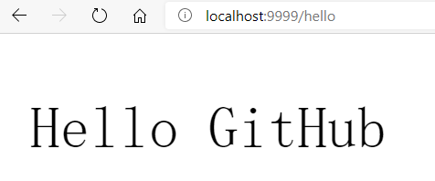
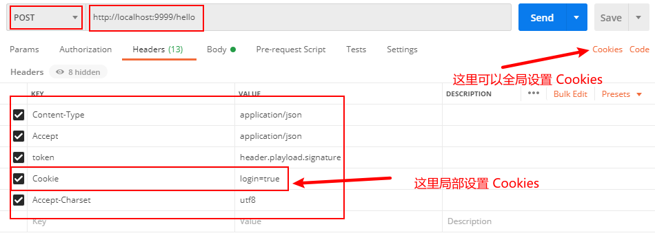
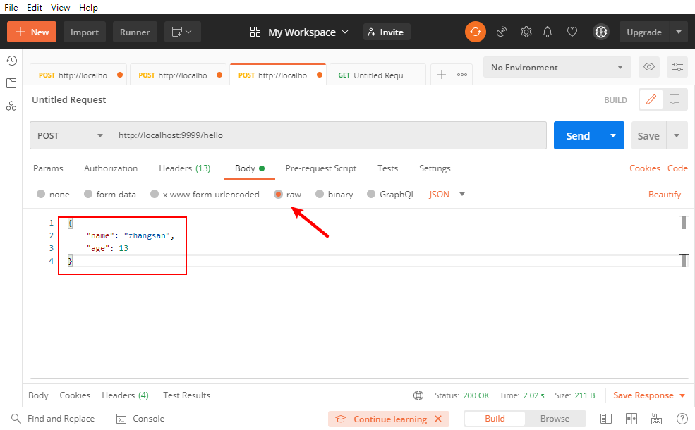
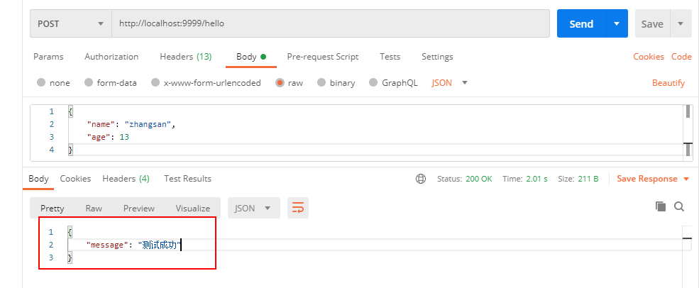
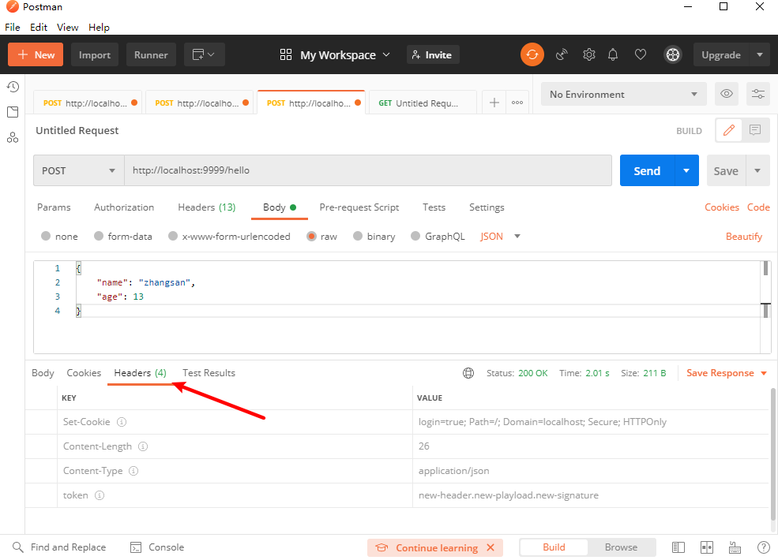
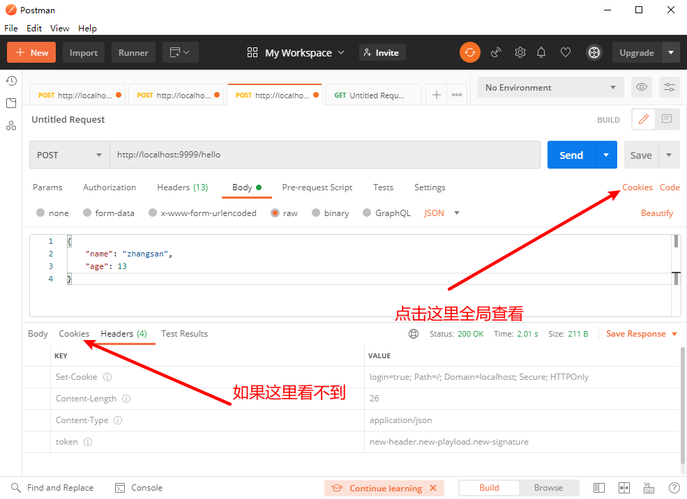
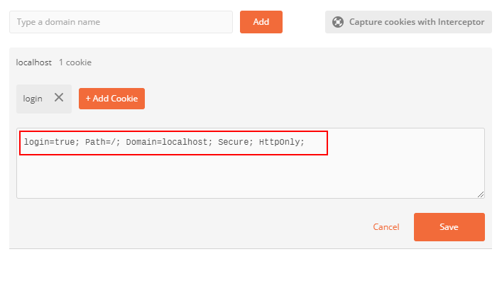

# 不想再等后端的接口了？帮你 2 分钟模拟个后端接口的开源项目


<p align="center">本文作者：HelloGitHub-<strong>嘉文</strong></p>

这里是 HelloGitHub 推出的[《讲解开源项目》](https://github.com/HelloGitHub-Team/Article)系列，今天给大家带来一款开源免费的模拟后端 API 的工具：moco

没学过后端开发的也能快速上手这个开源项目，靓仔靓妹们不必再辛苦等待后端开发 API，从而有更多的时间逛 HelloGitHub 体验更多有趣的开源项目。接下来本文将用带你快速上手 moco 这个开源工具，让你不再卡在后端接口的开发进度上，一骑绝尘！

> 项目地址：https://github.com/dreamhead/moco


## 一、moco 有什么用

> 我做前端或者客户端开发，对我有什么用？

1. 在后端 API 开发缓慢的时候，如果你想测试应用展示效果，就不必再等后端进度，使用 moco 轻松模拟后端 API。 
2. 在项目初期的时候，产品经理或者是客户想看到你的应用展示，模拟好 API 就可以开发前端，展示效果啦。


> 我做后端开发，对我有什么用？

1. 企业级软件一般都是多人开发，因为接口之间是互相依赖的，所以如果你依赖的服务进度缓慢或者是没有在环境中运行，你就无法对你开发的功能进行测试，进而不能及时交付项目，从而加班熬夜。
2. 即使你所依赖的服务在环境中运行，但是所依赖的服务依旧会不断测试和调优，这个过程也可能会导致你开发功能测试出现问题。一个稳定的测试接口，减少你的等待时间。


## 二、快速开始

### 2.1 准备工作

```bash
JDK 1.8+ (推荐1.8版本)
```


### 2.2 下载 jar 包

[点击此处下载 jar 包](https://repo1.maven.org/maven2/com/github/dreamhead/moco-runner/1.1.0/moco-runner-1.1.0-standalone.jar)


### 2.3 API 配置文件

新建 `hello.json` 文件，写入以下内容

```json
[{
	"description": "moco 快速开始示例",
	"request": {
		"uri": "/hello"
	},
	"response": {
		"text": "Hello GitHub"
	}
}]
```

目录结构如下

```json
├── hello.json                             // API 接口配置文件
├── moco-runner-1.1.0-standalone.jar       // 下载的模拟 API 的工具
```


### 2.4 运行项目

在该目录下运行

```bash
java -jar moco-runner-1.1.0-standalone.jar http -p 9999 -c hello.json
```

>* moco-runner-1.1.0-standalone.jar：运行程序的路径（刚刚下载的包的路径）
>
>* http：选择服务类型（有 http、https、socket）
>
>* -p 9999：设置服务端口 9999
>
>* -c hello.json：设置配置文件路径（刚刚新建的配置文件）


### 2.5 效果展示

在浏览器中访问一下地址

```bash
localhost:9999/hello
```

效果如图所示




## 三、详细用法

刚刚的你应该十分轻松地模拟一个简单的后端 API，是不是很有成就感？但是你使用或者开发过后端 API 你就也许知道：一个合格的后端 API 不应该仅仅局限如此。一个合格的后端 API 应该能包括：请求方法、请求 URL、请求参数、请求头、请求体、返回状态码、返回提示信息、返回头和返回体等内容。

如何使用 moco 这个开源项目模拟出一个合格的后端接口呢？接下来就带你一步步了解详细用法。


### 3.1 基本结构

```json
[
  {
    "description": "moco 基本结构",
    "request": {
      "uri": "/hello",
      "method": "post"
    },
    "response": {
      "text": "Hello GitHub"
    }
	}
]
```

* json 文件的最层是一个 `[]` 数组，里面可以封装多个 API（示例只有一个 API）
* 因为 json 配置文件不支持注释，所以这个 API 的注释你可以写到 `description` 里面
* `request` 可以包含请求的所有内容
* `response` 可以包含返回的所有内容


### 3.2 模拟一个基本的 RESTful API

```json
[{
	"description": "模拟一个基本的 RESTful API",
	"request": {
		"uri": "/hello2",
		"method": "post",
		"headers": {
			"Content-Type": "application/json",
			"Accept": "application/json",
			"token": "header.playload.signature",
			"Accept-Charset": "utf8"
		},
		"cookies": {
			"login": "true"
		},
		"json": {
			"name": "zhangsan",
			"age": 13
		}
	},
	"response": {
		"json": {
			"message": "测试成功"
		},
		"latency": {
			"duration": 2,
			"unit": "second"
		},
		"headers": {
			"Content-Type": "application/json",
			"token": "new-header.new-playload.new-signature"
		},
		"cookies": {
			"login": {
				"value": "true",
				"domain": "localhost",
				"secure": "true",
				"httpOnly": "true",
				"path": "/"
			}
		}
	}
}]
```

* `method`：请求方法
* `headers`：请求头
* `cookies`：请求 Cookies
* `json`：请求体的一种类型（还有 `froms` 表单等类型）
* `response` 返回值的 `headers` 、`json`、`cookies` 也类似
* `latency` 模拟服务器卡顿（因为模拟的后端 API 返回数据几乎是瞬间的，这里我们让其卡顿 2 秒）


**测试**

这里我们使用 GitHub 上面开源免费的 API 测试软件 [Postman](https://github.com/postmanlabs/postman-app-support) 进行测试

（1）url、请求方法、请求头和 Cookies



（2）请求体（json）




（3）测试效果

点击 Send 发送，并在下方 response 查看测试效果



查看返回的请求头



查看返回的 Cookies



查看全局 Cookies



### 3.3 附件下载

有时候我们需要模拟文件下载，moco 如何实现呢？

```json
[{
	"description": "moco  附件下载",
	"request": {
		"uri": "/hello"
	},
	"response": {
		"attachment":{
			"filename": "demo.txt",
			"file": "demo.txt"
		}
	}
}]
```

文件目录

```bash
├── hello.json                             // API 接口配置文件
├── moco-runner-1.1.0-standalone.jar       // 模拟 API 的工具
├── demo.txt                               // 要下载的文件，这里可以使用相对路径
```

`localhost:9999/hello` 即可下载 `demo.txt` 文件


### 3.4 轮询数据

如果我们刷新页面想获得不同的内容 moco 如何实现呢？

```json
[{
	"description": "moco 轮询数据",
	"request": {
		"uri": "/hello"
	},
	"response": {
		"cycle": [{
				"text": "hello 1"
			},
			{
				"text": "hello 2"
			},
			{
				"text": "hello 3"
			}
		]
	}

}]
```

访问 `localhost:9999/hello` 会依次得到如下内容

```json
hello 1
hello 2
hello 3
hello 1
hello 2
...
```

### 3.5 重定向

有时候我们想重定向页面 moco 如何实现呢？

```json
[{
	"description": "moco 重定向",
	"request": {
		"uri": "/hello"
	},
	"redirectTo": "https://hellogithub.com"
}]
```

访问 `localhost:9999/hello` 会自动重定向到 `https://hellogithub.com`


### 3.6 正则表达式

moco 还支持一些运算符，比如正则表达式。

```json
[{
	"description": "moco 正则表达式",
	"request": {
		"uri": {
			"match": "/hello/\\w*"
		}
	},
	"response": {
		"text": "Hello GitHub"
	}
}]
```

可以通过正则表达式匹配的链接访问，比如

```json
localhost:9999/hello/jarvan
localhost:9999/hello/bmft
```


### 3.7 使用模板

有的时候我们的返回参数依赖于请求参数（比如编码类型），这个时候我们就可以用 template 模板来实现，我们可以在模板中通过 `req` 来表示发送的请求 。

```json
{
    "description": "moco 使用模板",
    "request": {
        "uri": "/hello",
      	"method": "post"
    },
    "response": {
        "text": {
            "template": "${req.method}"
        }
    }
}
```

返回的值是

```json
{
  "text": "post"
}
```

## 四、最后

看到这里，想必你已经了解开源项目 moco 的基本使用了，是不是觉得很有意思？这里给出一个小建议，如果想真正使用这个开源项目 moco，建议参考官方文档去「实践」，这是最快捷，最有效的使用开源项目的办法。「实践」就是巩固的最佳方法，希望你能在实践中体验设计程序的快乐！

至此，感谢热爱开源的小伙伴们的阅读。HelloGitHub 会定时不断介绍 GitHub 上有趣的开源免费的项目，如果你对开源项目感兴趣，那就关注我们收到第一时间​的文章推送吧。


> 参考:
>
> [GitHub：项目官方文档](https://github.com/dreamhead/moco/blob/master/moco-doc/apis.md)
>
> [开源中国：Moco 可轻松搭建的测试服务器](https://www.oschina.net/p/moco)

