### 微人事一个前后端分离的人力资源管理系统

微人事是一个前后端分离的人力资源管理系统，项目采用SpringBoot+Vue开发。该系统只是管理员对员工信息的操作。首先管理员需要登入系统，可对员工信息进行增删查改操作，也可以对员工进行奖罚，工资等信息的增删查改。然后实现对部门员工信息的统计和修改。所有的操作都在系统中有记录。下面是项目搭建完成的效果图：

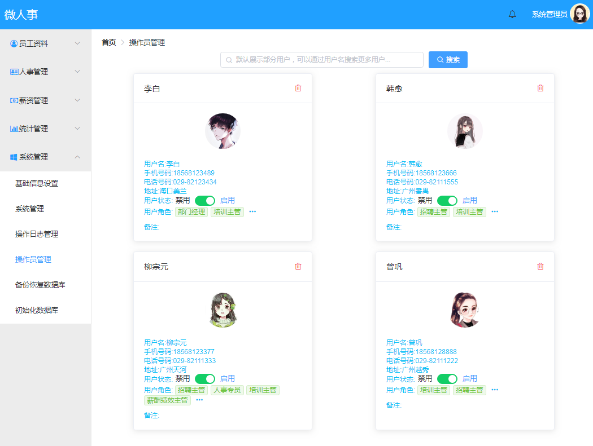

## 技术栈

微人事这个项目采用：

### 后端技术栈

**SpringBoot**：SpringBoot基于Sring4进行设计，目的是为了简化Spring应用的初始搭建以及开发过程。 该框架使用特定的方式(集成starter，约定优于配置)来进行配置，从而使开发人员不需要再定义样板化的配置。  

**SpringSecurity**：SpringSecurity 是一个强大的和高度可定制的身份验证和访问控制框架。它着重于为Java应用程序提供身份验证和授权。  

**MyBatis**：MyBatis 是一款优秀的持久层框架，它支持定制化 SQL、存储过程以及高级映射。MyBatis 避免了几乎所有的 JDBC 代码和手动设置参数以及获取结果集。

**MySQL**：MySQL 是一个轻量级关系型数据库管理系统，由瑞典MySQL AB公司开发，目前属于Oracle公司。

### 前端技术栈

**Vue**：Vue 是一套构建用户界面的渐进式框架。 数据驱动，组件化是Vue的两大核心思想。

**ElementUI**： ElementUI 时一套基于 Vue 2.0 的组件库，提供了配套设计资源。由饿了么公司前端团队开源。 

**Axios**：Axios 是一个基于 Promise 的 HTTP 库，可以用在浏览器和 node.js 中。

**Vue-router**：Vue-router 是Vue的路由，根据不同的路径映射到不同的视图。 

## 项目结构

### 1.后端项目 hrserver 项目结构如下图：

 

后端项目采用MVC模式，使用现在流行的SpringBoot框架。SpringBoot是基于SpringMVC衍生出来的框架。宗旨是较少配置，让开发者快速上手做项目。

目录说明：

1. bean：数据模型目录，包括数据库模型，参数模型，业务模型。 
2. common：基础工具包目录，包括日期工具类，邮件工具类等。
3. config：基础配置目录，包括权限认证，安全认证，菜单权限等类。
4. controller：业务的控制器目录，包括员工信息，工资，系统公共功能等控制器。 
5. exception：自定义异常目录。公用的异常处理实现类。
6. mapper：数据库操作层目录。包括数据接口的定义，查询sql的业务实现。
7. service：业务层目录，包括部门，员工，菜单，角色，工资等业务的业务类。 
8. HrserverApplication：SpringBoot框架的入口类，在 IDE 中可直接运行main方法。 
9. resources/static：静态资源存放目录
10. resources/templates：前台页面模板路径，包括email模板。
11. resources/application.properties：环境配置文件，包括关系型数据库mysql连接信息，mybatis配置文件路径，非关系型数据redis的连接信息，邮件服务的配置等。
12. resources/mybatis-config.xml：mybatis配置文件，目前包括日志带引的配置。
13. resources/vhr.sql：mysql数据库脚本，（数据库脚本是mysql5.0创建的，mysql5.7版本的数据脚本在我的项目中已提交）

### 2.前端项目 vuehr 项目结构如下图：


前端项目采用MVVM架构，就是MVC架构中多了一个ViewModel，ViewModel，是Model和Controller之间的一座桥梁。

目录说明：

1. build：vue项目构建配置目录，包括vue加载器的基础配置，webpack的环境配置。
2. config：web项目的环境配置目录，包括代理配置，开发环境配置，生成环境配置。
3. node_modules：第三方依赖目录，包括项目引用的三方依赖模块。
4. src/components：前端组件目录，包括聊天组件，员工组件，个人组件，统计组件等。
5. src/lib：三方依赖目录，包括SockJS，SockJS是一个浏览器JavaScript库，提供类似WebSocket的对象。
6. src/router：路由目录，包括项目前端路由的配置信息。
7. src/store：全局数据商店，存放供全局使用的一些数据。
8. src/utils：工具包路径，包括前台api接口和常用的工具类。
9. src/App.vue：vue前端的入口组件。
10. src/main.js：vue前端入口js事件定义的文件。
11. src/index.html：微人事前端首页。
12. src/package*.json：vue前端项目打包的配置文件，类似于maven项目的pom.xml文件。声明了项目需要的三方依赖。

## 实战操作

### 1.准备工作

1.确保本地已安装 Java8 开发环境；


2.确保本地以安装 maven 工具；

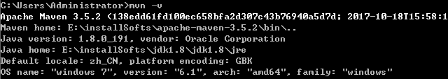

3.确保本地以安装 Node.js；

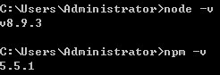


### 2.下载项目

```
git clone https://github.com/lenve/vhr.git
```

### 3.运行项目

#### 1.初始化数据库

数据库脚本存放的路径在：hrserver\src\main\resources\vhr.sql，我本地使用的可视化工具Navcat。新建一个名称为vhr的数据库。

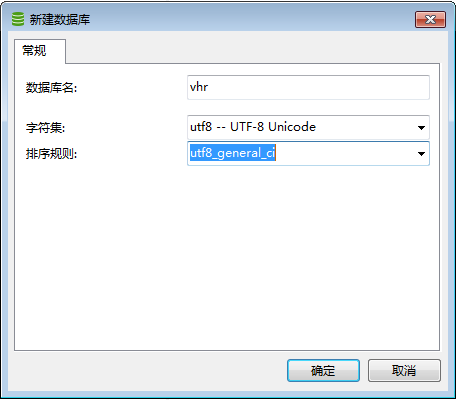


导入 vhr.sql 文件数据到mysql数据库。

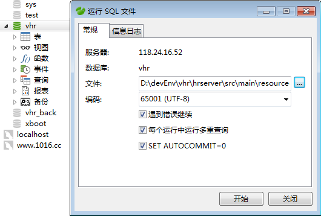

#### 2.修改后台项目的环境配置文件

修改后台项目的环境配置文件 hrserver\src\main\resources\application.properties

```
#MySQL配置
spring.datasource.type=com.alibaba.druid.pool.DruidDataSource
spring.datasource.url=jdbc:mysql://IP:3306/vhr?useUnicode=true&characterEncoding=UTF-8
spring.datasource.username=root
spring.datasource.password=root
```

#### 3.IDE里运行项目

1. 运行后台项目

   1.导入项目到Idea开发工具

   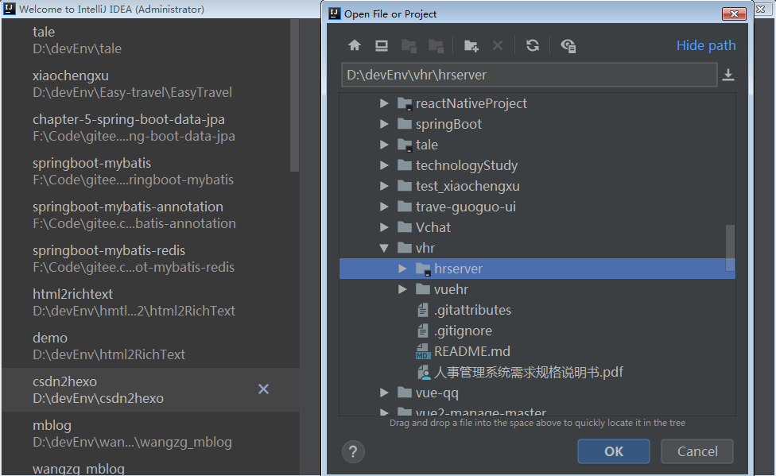

   2.运行项目

   打开后台项目的入口类 HrserverApplication.java 

   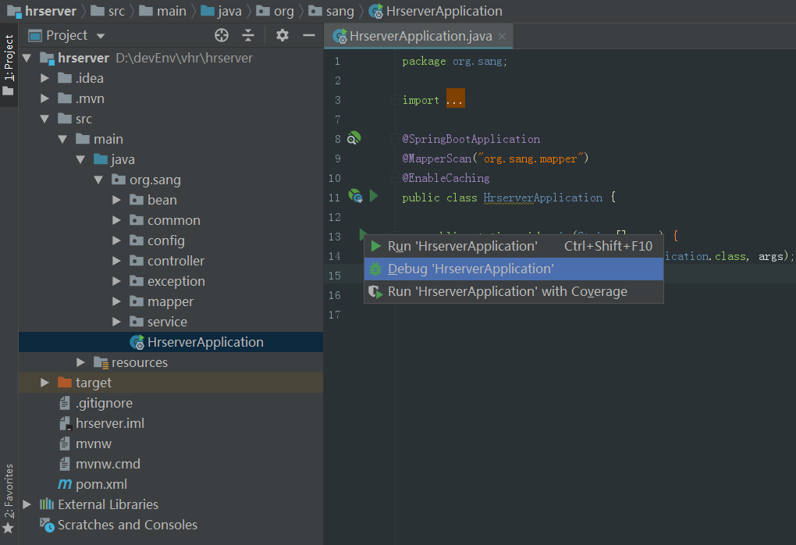

   3.项目启动成功如下图

   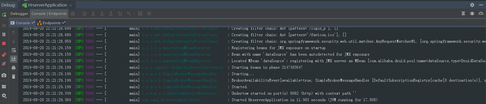

2. 运行前台项目

   1.导入项目到VSCode开发工具

   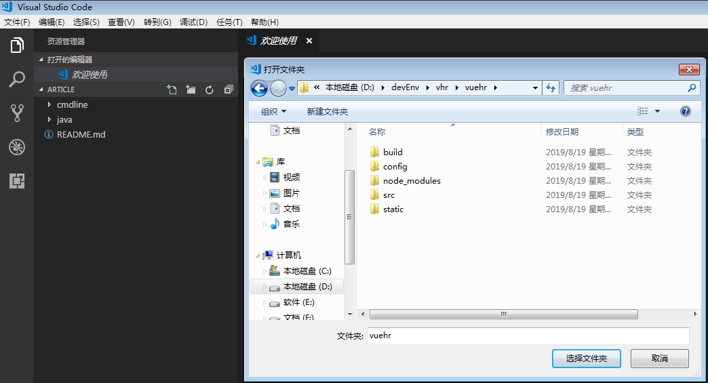

   2.运行项目

   1.在VSCode左侧导航栏，NPM SCRIPTS中直接运行 dev 。

   

   2.Ctrl+shift+Y呼出控制台，在控制台终端依次执行如下命令：

   ```
   # 安装依赖
   npm install
   
   # 在 localhost:8080 启动项目
   npm run dev
   ```

   

   3.项目运行成功如下图

   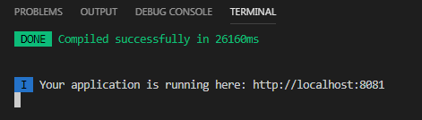


### 4.命令行运行项目

Win + R 打开windows命令行窗口

1. 运行后台项目

   1.切换目录到 vhr\hrserver\ 下

   

   2.打包后台项目

   ```
   mvn clean install
   ```

   3.命令行运行微人事后台项目

   切换目录到 hrserver\target\，执行如下命令可启动项目

   ```
   java -jar hrserver-0.0.1-SNAPSHOT.jar
   ```

   4.项目运行成功成功入下图

   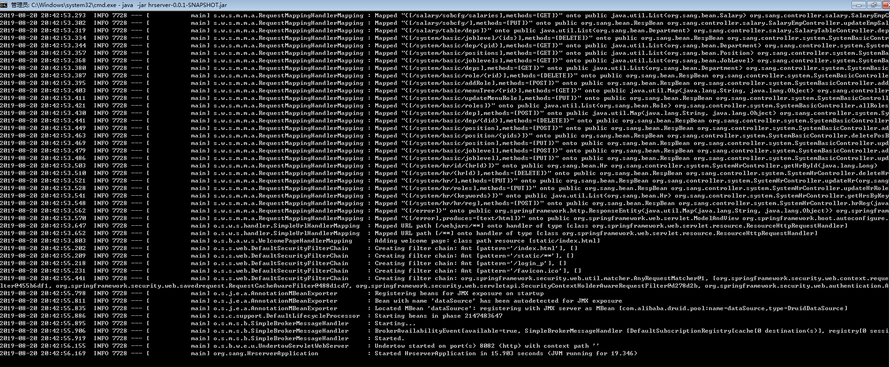

2. 运行前台项目

   1.切换目录到 vhr\vuehr\ 下

   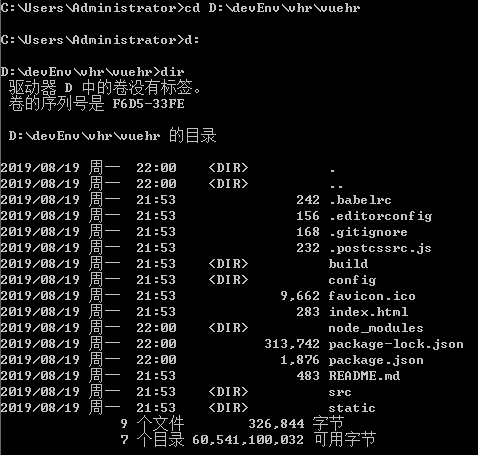

   2.在命令行依次执行如下命令

   ```
   # 安装依赖
   npm install
   
   # 在 localhost:8080 启动项目
   npm run dev
   ```

   3.项目运行成功成功入下图

   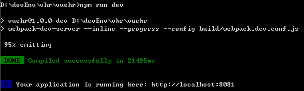

### 5.项目启动成功效果

1.员工基本信息维护

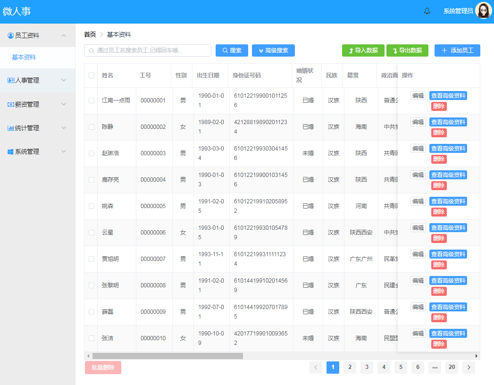

2.基础信息设置

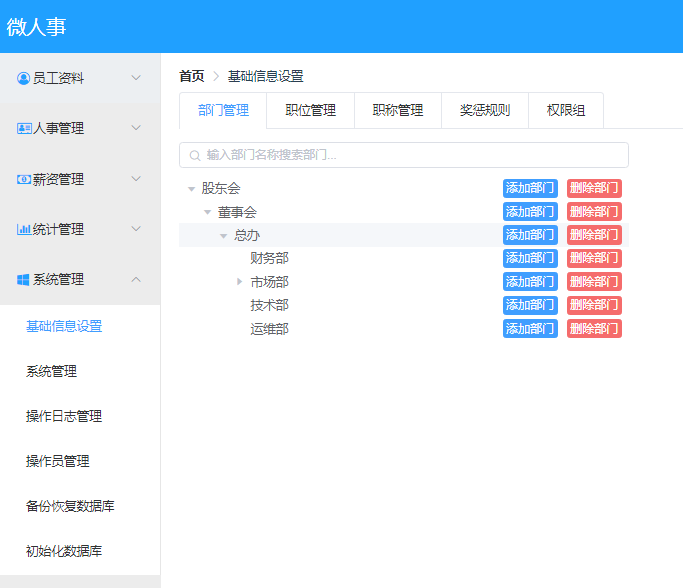

## 参考文章：

SpringBoot简介  <https://www.jianshu.com/p/350972a3a258> 

Spring Security是什么?   <https://book-spring-security-reference.vnzmi.com/1_introduction.html> 

Spring Security简介   <https://blog.51cto.com/favccxx/1606179> 

MyBatis简介  <http://www.mybatis.org/mybatis-3/zh/index.html> 

什么是MVVM框架？ <https://zhuanlan.zhihu.com/p/59467370> 


