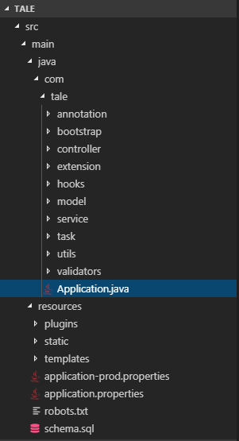
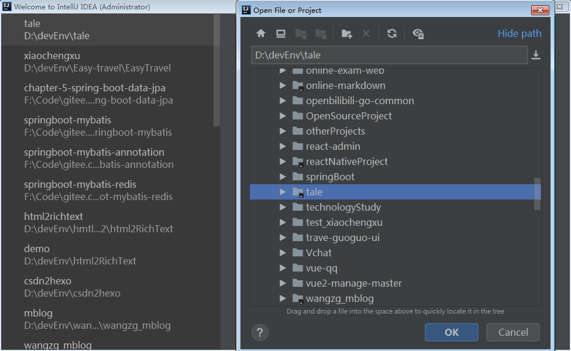
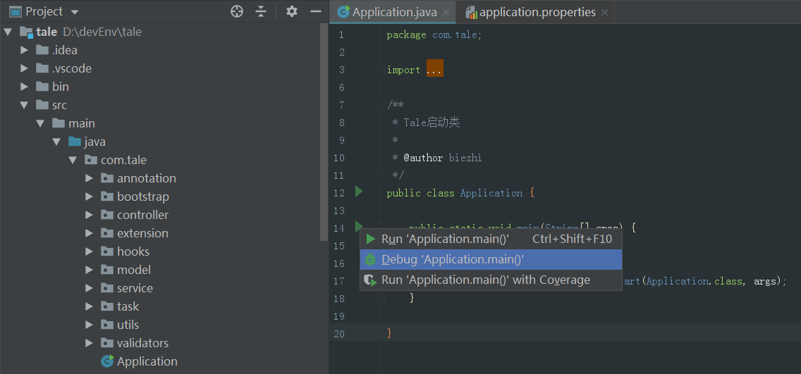
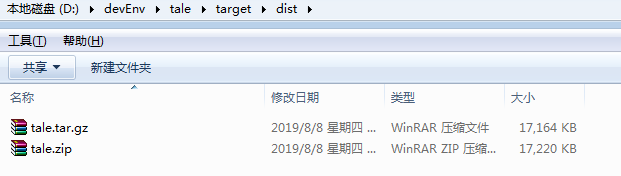
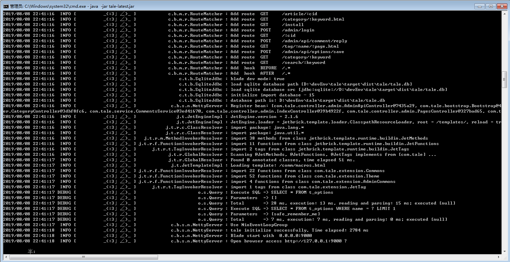

# 基于 Tale 实现 5 分钟搭建私人订制博客

**Tale** 是轻量级 Java 平台的博客系统，拥有小、美、快、稳的特点。该项目完全开源、免费能够让你快速搭建博客系统，专注于创作，让有故事的人更好的表达想法。

想要快速搭建一套自己的博客，跟着本文的教程，你只需要花 5 分钟。下面是搭建完成的效果图：


## 技术栈

Tale 这个项目采用：

- **Blade 框架**：快速搭建 Web 应用程序的开源框架，该框架代码简洁、风格优雅。 

- **Jetbrick-template 模板引擎**：适合于动态 HTML 页面输出或者代码生成，可替代 JSP 页面或者 Velocity 等模板。 指令和 Velocity 相似，表达式和 Java 保持一致，易学易用。

- **Sqlite 数据库**：是一种嵌入式数据库,它的数据库就是一个文件。

## 项目结构简介

项目结构如下图：



项目采用MVC模式：Model数据层，view展现层，controller逻辑层。

1. 后台代码目录说明

   annotation：自定义注解目录，包括系统日志的注解类。

   bootstarp：初始化操作目录，包括初始化进程类， sqlite数据库初始化类，公共常量类等。

   controller：业务的控制器目录，包括文章控制器，分类控制器，初始化博客的控制器等。

   extension：底层公用代码目录，包括后台公共函数，主题公共函数。

   hooks：拦截器/过滤器目录，做一些拦截器的操作。

   model：数据模型目录，包括数据库模型，参数模型，业务模型。

   service：业务层目录，包括站点，系统配置，分类，标签，文章，评论的业务类。

   task：定时任务目录，可自定时添加定时任务。

   utils：业务层工具类目录，包括图像工具类，缓存工具类，公用工具类。

   validators：验证器目录，包括保存文章的校验，添加评论的校验功能。

   Application：入口类，在 IDE 中可直接运行。

2. 前台代码目录说明

   plugins：插架存放目录，此目录作者废弃了

   static：静态资源目录，包括 css,images,js 和第三方插件

   templates：模板资源目录，包括后台管理界面，公共模板和主题模板，支持扩展主题

   application*.properties：项目环境配置文件

   

Tale 的项目的结构很简单，当然它运行起来超级简单，你是不是开始手痒痒了，那接下来我们一起让项目运行起来。

## 实战操作

1. ### 准备工作

   1.确保本地已安装 Java8 开发环境；

   

   

   2.确保本地已安装 maven 工具；

   

   

2. ### 下载项目

   ```shell
   git clone https://github.com/otale/tale.git
   ```

3. ### 运行项目

   1. #### IDE 里面运行

      a.将项目导入到 IDE 中，这里我使用的是 Idea

      

      b.找到 com.tale.Application 类，直接运行

      

      c.运行成功如下图

      

   2. #### 命令行运行项目

   #####    a.切换到项目源码路径,编译源码

   ```shell
   mvn clean package -Pprod -Dmaven.test.skip=true
   ```

   编译成功如下图：
   

#####    b.切换路径到 tale\target\dist\ 

   

#####    c.解压 tale.zip 压缩文件

   

#####    d.运行 tale-latest.jar

   ```shell
   java -jar  tale-latest.jar
   ```

   启动成功如下图：
   

   

 3.####  在 Idea 的 Terminal 窗口执行打包命令

  Idea 的 Terminal 窗口与 cmd 窗口的功能是相同的。可以执行

   ```shell
   mvn clean package -Pprod -Dmaven.test.skip=true
   ```

   对源码进行打包，然后也可以在命令行启动项目。

 4. #### 项目启动成功

   ##### 1.首次登录，需要填写配置信息

   

   ##### 2.登录后台管理系统

   后台系统链接：<http://127.0.0.1:9000/admin/login> 

   输入管理员账号和密码即可登录

   

   后台管理页面

   

   ##### 3.博客前台页面

   博客前台链接：<http://127.0.0.1:9000/> 

   

   

   

参考资料：

https://github.com/otale/tale/wiki

https://lets-blade.com/docs/why-blade.html

https://www.oschina.net/p/jetbrick-template
